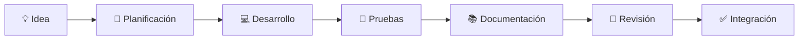

# 🤝 Guía de Contribución

> **Proyecto:** AyniKortex  
> **Estado:** En desarrollo

¡Gracias por tu interés en contribuir a **AyniKortex**!

Este proyecto nace con el propósito de transformar documentación técnica en conocimiento inteligente mediante Machine Learning, combinando buenas prácticas de ingeniería, colaboración y aprendizaje continuo.

Toda contribución, ya sea código, documentación, pruebas o propuestas de mejora, ayuda a fortalecer el proyecto y a construir una plataforma más útil para toda la comunidad.

---

# 🎯 Objetivo

Esta guía describe el proceso de colaboración, los estándares de desarrollo y las buenas prácticas que seguimos para mantener un proyecto consistente, mantenible y preparado para evolucionar.

Nuestro objetivo es que cualquier colaborador pueda integrarse rápidamente al proyecto y contribuir siguiendo un conjunto común de principios y convenciones.

---

# 🌟 Nuestra Filosofía

En AyniKortex creemos que construir software va mucho más allá de escribir código.

Valoramos por igual:

- 🤝 La colaboración entre equipos.
- 📚 La documentación clara y actualizada.
- 💻 El código limpio y mantenible.
- 🧪 La calidad mediante pruebas.
- 🚀 La mejora continua.
- 💡 El intercambio de conocimiento.

Cada contribución, sin importar su tamaño, representa una oportunidad para fortalecer el proyecto y aprender en conjunto.

---

# 🏗 Organización del Proyecto

AyniKortex está organizado en componentes especializados que colaboran para ofrecer una solución integral para la gestión inteligente de documentación técnica.

| Componente | Responsabilidad |
|------------|-----------------|
| 🎨 Frontend | Desarrollo de la interfaz de usuario y experiencia de navegación. |
| ⚙️ Backend | Implementación de la lógica de negocio, APIs REST y persistencia de datos. |
| 🤖 Data Science | Desarrollo del modelo de Machine Learning y servicios de inferencia. |
| 📚 Documentación | Mantenimiento de la documentación técnica y funcional del proyecto. |

Cada componente puede evolucionar de manera independiente, manteniendo una arquitectura modular y una comunicación claramente definida entre los distintos equipos.

---

# 🚀 Antes de comenzar

Antes de realizar cualquier contribución, te recomendamos familiarizarte con la documentación oficial del proyecto.

Los documentos principales son:

| Documento | Propósito |
|------------|-----------|
| 📘 README.md | Conocer el proyecto y su propósito. |
| 🏛️ ARCHITECTURE.md | Comprender la arquitectura general del sistema. |
| 🗺️ ROADMAP.md | Conocer la evolución planificada del proyecto. |
| 📖 DOCUMENTATION_STYLE_GUIDE.md | Estándares para la documentación. |

Comprender estos documentos facilitará la integración de cambios y permitirá mantener la coherencia del proyecto.

---

# 🌿 Flujo de Contribución

Toda contribución sigue un proceso sencillo orientado a mantener la calidad y la estabilidad del proyecto.



Cada etapa tiene como objetivo asegurar que las nuevas funcionalidades, mejoras o correcciones sean incorporadas de forma ordenada y manteniendo los estándares definidos por el proyecto.

---

# 💻 Estándares de Desarrollo

En AyniKortex buscamos construir un software mantenible, escalable y fácil de comprender.

Antes de incorporar cualquier cambio al proyecto, verifica que tu contribución respete los principios de diseño, la arquitectura definida y los estándares de calidad acordados por el equipo.

## 🏗️ Principios de Desarrollo

Durante el desarrollo se recomienda priorizar los siguientes principios:

| Principio | Descripción |
|-----------|-------------|
| Responsabilidad Única | Cada módulo debe tener un único propósito claramente definido. |
| Bajo Acoplamiento | Reducir las dependencias entre componentes. |
| Alta Cohesión | Agrupar funcionalidades relacionadas dentro del mismo módulo. |
| Simplicidad (KISS) | Preferir soluciones simples antes que implementaciones innecesariamente complejas. |
| No Repetición (DRY) | Evitar duplicar lógica o información. |
| Legibilidad | Escribir código claro, descriptivo y fácil de mantener. |
| Documentación Actualizada | Mantener la documentación sincronizada con la evolución del proyecto. |

---

## 📝 Convenciones de Código

Antes de realizar un commit, verifica que:

- Se utilizan nombres descriptivos para clases, funciones y variables.
- Cada archivo tiene una responsabilidad claramente definida.
- No existen bloques de código duplicados.
- Se eliminaron archivos temporales o código de prueba.
- La estructura del proyecto permanece consistente con la arquitectura definida.
- El código incluye comentarios únicamente cuando aportan contexto relevante.

---

# 📝 Convención de Commits

Para mantener un historial claro y fácil de consultar, utilizamos una convención basada en prefijos.

| Prefijo | Uso |
|----------|-----|
| `feat` | Nueva funcionalidad |
| `fix` | Corrección de errores |
| `docs` | Cambios en la documentación |
| `refactor` | Mejora del código sin modificar su comportamiento |
| `test` | Incorporación o actualización de pruebas |
| `style` | Cambios de formato o estilo sin afectar la lógica |
| `chore` | Tareas de mantenimiento o configuración |

## Ejemplos

```text
feat: agregar servicio de clasificación

fix: corregir validación de documentos

docs: actualizar arquitectura del sistema

refactor: simplificar controlador de documentos

test: agregar pruebas del pipeline

chore: actualizar dependencias
```

---

# 🧪 Calidad y Pruebas

La calidad del software es responsabilidad de todo el equipo.

Siempre que sea posible, las nuevas funcionalidades deberán ser validadas antes de integrarse al proyecto.

## Backend

- Pruebas unitarias.
- Pruebas de integración.
- Validación de APIs.

## Data Science

- Validación del dataset.
- Validación del pipeline de procesamiento.
- Validación del modelo entrenado.
- Validación de los servicios de inferencia.

## Frontend

- Validación de componentes.
- Validación de integración con Backend.
- Verificación de la experiencia de usuario.

---

# 📚 Documentación

La documentación forma parte del producto y debe evolucionar junto con el código.

Cuando una contribución modifique el funcionamiento del sistema, también deberá revisarse la documentación correspondiente.

Los principales documentos del proyecto son:

| Documento | Propósito |
|------------|-----------|
| 📘 README.md | Presentación general del proyecto. |
| 🏛️ ARCHITECTURE.md | Arquitectura del sistema. |
| 🗺️ ROADMAP.md | Plan de evolución del proyecto. |
| 📖 DOCUMENTATION_STYLE_GUIDE.md | Estándares de documentación. |
| 🤝 CONTRIBUTING.md | Guía para colaboradores. |
| 🔒 SECURITY.md | Gestión de vulnerabilidades. |
| 🆘 SUPPORT.md | Canales de soporte. |

---

# ✅ Lista de Verificación

Antes de compartir tu contribución, verifica que:

- [ ] El código compila correctamente.
- [ ] La funcionalidad cumple con el objetivo propuesto.
- [ ] Se ejecutaron las pruebas correspondientes.
- [ ] No existen archivos temporales o innecesarios.
- [ ] La documentación fue actualizada cuando fue necesario.
- [ ] Se respetó la arquitectura del proyecto.
- [ ] El mensaje de commit sigue la convención establecida.
- [ ] La contribución mantiene la calidad y legibilidad del código.

---

# 💙 Gracias por contribuir

Cada línea de código, cada mejora en la documentación, cada prueba y cada sugerencia ayudan a construir un proyecto más sólido.

AyniKortex es posible gracias al trabajo colaborativo de personas que comparten el interés por aprender, innovar y construir soluciones de calidad.

¡Gracias por formar parte de esta comunidad! 🚀
