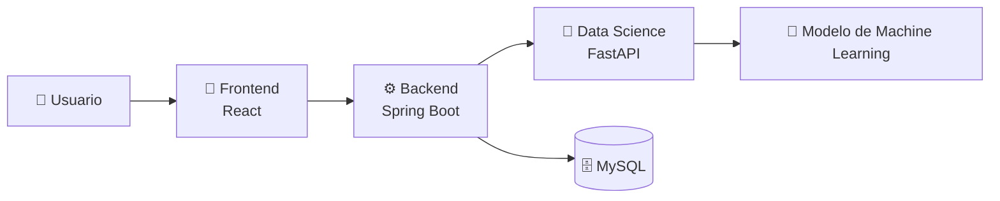

# 🚀 AyniKortex – Organización Inteligente del Conocimiento Técnico

> Transformando documentación técnica en conocimiento inteligente.

*"Organizando el conocimiento de hoy para impulsar las decisiones del mañana."*

## Estado del proyecto (Julio 2026)

AyniKortex es una plataforma inteligente diseñada para organizar, clasificar y facilitar el acceso al conocimiento técnico mediante Inteligencia Artificial y Machine Learning.

Su propósito es transformar documentación dispersa en una base de conocimiento estructurada, reutilizable y fácil de consultar, mejorando la gestión del conocimiento dentro de equipos de desarrollo y organizaciones.

---

## 🌄 ¿Por qué AyniKortex?

El nombre **AyniKortex** representa la esencia del proyecto.

**Ayni** es un principio ancestral andino basado en la reciprocidad, la colaboración y el intercambio de conocimiento para el beneficio común.

**Kortex**, inspirado en la palabra *cortex*, representa la capacidad de aprender, analizar y transformar información en conocimiento mediante Inteligencia Artificial.

La unión de ambos conceptos simboliza una plataforma donde el conocimiento técnico deja de estar disperso para convertirse en información organizada, accesible e inteligente.

---

## 🎯 El problema

En muchos equipos de desarrollo, el conocimiento técnico se encuentra distribuido en múltiples fuentes:

- Documentación interna.
- Tutoriales.
- Artículos técnicos.
- Repositorios.
- Notas personales.
- Wikis.
- Manuales.

Esta información suele crecer de manera desorganizada, dificultando su consulta, reutilización y mantenimiento.

Como consecuencia:

- Se pierde conocimiento con el paso del tiempo.
- Se duplica información.
- La búsqueda de contenido es lenta.
- La clasificación depende de procesos manuales.
- La transferencia de conocimiento resulta poco eficiente.

---

## 💡 Nuestra solución

AyniKortex propone una plataforma inteligente que utiliza técnicas de Machine Learning para transformar documentación técnica en conocimiento organizado.

La plataforma permite clasificar automáticamente documentos, estructurar la información y facilitar su consulta mediante una arquitectura modular compuesta por Frontend, Backend y un componente especializado de Ciencia de Datos.

El resultado es una base de conocimiento más accesible, reutilizable y preparada para evolucionar junto con las necesidades del proyecto.

---

## ✨ Características principales

- 📚 Organización inteligente de documentación técnica.
- 🤖 Clasificación automática mediante Machine Learning.
- 🔍 Estructuración del conocimiento para facilitar su consulta.
- 🏗️ Arquitectura modular basada en componentes.
- 🔗 Integración entre Frontend, Backend y Ciencia de Datos.
- 📈 Diseño preparado para evolucionar y escalar.

---

## 🏗️ Ecosistema AyniKortex

AyniKortex está diseñado como una plataforma modular donde cada componente cumple una responsabilidad específica y colabora con los demás para transformar documentación técnica en conocimiento estructurado.




La arquitectura sigue un enfoque basado en componentes, donde el Backend actúa como punto central de comunicación entre la interfaz de usuario, la base de datos y el componente de Ciencia de Datos.

Cada componente puede evolucionar de forma independiente, manteniendo una separación clara de responsabilidades y facilitando la escalabilidad y el mantenimiento del sistema.

---

## 🧩 Componentes del Proyecto

| Componente | Responsabilidad |
|------------|-----------------|
| 🎨 **Frontend** | Proporciona la interfaz de usuario para registrar, consultar y visualizar información técnica mediante una experiencia intuitiva. |
| ⚙️ **Backend** | Centraliza la lógica de negocio, expone la API REST, gestiona la persistencia de datos y coordina la comunicación con el componente de Ciencia de Datos. |
| 🤖 **Data Science** | Procesa el contenido técnico utilizando modelos de Machine Learning para realizar la clasificación automática y generar información enriquecida. |
| 🗄️ **Base de Datos** | Almacena la información estructurada generada por la plataforma y garantiza su disponibilidad para futuras consultas. |

---

## 🚧 Estado del Proyecto

AyniKortex se encuentra actualmente en desarrollo activo. La arquitectura principal ha sido definida y los diferentes componentes avanzan de forma coordinada hacia la integración del sistema.

| Área | Estado |
|------|:------:|
| 🏗️ Arquitectura | ✅ Definida |
| 🤖 Data Science | 🚧 En desarrollo |
| ⚙️ Backend | 🚧 En desarrollo |
| 🎨 Frontend | 🚧 En desarrollo |
| 🔗 Integración | ⏳ Pendiente |
| 🚀 Despliegue | ⏳ Pendiente |

---

---

## 💻 Stack Tecnológico

AyniKortex integra diferentes tecnologías especializadas para construir una plataforma modular, escalable y orientada a la gestión inteligente del conocimiento técnico.

| Componente | Tecnología | Propósito |
|------------|------------|-----------|
| 🎨 Frontend | React | Desarrollo de la interfaz de usuario. |
| ⚙️ Backend | Spring Boot | API REST, lógica de negocio y orquestación del sistema. |
| 🤖 Data Science | Python, FastAPI, Scikit-learn | Clasificación automática e inferencia mediante Machine Learning. |
| 🗄️ Base de Datos | MySQL | Persistencia de la información del sistema. |
| 🔧 Control de Versiones | Git & GitHub | Gestión colaborativa del código fuente. |

---

## 📂 Estructura del Repositorio

```text
AyniKortex/

├── frontend/              # Aplicación React
├── backend/               # API Spring Boot
├── data_science/          # Modelo de Machine Learning y FastAPI
├── docs/                  # Documentación del proyecto
├── .github/               # Configuración de GitHub
├── README.md
├── CONTRIBUTING.md
├── CODE_OF_CONDUCT.md
├── SECURITY.md
└── SUPPORT.md
```

> **Nota:** La estructura podrá evolucionar conforme avance el desarrollo del proyecto.

---

## 🚀 Primeros pasos

La documentación para la instalación y ejecución de cada componente será publicada conforme avance el desarrollo del proyecto.

Mientras tanto, puedes explorar la arquitectura, la documentación técnica y las guías para colaboradores disponibles en este repositorio.

---

## 📚 Documentación

La documentación del proyecto está organizada para facilitar la incorporación de nuevos colaboradores y mantener una única fuente de información para cada tema.

| Documento | Descripción |
|------------|-------------|
| 📘 README.md | Presentación general del proyecto. |
| 🏛️ ARCHITECTURE.md | Arquitectura general del sistema. |
| 🤝 CONTRIBUTING.md | Guía para contribuir al proyecto. |
| 📜 CODE_OF_CONDUCT.md | Normas de convivencia de la comunidad. |
| 🔒 SECURITY.md | Política para el reporte de vulnerabilidades. |
| 🆘 SUPPORT.md | Canales de soporte y ayuda. |
| 🗺️ ROADMAP.md | Evolución y planificación del proyecto. |
| 📖 DOCUMENTATION_STYLE_GUIDE.md | Estándares de documentación del proyecto. |

---

## 🗺️ Roadmap

La evolución del proyecto se organiza en diferentes etapas que abarcan el diseño, desarrollo e integración de todos los componentes del sistema.

- ✅ Arquitectura del proyecto
- 🚧 Desarrollo del componente Data Science
- 🚧 Desarrollo del Backend
- 🚧 Desarrollo del Frontend
- ⏳ Integración de componentes
- ⏳ Despliegue
- ⏳ Optimización y mejoras continuas

---

## 👥 Equipo

AyniKortex es desarrollado de manera colaborativa por un equipo multidisciplinario conformado por especialistas en:

- 🎨 Frontend
- ⚙️ Backend
- 🤖 Data Science
- 📚 Documentación
- 🏗️ Arquitectura

El proyecto promueve el trabajo colaborativo, la mejora continua y el intercambio de conocimiento como principios fundamentales de desarrollo.

---

## 🤝 Cómo contribuir

¡Las contribuciones son bienvenidas!

Si deseas colaborar con el proyecto, consulta la guía disponible en:

> 📄 **CONTRIBUTING.md**

Allí encontrarás las convenciones, estándares y flujo de trabajo utilizados por el equipo.

---

# Estado del Desarrollo

Actualmente el proyecto cuenta con:

- Arquitectura modular basada en Clean Architecture.
- Pipeline completo de adquisición y preparación de datos.
- Pipeline de Ingeniería de Características.
- Arquitectura desacoplada para entrenamiento.
- Evaluación del modelo.
- 138 pruebas unitarias exitosas.
- Cero regresiones entre sprints.

El proyecto se encuentra preparado para iniciar el desarrollo del módulo de persistencia e inferencia del modelo.

---

# Licencia

Este proyecto se distribuye bajo la licencia **MIT**.

Para más información, consultar el archivo `LICENSE`.