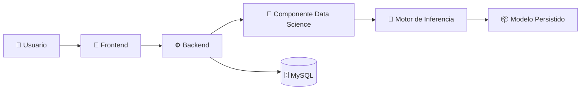

# 🚀 AyniKortex – Organización Inteligente del Conocimiento Técnico

> Transformando documentación técnica en conocimiento inteligente.

*"Organizando el conocimiento de hoy para impulsar las decisiones del mañana."*

## Estado del proyecto (Julio 2026)

AyniKortex es una plataforma inteligente diseñada para organizar, clasificar y facilitar el acceso al conocimiento técnico mediante Inteligencia Artificial y Machine Learning.

Su propósito es transformar documentación dispersa en una base de conocimiento estructurada, reutilizable y fácil de consultar, mejorando la gestión del conocimiento dentro de equipos de desarrollo y organizaciones.

---

## 🌄 ¿Por qué AyniKortex?

El nombre **AyniKortex** representa la esencia del proyecto.

**Ayni** es un principio ancestral andino basado en la reciprocidad, la colaboración y el intercambio de conocimiento para el beneficio común.

**Kortex**, inspirado en la palabra *cortex*, representa la capacidad de aprender, analizar y transformar información en conocimiento mediante Inteligencia Artificial.

La unión de ambos conceptos simboliza una plataforma donde el conocimiento técnico deja de estar disperso para convertirse en información organizada, accesible e inteligente.

---

## 🎯 El problema

En muchos equipos de desarrollo, el conocimiento técnico se encuentra distribuido en múltiples fuentes:

- Documentación interna.
- Tutoriales.
- Artículos técnicos.
- Repositorios.
- Notas personales.
- Wikis.
- Manuales.

Esta información suele crecer de manera desorganizada, dificultando su consulta, reutilización y mantenimiento.

Como consecuencia:

- Se pierde conocimiento con el paso del tiempo.
- Se duplica información.
- La búsqueda de contenido es lenta.
- La clasificación depende de procesos manuales.
- La transferencia de conocimiento resulta poco eficiente.

---

## 💡 Nuestra solución

AyniKortex propone una plataforma inteligente que utiliza técnicas de Machine Learning para transformar documentación técnica en conocimiento organizado.

La plataforma permite clasificar automáticamente documentos, estructurar la información y facilitar su consulta mediante una arquitectura modular compuesta por Frontend, Backend y un componente especializado de Ciencia de Datos.

El resultado es una base de conocimiento más accesible, reutilizable y preparada para evolucionar junto con las necesidades del proyecto.

---

## ✨ Características principales

- 📚 Organización inteligente de documentación técnica.
- 🤖 Clasificación automática mediante Machine Learning.
- 🔍 Estructuración del conocimiento para facilitar su consulta.
- 🏗️ Arquitectura modular basada en componentes.
- 🔗 Integración entre Frontend, Backend y Ciencia de Datos.
- 📈 Diseño preparado para evolucionar y escalar.

---

## 🏗️ Ecosistema AyniKortex

AyniKortex está diseñado como una plataforma modular donde cada componente cumple una responsabilidad específica y colabora con los demás para transformar documentación técnica en conocimiento estructurado.



La arquitectura de AyniKortex sigue un enfoque modular basado en componentes, donde cada uno tiene responsabilidades claramente definidas.

El Backend, desarrollado con Spring Boot, actúa como el punto central de comunicación entre el Frontend, la base de datos y el componente de Ciencia de Datos.

El componente de Data Science expone el modelo de Machine Learning mediante una API desarrollada con FastAPI, permitiendo que el Backend solicite clasificaciones automáticas y reciba los resultados en formato JSON para integrarlos con la lógica de negocio del sistema.

Esta separación de responsabilidades facilita el mantenimiento, la escalabilidad y la evolución independiente de cada componente.

---

## 🧩 Componentes del Proyecto

| Componente | Responsabilidad |
|------------|-----------------|
| 🎨 **Frontend** | Proporciona la interfaz de usuario para registrar, consultar y visualizar información técnica mediante una experiencia intuitiva. |
| ⚙️ **Backend** | Centraliza la lógica de negocio, expone la API REST, gestiona la persistencia de datos y coordina la comunicación con el componente de Ciencia de Datos. |
| 🤖 **Data Science** | Procesa el contenido técnico utilizando modelos de Machine Learning para realizar la clasificación automática y generar información enriquecida. |
| 🗄️ **Base de Datos** | Almacena la información estructurada generada por la plataforma y garantiza su disponibilidad para futuras consultas. |

---

## 🚧 Estado del Proyecto

AyniKortex se encuentra actualmente en desarrollo activo. La arquitectura principal ha sido definida y los diferentes componentes avanzan de forma coordinada hacia la integración del sistema.

| Área | Estado |
|------|:------:|
| 🏗️ Arquitectura | ✅ Definida |
| 🤖 Data Science |  🚧 En desarrollo (DS-08 completado)|
| ⚙️ Backend | 🚧 En desarrollo |
| 🎨 Frontend | 🚧 En desarrollo |
| 🔗 Integración | ⏳ Pendiente |
| 🚀 Despliegue | ⏳ Pendiente |

---

---

## 💻 Stack Tecnológico

AyniKortex integra diferentes tecnologías especializadas para construir una plataforma modular, escalable y orientada a la gestión inteligente del conocimiento técnico.

| Componente | Tecnologías | Propósito |
|------------|-------------|-----------|
| 🎨 Frontend | React | Desarrollo de la interfaz de usuario y experiencia del usuario. |
| ⚙️ Backend | Java, Spring Boot | API REST principal, lógica de negocio, persistencia y comunicación con Data Science. |
| 🤖 Data Science | Python, FastAPI, Scikit-learn, Pandas | Procesamiento de datos, entrenamiento, inferencia y exposición del modelo mediante API. |
| 🗄️ Base de Datos | MySQL | Persistencia y gestión de la información del sistema. |
| 🔧 Control de Versiones | Git & GitHub | Gestión colaborativa del código fuente y control de versiones. |

---

## 📂 Estructura del Repositorio

```text
AyniKortex/

├── datasets/              # Conjuntos de datos utilizados para entrenamiento y pruebas
├── docs/                  # Documentación técnica y funcional del proyecto
├── models/                # Modelos entrenados y artefactos relacionados
├── scripts/               # Scripts de apoyo para automatización y utilidades
├── src/
│   ├── backend/           # API principal desarrollada con Spring Boot
│   ├── data_science/      # Componente de Machine Learning y API FastAPI
│   ├── frontend/          # Aplicación web desarrollada en React
│   └── shared/            # Recursos compartidos entre componentes
├── tests/                 # Pruebas automatizadas del proyecto
├── .github/               # Configuración de GitHub
├── README.md              # Presentación general del proyecto
├── CONTRIBUTING.md        # Guía para colaboradores
├── CODE_OF_CONDUCT.md     # Código de conducta de la comunidad
├── LICENSE.md             # Licencia del proyecto
└── requirements.txt       # Dependencias del proyecto
```

> **Nota:** La estructura del repositorio podrá evolucionar conforme avance el desarrollo del proyecto y se incorporen nuevos componentes o recursos.
---

## 🚀 Primeros Pasos

Si deseas conocer AyniKortex o colaborar en su desarrollo, te recomendamos seguir el siguiente recorrido:

1. Explora este **README** para comprender la visión general y la arquitectura del proyecto.
2. Consulta la documentación disponible en el directorio **docs/** para conocer los estándares, lineamientos y decisiones de diseño.
3. Revisa el README específico de cada componente para comprender su arquitectura, responsabilidades y estado de desarrollo.
4. Sigue la guía de **CONTRIBUTING.md** para conocer el flujo de trabajo y las buenas prácticas del equipo.

> **Nota:** Las instrucciones de instalación y ejecución de cada componente se documentan de manera independiente conforme avanzan los diferentes equipos del proyecto.

---

## 📚 Documentación

La documentación de AyniKortex está organizada para facilitar la incorporación de nuevos colaboradores y mantener una única fuente de información para cada aspecto del proyecto.

| Documento | Descripción |
|------------|-------------|
| 📘 README.md | Presentación general del proyecto y visión de la solución. |
| 🏛️ ARCHITECTURE.md | Arquitectura general del sistema. |
| 📂 docs/ | Documentación técnica, funcional y de diseño del proyecto. |
| 🤖 src/data_science/README.md | Documentación del componente de Ciencia de Datos. |
| 🤝 CONTRIBUTING.md | Guía para contribuir al proyecto. |
| 📜 CODE_OF_CONDUCT.md | Normas de convivencia de la comunidad. |
| 🔒 SECURITY.md | Política para el reporte de vulnerabilidades. |
| 🆘 SUPPORT.md | Canales de soporte y ayuda. |
| 🗺️ ROADMAP.md | Evolución y planificación del proyecto. |
| 📖 DOCUMENTATION_STYLE_GUIDE.md | Estándares de documentación del proyecto. |

---

## 🗺️ Roadmap

La evolución de AyniKortex se organiza en etapas que abarcan el diseño, desarrollo, integración y despliegue de todos los componentes del sistema.

### Arquitectura y Planificación
- ✅ Definición de la arquitectura del proyecto.
- ✅ Diseño de la arquitectura del componente Data Science.
- ✅ Definición de estándares de ingeniería y documentación.

### Desarrollo de Componentes
- 🚧 Frontend.
- 🚧 Backend.
- 🚧 Data Science (DS-08 completado).

### Próximos Hitos
- ⏳ DS-09 – API REST e integración con Backend.
- ⏳ DS-10 – Optimización, validación y cierre del componente Data Science.
- ⏳ Integración completa de los componentes del sistema.
- ⏳ Despliegue de la plataforma.
- ⏳ Mejoras continuas y evolución del producto.

---

## 👥 Equipo

AyniKortex es desarrollado de manera colaborativa por un equipo multidisciplinario conformado por especialistas en diferentes áreas de ingeniería de software e inteligencia artificial.

Cada equipo aporta su experiencia para construir una plataforma modular, escalable y orientada a la gestión inteligente del conocimiento técnico.

| Área | Responsabilidad |
|------|-----------------|
| 🎨 Frontend | Desarrollo de la interfaz de usuario y experiencia del usuario. |
| ⚙️ Backend | Lógica de negocio, API REST, persistencia e integración de componentes. |
| 🤖 Data Science | Procesamiento de datos, entrenamiento, inferencia y clasificación automática mediante Machine Learning. |
| 📚 Documentación | Elaboración y mantenimiento de la documentación técnica y funcional del proyecto. |
| 🏗️ Arquitectura | Definición de estándares, diseño de la solución y evolución de la arquitectura. |

El proyecto promueve la colaboración, el intercambio de conocimiento y la mejora continua como principios fundamentales para el desarrollo de soluciones de calidad.

---

## 🤝 Cómo contribuir

¡Las contribuciones son bienvenidas!

Si deseas colaborar con el proyecto, consulta la guía disponible en **CONTRIBUTING.md**.

Allí encontrarás las convenciones, estándares, flujo de trabajo y buenas prácticas utilizadas por el equipo para garantizar un desarrollo colaborativo y consistente.

---

# Licencia

Este proyecto se distribuye bajo la licencia **MIT**.

Para más información, consultar el archivo `LICENSE`.