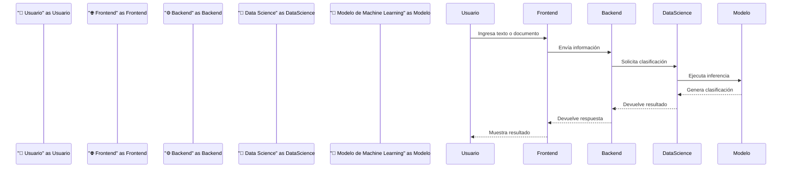

# 🏗️ Arquitectura de AyniKortex

> **Versión:** 3.0  
> **Estado:** MVP funcional desplegado  
> **Proyecto:** AyniKortex – Organización Inteligente del Conocimiento Técnico.

---

## 🎯 Propósito

Este documento presenta la arquitectura general de **AyniKortex**, describiendo sus componentes principales, responsabilidades y relaciones.

AyniKortex es una plataforma orientada a la **organización y clasificación de documentación técnica mediante Inteligencia Artificial**, integrando una interfaz web, un Backend, un componente de Ciencia de Datos y una base de datos.

El objetivo de este documento es proporcionar una visión técnica de alto nivel que facilite la comprensión de la solución por parte de desarrolladores, colaboradores y nuevos integrantes del proyecto.

Los detalles específicos de implementación, contratos de integración, decisiones arquitectónicas y procedimientos de despliegue se mantienen en documentos especializados para evitar duplicidad y conservar una única fuente de verdad.

---

## 🧭 Principios arquitectónicos

La arquitectura de AyniKortex se basa en los siguientes principios:

| Principio | Descripción |
|---|---|
| **Separación de responsabilidades** | Cada componente concentra responsabilidades específicas. |
| **Bajo acoplamiento** | Los componentes se comunican mediante interfaces claramente definidas. |
| **Alta cohesión** | Cada componente agrupa funcionalidades relacionadas con su propósito. |
| **Mantenibilidad** | La estructura facilita la evolución y mantenimiento de la solución. |
| **Escalabilidad** | Los componentes pueden evolucionar de forma independiente. |
| **Desarrollo incremental** | La solución se construye y mejora mediante iteraciones controladas. |
| **Documentación como fuente de verdad** | Cada tema se documenta en el lugar correspondiente, evitando duplicidad. |

---

## 🧩 Arquitectura de alto nivel

AyniKortex está compuesto por componentes especializados que trabajan de forma integrada para procesar y clasificar documentación técnica.

```mermaid
flowchart LR
    "👤 Usuario" --> "🌐 Frontend"
    "🌐 Frontend" --> "⚙️ Backend"
    "⚙️ Backend" --> "🤖 Data Science"
    "🤖 Data Science" --> "🧠 Modelo de Machine Learning"
    "⚙️ Backend" --> "🗄️ MySQL"
```

### Responsabilidades principales

- **🌐 Frontend:** proporciona la interfaz mediante la cual el usuario interactúa con la plataforma.
- **⚙️ Backend:** gestiona la lógica de negocio, las solicitudes y la persistencia.
- **🤖 Data Science:** procesa el contenido y ejecuta la inferencia del modelo.
- **🧠 Modelo de Machine Learning:** analiza el contenido y genera la clasificación.
- **🗄️ MySQL:** almacena la información gestionada por la aplicación.

El **Backend actúa como punto central de integración**, coordinando la comunicación entre la interfaz, Data Science y la persistencia.

---

## 🔄 Flujo principal de clasificación

El siguiente flujo representa el proceso principal desde que el usuario proporciona información hasta que recibe el resultado de la clasificación.



### Proceso general

1. El usuario proporciona texto o un documento.
2. El Frontend envía la información al Backend.
3. El Backend procesa la solicitud y coordina la clasificación.
4. Data Science analiza el contenido recibido.
5. El modelo de Machine Learning genera la predicción.
6. Data Science devuelve el resultado al Backend.
7. El Backend entrega la respuesta al Frontend.
8. El usuario visualiza el resultado.

---

## 📦 Componentes del sistema

La solución se organiza en cuatro componentes principales:

| Componente | Responsabilidad |
|---|---|
| 🌐 **Frontend** | Interfaz web para la interacción con el usuario. |
| ⚙️ **Backend** | Lógica de negocio, API e integración entre componentes. |
| 🤖 **Data Science** | Procesamiento e inferencia mediante Machine Learning. |
| 🗄️ **Base de Datos** | Persistencia de la información de la aplicación. |

---

## 🎨 Frontend

El Frontend constituye el punto de interacción entre el usuario y AyniKortex.

### Responsabilidades

- Presentar la interfaz web.
- Gestionar la interacción con el usuario.
- Enviar información al Backend.
- Presentar los resultados de clasificación.
- Facilitar el uso de las funcionalidades disponibles en la plataforma.

### Tecnologías principales

- React
- Vite
- JavaScript
- Nginx

---

## ⚙️ Backend

El Backend representa el núcleo de la aplicación y coordina la comunicación entre los diferentes componentes.

### Responsabilidades

- Implementar la lógica de negocio.
- Exponer la API de la aplicación.
- Validar y procesar solicitudes.
- Coordinar las solicitudes de clasificación.
- Comunicarse con Data Science.
- Gestionar la persistencia de información.
- Entregar los resultados al Frontend.

### Tecnologías principales

- Java
- Spring Boot
- MySQL

---

## 🤖 Data Science

El componente de Data Science incorpora las capacidades de Machine Learning de AyniKortex.

Su función principal es procesar el contenido recibido y ejecutar el modelo entrenado para generar una clasificación.

### Responsabilidades

- Procesar el contenido recibido.
- Preparar la información para inferencia.
- Ejecutar el modelo de Machine Learning.
- Generar la clasificación.
- Generar información complementaria del resultado.
- Devolver el resultado al Backend.
- Gestionar la versión del modelo utilizada para la inferencia.

### Tecnologías principales

- Python
- FastAPI
- scikit-learn
- pandas
- NumPy

---

## 🧠 Modelo de Machine Learning

El modelo de Machine Learning constituye el componente encargado de realizar la clasificación automática del contenido.

A partir de los patrones aprendidos durante el entrenamiento, el modelo analiza la información recibida y genera una predicción.

El resultado puede incluir:

- Categoría.
- Subcategoría.
- Nivel de confianza.
- Palabras clave.
- Resumen del contenido.
- Versión del modelo.
- Tiempo de procesamiento.

Los detalles del proceso de preparación de datos, entrenamiento, evaluación, persistencia e inferencia se encuentran en la documentación específica de Data Science.

---

## 🗄️ Base de datos

MySQL proporciona la persistencia necesaria para el funcionamiento de la aplicación.

### Responsabilidades

- Almacenar información gestionada por la plataforma.
- Persistir los datos necesarios para la operación del Backend.
- Mantener la integridad de la información.
- Permitir la consulta y recuperación de los datos almacenados.

### Tecnología

- MySQL

---

## 🔗 Comunicación entre componentes

Los componentes de AyniKortex se comunican mediante interfaces definidas, manteniendo responsabilidades separadas.

| Origen | Destino | Medio de comunicación |
|---|---|---|
| 👤 Usuario | 🌐 Frontend | Interfaz web |
| 🌐 Frontend | ⚙️ Backend | API REST |
| ⚙️ Backend | 🤖 Data Science | API REST mediante FastAPI |
| ⚙️ Backend | 🗄️ MySQL | JDBC / JPA |
| 🤖 Data Science | 🧠 Modelo | Ejecución interna de inferencia |

---

## 🔗 Flujo de comunicación

```mermaid
flowchart LR
    "🌐 Frontend" -->|"API REST"| "⚙️ Backend"
    "⚙️ Backend" -->|"API REST"| "🤖 Data Science"
    "⚙️ Backend" -->|"Persistencia"| "🗄️ MySQL"
    "🤖 Data Science" -->|"Inferencia"| "🧠 Modelo de Machine Learning"
```

---

## 💻 Stack tecnológico

| Área | Tecnología | Propósito |
|---|---|---|
| 🌐 Presentación | React + Vite | Interfaz web |
| ⚙️ Backend | Java + Spring Boot | Lógica de negocio y API |
| 🤖 Data Science | Python | Procesamiento e inferencia |
| 🔌 Servicio de inferencia | FastAPI | Exposición del servicio de Data Science |
| 🧠 Machine Learning | scikit-learn | Clasificación automática |
| 📊 Procesamiento | pandas | Preparación y manipulación de datos |
| 🔢 Computación | NumPy | Operaciones numéricas |
| 🗄️ Persistencia | MySQL | Almacenamiento de información |
| 🐳 Contenedores | Docker | Empaquetado y ejecución |
| ☁️ Cloud | Oracle Cloud Infrastructure | Infraestructura de despliegue |
| 🔧 Versionamiento | Git + GitHub | Control de versiones y colaboración |
| 🔄 Automatización | GitHub Actions | Automatización de procesos |

---

## ☁️ Despliegue

AyniKortex cuenta con un **MVP funcional desplegado en Oracle Cloud Infrastructure (OCI)**.

La solución utiliza contenedores para facilitar el empaquetado y despliegue de sus componentes.

```mermaid
flowchart LR
    "🌐 Frontend" --> "⚙️ Backend"
    "⚙️ Backend" --> "🤖 Data Science"
    "⚙️ Backend" --> "🗄️ MySQL"
    "🤖 Data Science" --> "🧠 Modelo de Machine Learning"

    "🌐 Frontend" -. "Despliegue" .-> "☁️ Oracle Cloud Infrastructure"
    "⚙️ Backend" -. "Despliegue" .-> "☁️ Oracle Cloud Infrastructure"
    "🤖 Data Science" -. "Despliegue" .-> "☁️ Oracle Cloud Infrastructure"
```

La configuración y los procedimientos específicos de despliegue se encuentran documentados en:

👉 [Guía de despliegue](../Deployment-Guide/Deployment-Guide.md)

---

## 📁 Organización del repositorio

La estructura del proyecto separa el código fuente, documentación, datos, modelos y herramientas de soporte.

```text
AyniKortex/
│
├── .github/
│   └── workflows/
│
├── datasets/
│
├── docs/
│   ├── ADR/
│   ├── api/
│   ├── Architecture/
│   ├── Deployment-Guide/
│   ├── meetings/
│   ├── ROADMAP/
│   ├── SDS/
│   ├── SPRINTS/
│   ├── Standards/
│   └── templates/
│
├── models/
├── scripts/
├── src/
│   ├── backend/
│   ├── data_science/
│   └── frontend/
│
├── tests/
│
├── docker-compose.yml
├── README.md
└── requirements.txt
```

La estructura permite mantener separados los diferentes componentes de la solución y facilita la colaboración entre las áreas de desarrollo, Ciencia de Datos y documentación.

---

## 📈 Escalabilidad y evolución

La arquitectura de AyniKortex permite continuar evolucionando la solución sin modificar necesariamente todos sus componentes.

Entre las posibilidades de evolución se encuentran:

- Incorporar nuevos modelos de clasificación.
- Mejorar el modelo existente mediante nuevos datos y entrenamiento.
- Ampliar las categorías y subcategorías disponibles.
- Incorporar nuevos tipos de documentos.
- Agregar nuevas funcionalidades al Backend.
- Ampliar la interfaz web.
- Mejorar los mecanismos de autenticación y autorización.
- Evolucionar la infraestructura de despliegue.

La separación entre Frontend, Backend y Data Science permite que cada área pueda evolucionar manteniendo contratos de integración definidos.

---

## 🚀 Alcance del MVP

El MVP de AyniKortex tiene como objetivo demostrar el funcionamiento integral de una plataforma capaz de analizar y clasificar documentación técnica mediante Machine Learning.

### Incluye

- Plataforma web funcional.
- Backend integrado.
- Servicio de Data Science.
- Modelo de Machine Learning entrenado.
- Clasificación automática.
- Procesamiento de texto y documentos compatibles.
- Persistencia mediante MySQL.
- Integración entre los componentes.
- Ejecución mediante contenedores.
- Despliegue en Oracle Cloud Infrastructure.

### Fuera del alcance actual

Las siguientes capacidades no forman parte del MVP actual:

- Inteligencia Artificial Generativa.
- Modelos de Lenguaje de gran escala (LLM).
- Retrieval-Augmented Generation (RAG).
- Bases de datos vectoriales.
- Procesamiento distribuido.
- Arquitectura basada en microservicios.
- Infraestructura de alta disponibilidad.

Estas capacidades podrán evaluarse en futuras etapas de evolución del proyecto.

---

## 📚 Documentación relacionada

Este documento proporciona la visión arquitectónica general de AyniKortex.

Para profundizar en aspectos específicos, consultar:

### 🔌 API e integración

- [Documentación de API](../api/README.md)
- [Contrato Backend–Data Science](../api/Backend-Data-Contract.md)
- [Modelo de datos](../api/Backend-Data-Model.md)
- [Especificación OpenAPI](../api/aynikortex-api.yaml)

### 🧠 Ciencia de Datos

- [Documentación de Sprints de Data Science](../SPRINTS/data-science/)

### ☁️ Despliegue

- [Guía de despliegue](../Deployment-Guide/Deployment-Guide.md)

### 🧭 Decisiones arquitectónicas

- [Architecture Decision Records](../ADR/)

### 📋 Diseño y planificación

- [SDS](../SDS/SDS.md)
- [Roadmap técnico](../ROADMAP/Technical-Roadmap.md)

### 📐 Estándares

- [Engineering Standards](../Standards/Engineering-Standards.md)

---

---

## 📌 Fuente de verdad

La arquitectura descrita en este documento representa la **arquitectura actual del MVP de AyniKortex**.

Las decisiones históricas se mantienen en `docs/ADR/`, mientras que los detalles de implementación y operación se documentan en sus respectivas áreas.

La documentación debe actualizarse cuando una modificación de arquitectura sea aprobada y pase a formar parte del estado vigente del sistema.

---
