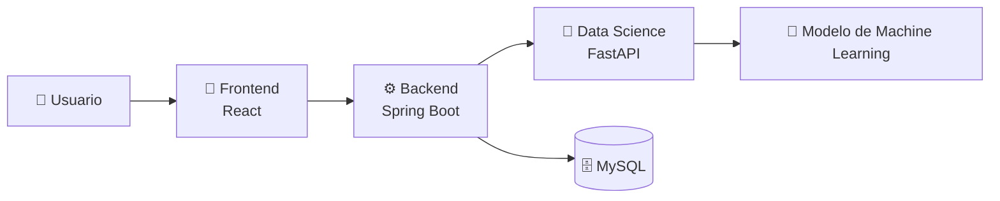
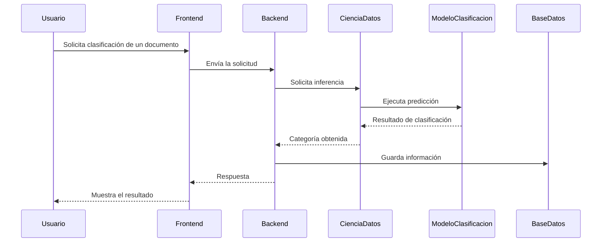
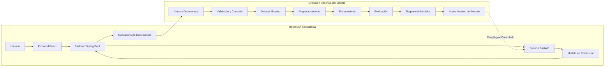

# 🏛️ Arquitectura de AyniKortex

> **Versión:** 2.0  
> **Estado:** En desarrollo  
> **Proyecto:** AyniKortex – Transformando documentación técnica en conocimiento inteligente.

---

# 🎯 Propósito

Este documento presenta la arquitectura general de **AyniKortex**, describiendo los componentes principales del sistema, sus responsabilidades y la forma en que interactúan para transformar documentación técnica en conocimiento organizado e inteligente.

Su objetivo es proporcionar una visión técnica de alto nivel que facilite la comprensión del sistema por parte de desarrolladores, colaboradores y nuevos integrantes del proyecto.

Los detalles específicos de implementación, contratos entre componentes y decisiones de diseño se documentan en archivos especializados para mantener una única fuente de verdad y evitar duplicidad de información.

---

# 🌐 Visión General del Sistema

AyniKortex es una plataforma diseñada para organizar y clasificar documentación técnica mediante técnicas de Machine Learning.

El sistema está compuesto por cuatro componentes principales que trabajan de manera coordinada:

- 🎨 **Frontend**, encargado de la interacción con el usuario.
- ⚙️ **Backend**, responsable de la lógica de negocio y la orquestación del sistema.
- 🤖 **Data Science**, encargado del procesamiento e inferencia mediante modelos de Machine Learning.
- 🗄️ **Base de Datos**, destinada al almacenamiento de la información generada por la plataforma.

Cada componente posee responsabilidades claramente definidas, permitiendo una arquitectura modular, mantenible y preparada para evolucionar conforme crezcan las necesidades del proyecto.

La comunicación entre componentes sigue una arquitectura basada en APIs, donde el Backend actúa como punto central de integración entre la interfaz de usuario, el componente de Ciencia de Datos y la persistencia de la información.

---

# 🏗️ Principios Arquitectónicos

La arquitectura de AyniKortex se basa en los siguientes principios:

| Principio | Descripción |
|-----------|-------------|
| Separación de Responsabilidades | Cada componente tiene una función claramente definida y especializada. |
| Bajo Acoplamiento | Los componentes interactúan mediante interfaces bien definidas, reduciendo dependencias directas. |
| Alta Cohesión | Cada módulo concentra funcionalidades relacionadas con una única responsabilidad. |
| Escalabilidad | La arquitectura permite evolucionar cada componente de forma independiente. |
| Mantenibilidad | La organización del proyecto facilita la incorporación de nuevas funcionalidades y el mantenimiento del código. |
| Desarrollo Incremental | El sistema evoluciona mediante iteraciones controladas, manteniendo siempre una arquitectura estable. |
| Documentación como Fuente de Verdad | Cada documento describe un único tema, evitando duplicidad y facilitando su mantenimiento. |

---

---

# 🧩 Arquitectura de Alto Nivel

La arquitectura de AyniKortex está organizada en componentes especializados que colaboran para ofrecer una plataforma capaz de gestionar y clasificar documentación técnica de forma inteligente.

Cada componente tiene una responsabilidad claramente definida y se comunica mediante interfaces bien establecidas, favoreciendo un bajo acoplamiento, una alta cohesión y una evolución independiente de cada módulo.



El Backend actúa como punto central de integración del sistema, coordinando la comunicación entre la interfaz de usuario, el componente de Ciencia de Datos y la base de datos.

Esta arquitectura facilita el mantenimiento, la incorporación de nuevas funcionalidades y la evolución independiente de cada componente.

---

# 🔄 Flujo General del Sistema

El siguiente diagrama muestra el recorrido de una solicitud desde que un usuario interactúa con la plataforma hasta que obtiene un resultado.



## Proceso General

1. El usuario interactúa con la interfaz de AyniKortex.
2. El Frontend envía la solicitud al Backend.
3. El Backend valida y procesa la información recibida.
4. Cuando es necesario clasificar contenido técnico, el Backend solicita una inferencia al componente de Data Science.
5. El componente de Data Science utiliza el modelo de Machine Learning para generar la clasificación correspondiente.
6. El Backend almacena la información relevante en la base de datos.
7. Finalmente, el Backend devuelve la respuesta al Frontend para que sea presentada al usuario.

---

# 📦 Componentes del Sistema

La solución está organizada en cuatro componentes principales.

| Componente | Responsabilidad |
|------------|-----------------|
| 🎨 **Frontend** | Proporciona la interfaz de usuario para consultar, registrar y visualizar documentación técnica. |
| ⚙️ **Backend** | Implementa la lógica de negocio, expone la API REST, coordina la comunicación entre componentes y gestiona la persistencia de datos. |
| 🤖 **Data Science** | Ejecuta el procesamiento de documentos y la inferencia mediante modelos de Machine Learning para realizar la clasificación automática. |
| 🗄️ **Base de Datos** | Almacena la información técnica, los resultados de clasificación y los datos necesarios para el funcionamiento del sistema. |

---

---

# 🎨 Frontend

El Frontend constituye el punto de interacción entre los usuarios y la plataforma AyniKortex.

Su principal responsabilidad es proporcionar una experiencia de usuario intuitiva para consultar, registrar y gestionar documentación técnica, consumiendo los servicios expuestos por el Backend mediante APIs REST.

### Responsabilidades

- Presentar la interfaz gráfica del sistema.
- Gestionar la interacción con el usuario.
- Consumir los servicios del Backend.
- Mostrar los resultados de clasificación.
- Validar información básica antes de enviarla al Backend.

### Tecnologías

- React
- HTML5
- CSS3
- JavaScript

---

# ⚙️ Backend

El Backend representa el núcleo de la aplicación y actúa como orquestador de todos los componentes del sistema.

Es responsable de centralizar la lógica de negocio, gestionar la persistencia de la información y coordinar la comunicación con el componente de Data Science.

### Responsabilidades

- Exponer la API REST.
- Gestionar la lógica de negocio.
- Validar solicitudes.
- Administrar la persistencia de datos.
- Solicitar inferencias al componente de Data Science.
- Consolidar la información enviada al Frontend.

### Tecnologías

- Spring Boot
- Java
- MySQL

---

# 🤖 Data Science

El componente de Data Science incorpora las capacidades de Machine Learning dentro de AyniKortex.

Su función principal es analizar documentación técnica y generar clasificaciones utilizando modelos previamente entrenados.

### Responsabilidades

- Preprocesar documentos.
- Ejecutar inferencias.
- Administrar el modelo entrenado.
- Generar categorías.
- Devolver resultados al Backend.

### Tecnologías

- Python
- FastAPI
- Scikit-learn
- Pandas
- NumPy

---

# 🗄️ Base de Datos

La base de datos almacena la información utilizada por la plataforma y permite conservar el historial de documentos y resultados obtenidos durante el funcionamiento del sistema.

### Responsabilidades

- Almacenar información del sistema.
- Persistir resultados de clasificación.
- Gestionar consultas.
- Garantizar la integridad de la información.

### Tecnología

- MySQL

---

---

# 🔗 Comunicación entre Componentes

Los componentes de AyniKortex interactúan mediante interfaces claramente definidas, reduciendo el acoplamiento y facilitando el mantenimiento del sistema.

| Origen | Destino | Medio de Comunicación |
|---------|----------|-----------------------|
| Usuario | Frontend | Interfaz Web |
| Frontend | Backend | API REST (HTTP/JSON) |
| Backend | Data Science | API REST (FastAPI) |
| Backend | Base de Datos | JDBC / JPA |
| Data Science | Modelo de Machine Learning | Llamadas internas |

---

---

# 💻 Stack Tecnológico

AyniKortex integra diferentes tecnologías especializadas para construir una plataforma modular, escalable y orientada a la gestión inteligente del conocimiento técnico.

| Capa | Tecnología | Propósito |
|------|------------|-----------|
| 🎨 Presentación | React | Desarrollo de la interfaz de usuario. |
| ⚙️ Aplicación | Spring Boot | Implementación de la lógica de negocio y exposición de la API REST. |
| 🤖 Inteligencia | Python | Desarrollo del componente de Ciencia de Datos. |
| 🤖 Inferencia | FastAPI | Exposición de los servicios de Machine Learning para su consumo por el Backend. |
| 🧠 Machine Learning | Scikit-learn | Entrenamiento e inferencia del modelo de clasificación. |
| 📊 Procesamiento | Pandas | Manipulación y preparación de datos. |
| 🔢 Computación | NumPy | Operaciones numéricas utilizadas durante el procesamiento. |
| 🗄️ Persistencia | MySQL | Almacenamiento de la información del sistema. |
| 🔧 Control de versiones | Git & GitHub | Gestión colaborativa del código fuente. |

La selección de estas tecnologías responde a criterios de mantenibilidad, escalabilidad, integración y disponibilidad de herramientas ampliamente utilizadas por la comunidad.

---

# 📂 Organización del Repositorio

El repositorio se organiza de forma modular para facilitar el desarrollo independiente de cada componente y mantener una estructura clara para todos los colaboradores.

```text
AyniKortex/

├── .github/
│   ├── CONTRIBUTING.md
│   ├── CODE_OF_CONDUCT.md
│   ├── SECURITY.md
│   └── SUPPORT.md
│
├── frontend/
│
├── backend/
│
├── data_science/
│
├── docs/
│   ├── architecture/
│   ├── roadmap/
│   └── documentation/
│
├── README.md
└── LICENSE
```

La estructura podrá evolucionar conforme el proyecto incorpore nuevos componentes y documentación adicional.

---

# 📈 Escalabilidad

La arquitectura de AyniKortex ha sido diseñada para facilitar su evolución sin comprometer la estabilidad de los componentes existentes.

Entre las principales capacidades de crecimiento se encuentran:

- Incorporar nuevos modelos de Machine Learning sin modificar el Frontend.
- Sustituir o mejorar el componente de Data Science manteniendo la integración con el Backend.
- Ampliar la funcionalidad del Backend mediante nuevos servicios.
- Escalar la interfaz de usuario con nuevos módulos y funcionalidades.
- Integrar nuevos mecanismos de autenticación y autorización.
- Incorporar nuevas fuentes de información y tipos documentales.

La separación de responsabilidades permite que cada componente evolucione de manera independiente, reduciendo el impacto de los cambios sobre el resto del sistema.

---

# 🚧 Alcance del MVP

La primera versión de AyniKortex se enfoca en validar la arquitectura propuesta y demostrar el funcionamiento integral de la plataforma.

## Incluye

- Gestión de documentación técnica.
- Clasificación automática mediante Machine Learning.
- Integración entre Frontend, Backend y Data Science.
- Persistencia de la información.
- Consulta de resultados desde la interfaz de usuario.

## No incluye

- Autenticación y autorización avanzada.
- Procesamiento distribuido.
- Arquitectura basada en microservicios.
- Inteligencia Artificial Generativa.
- Modelos de Lenguaje (LLM).
- Retrieval-Augmented Generation (RAG).
- Bases de datos vectoriales.
- Procesamiento en tiempo real.
- Infraestructura de alta disponibilidad.

Estas capacidades podrán evaluarse en futuras etapas del proyecto conforme evolucionen los objetivos y necesidades de la plataforma.

---

# 📚 Referencias

La arquitectura de AyniKortex se complementa con la documentación especializada disponible en el repositorio.

- 📘 README.md
- 📖 DOCUMENTATION_STYLE_GUIDE.md
- 🗺️ ROADMAP.md
- 🤝 CONTRIBUTING.md
- 🔒 SECURITY.md
- 📜 CODE_OF_CONDUCT.md

Cada documento aborda un aspecto específico del proyecto, evitando la duplicidad de información y manteniendo una única fuente de verdad para cada tema.

---

# Ciclo de Vida del Modelo en Producción

## Objetivo

Una vez desplegado el MVP, el modelo de Machine Learning no permanece estático. La arquitectura de AyniKortex está diseñada para permitir la evolución continua del modelo mediante la incorporación de nuevos datos, la actualización del Dataset Maestro y el entrenamiento controlado de nuevas versiones.

Este proceso **no forma parte del alcance del MVP del Hackathon**, pero representa la evolución natural del producto hacia un entorno de producción.

---

## Ciclo de Vida del Modelo



---

## Descripción del proceso

### Operación diaria

Durante la operación normal del sistema, los usuarios interactúan con la plataforma mediante el Frontend. Las solicitudes son gestionadas por Spring Boot, que consume el servicio de inferencia implementado con FastAPI.

El modelo únicamente realiza predicciones utilizando el conocimiento adquirido durante el entrenamiento y devuelve la clasificación correspondiente.

Los documentos procesados y sus resultados son almacenados en el repositorio del sistema para su trazabilidad.

---

### Incorporación de nuevos datos

Los documentos almacenados representan una fuente potencial de información para mejorar futuras versiones del modelo.

Sin embargo, **los nuevos documentos no reentrenan automáticamente el modelo**.

Antes de ser utilizados para entrenamiento deben pasar por un proceso de:

- validación
- limpieza
- curación
- etiquetado
- control de calidad

Solo los documentos validados son incorporados al Dataset Maestro.

---

### Reentrenamiento controlado

Cuando existe suficiente información nueva o se identifica la necesidad de mejorar el desempeño del modelo, el equipo de Ciencia de Datos ejecuta un nuevo proceso de entrenamiento.

Este proceso reutiliza el pipeline completo definido durante el desarrollo:

1. Preprocesamiento
2. Ingeniería de características
3. Entrenamiento
4. Evaluación
5. Comparación con la versión actual

---

### Versionado del modelo

Cada proceso de entrenamiento genera una nueva versión del modelo.

Las versiones anteriores permanecen registradas para facilitar:

- auditoría
- trazabilidad
- comparación de métricas
- rollback
- análisis histórico

Una nueva versión solo es promovida a producción cuando demuestra un mejor desempeño respecto al modelo actualmente desplegado.

---

### Despliegue

Una vez aprobada una nueva versión, el servicio de inferencia actualiza el modelo utilizado para responder las solicitudes del sistema.

Este proceso se realiza de forma controlada, sin afectar la continuidad del servicio.

---

## Beneficios de la arquitectura

| Beneficio | Descripción |
|-----------|-------------|
| Separación de responsabilidades | La operación diaria y el entrenamiento del modelo son procesos independientes. |
| Escalabilidad | Permite incorporar grandes volúmenes de información sin afectar la disponibilidad del sistema. |
| Trazabilidad | Cada versión del modelo puede asociarse al dataset y a las métricas utilizadas durante su entrenamiento. |
| Mantenibilidad | El modelo puede evolucionar sin modificar la lógica del Backend ni del Frontend. |
| Versionado | Facilita la comparación entre modelos y la recuperación de versiones anteriores. |
| Evolución hacia MLOps | La arquitectura permite incorporar en el futuro procesos automatizados de monitoreo, reentrenamiento y despliegue continuo. |

---

## Consideraciones

Este flujo representa la evolución prevista de AyniKortex una vez finalizado el MVP.

Durante el Hackathon, el alcance del proyecto contempla el entrenamiento, evaluación, integración y despliegue del modelo seleccionado. La automatización del ciclo de vida del modelo y su reentrenamiento continuo constituyen una evolución futura del producto y sientan las bases para una arquitectura orientada a MLOps.