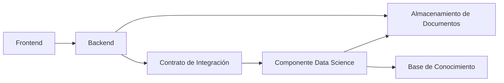
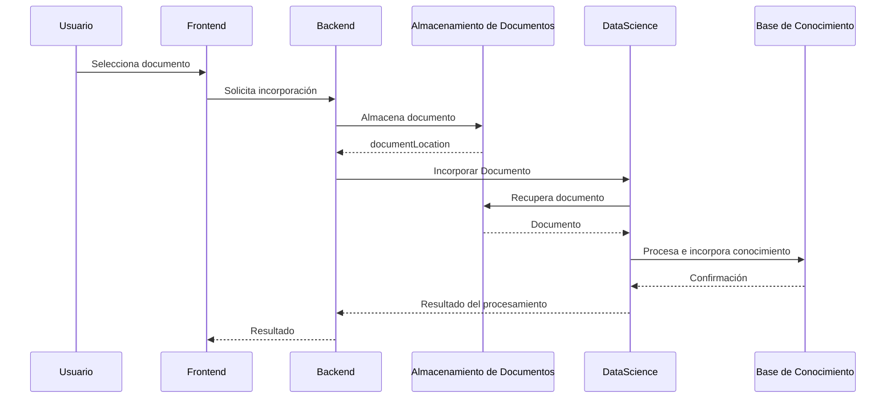
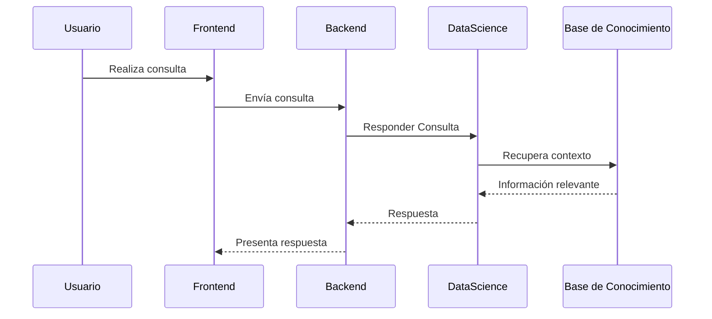

# Backend-Data-Contract.md

**Proyecto:** AyniKortex  
**Documento:** Contrato de Integración Backend – Data Science  
**Versión:** 0.1 (Draft)  
**Estado:** En revisión  
**Responsable:** Equipo Data Science  
**Consumidor:** Equipo Backend  
**Última actualización:** 21/07/2026

---

# Historial de Cambios

| Versión | Fecha | Autor | Descripción |
|----------|------|--------|-------------|
| 0.1 | 21/07/2026 | Equipo Data Science | Creación inicial del documento. |

---

# Tabla de Contenido

1. Introducción
2. Objetivo
3. Alcance
4. Referencias
5. Arquitectura de Integración
6. Principios del Contrato
7. Distribución de Responsabilidades
8. Operaciones del Componente
9. Flujo General de Integración
10. Reglas Generales
11. Manejo de Errores
12. Compatibilidad y Versionado
13. Consideraciones Futuras

---

# 1. Introducción

El presente documento define el **Contrato de Integración** entre los componentes **Backend** y **Data Science** del proyecto **AyniKortex**.

Su propósito es establecer un acuerdo funcional que permita la comunicación entre ambos componentes mediante un conjunto de operaciones claramente definidas, manteniendo un bajo acoplamiento y permitiendo que cada equipo evolucione su implementación interna de manera independiente.

Este documento constituye la referencia oficial para el desarrollo de la integración entre ambos equipos.

> [!IMPORTANT]
> Este documento describe únicamente el comportamiento esperado del componente de Data Science y las reglas de interacción con Backend. No documenta algoritmos de Machine Learning, arquitectura interna, ni detalles de implementación.

---

# 2. Objetivo

Definir un contrato funcional estable entre Backend y Data Science que permita:

- Desarrollar ambos componentes de forma paralela.
- Reducir el acoplamiento entre tecnologías.
- Establecer responsabilidades claras entre equipos.
- Facilitar el mantenimiento y evolución del sistema.
- Garantizar la compatibilidad durante todo el ciclo de vida del proyecto.

---

# 3. Alcance

Este documento define:

- Las operaciones ofrecidas por el componente Data Science.
- Las responsabilidades de cada componente.
- Las reglas generales de interacción.
- Los contratos funcionales de entrada y salida.
- El manejo de errores funcionales.
- Las políticas de versionado del contrato.

Este documento **no incluye**:

- Diseño interno del pipeline de Machine Learning.
- Arquitectura interna del componente Data Science.
- Algoritmos de clasificación.
- Estrategias de entrenamiento.
- Modelos de datos internos del pipeline.
- Tecnologías específicas de implementación.

---

# 4. Referencias

| Documento | Descripción |
|-----------|-------------|
| Software Design Specification (SDS) | Arquitectura general del sistema |
| ADR - Arquitectura | Decisiones arquitectónicas aprobadas |
| Backend-Data-Model.md | Modelos de intercambio entre Backend y Data Science |
| Engineering Standards | Estándares de desarrollo del proyecto |

# 5. Arquitectura de Integración

## 5.1 Visión General

El sistema **AyniKortex** está compuesto por componentes especializados que colaboran mediante responsabilidades claramente definidas.

El componente **Backend** actúa como el orquestador de la aplicación, administrando el flujo funcional, la autenticación, la gestión de usuarios y la comunicación con los diferentes servicios del sistema.

El componente **Data Science** es responsable del ciclo completo de procesamiento del conocimiento, incluyendo la incorporación de documentos, el procesamiento de información, la administración de la Base de Conocimiento y la generación de respuestas inteligentes.

Ambos componentes interactúan exclusivamente mediante el **Contrato de Integración**, el cual constituye la única interfaz funcional autorizada entre ambos equipos.

> [!IMPORTANT]
> Backend no conoce la implementación interna del componente Data Science.
>
> Data Science no conoce la lógica de negocio implementada por Backend.
>
> Ambos componentes evolucionan de manera independiente respetando el Contrato de Integración.

---

## 5.2 Arquitectura General

---

## 5.3 Principios de Integración

La comunicación entre Backend y Data Science se rige por los siguientes principios arquitectónicos.

### Desacoplamiento

Backend y Data Science deben evolucionar de manera independiente.

Los cambios internos realizados por cualquiera de los componentes no deberán afectar al otro mientras el Contrato de Integración permanezca compatible.

---

### Responsabilidad Única

Cada componente es responsable únicamente de su dominio funcional.

Backend administra la lógica de negocio de la aplicación.

Data Science administra el conocimiento técnico del sistema.

---

### Independencia Tecnológica

El Contrato de Integración es independiente de la tecnología utilizada para implementar la comunicación.

La implementación podrá realizarse mediante REST, gRPC, mensajería u otro mecanismo equivalente sin modificar el comportamiento funcional descrito en este documento.

---

### Encapsulamiento

Backend nunca accede directamente a:

- modelos de Machine Learning
- embeddings
- pipelines
- algoritmos
- estructuras internas de Data Science

De la misma forma, Data Science no administra:

- usuarios
- autenticación
- autorización
- proyectos
- reglas de negocio

---

### Compatibilidad

Toda modificación que afecte el Contrato de Integración deberá mantener compatibilidad con las versiones soportadas o generar una nueva versión del contrato.

---

# 6. Modelo de Colaboración entre Componentes

## 6.1 Propósito

El objetivo del Modelo de Colaboración es establecer una separación clara de responsabilidades entre los componentes **Backend** y **Data Science**, evitando duplicidad de funciones y reduciendo el acoplamiento entre ambos equipos.

Cada componente es responsable exclusivamente de las capacidades asociadas a su dominio funcional.

Esta distribución permite que ambos equipos desarrollen, prueben y evolucionen sus componentes de forma independiente, manteniendo como único punto de contacto el Contrato de Integración.

---

## 6.2 Responsabilidades del Backend

El componente Backend actúa como el orquestador principal de la aplicación y es responsable de administrar el flujo funcional del sistema.

Entre sus responsabilidades se encuentran:

- Gestión de usuarios.
- Autenticación y autorización.
- Administración de proyectos.
- Recepción de solicitudes del Frontend.
- Administración del almacenamiento físico de los documentos.
- Validación funcional de las solicitudes.
- Invocación del componente Data Science.
- Administración de auditoría y trazabilidad.
- Presentación de resultados al usuario.

> [!NOTE]
> Backend no ejecuta procesos de análisis documental, clasificación, indexación ni recuperación de conocimiento.

---

## 6.3 Responsabilidades del Componente Data Science

El componente Data Science administra el ciclo completo del conocimiento técnico del sistema.

Entre sus responsabilidades se encuentran:

- Validación técnica del documento recibido.
- Extracción de contenido.
- Normalización del texto.
- Preprocesamiento documental.
- Clasificación automática.
- Generación de representaciones semánticas.
- Administración de la Base de Conocimiento.
- Recuperación de contexto.
- Generación de respuestas.
- Administración del ciclo de vida del conocimiento.

> [!NOTE]
> Data Science no administra usuarios, autenticación, proyectos ni reglas de negocio de la aplicación.

---

## 6.4 Matriz de Responsabilidades

| Funcionalidad | Backend | Data Science |
|---------------|:-------:|:------------:|
| Autenticación | ✅ | ❌ |
| Autorización | ✅ | ❌ |
| Gestión de usuarios | ✅ | ❌ |
| Gestión de proyectos | ✅ | ❌ |
| Recepción del documento | ✅ | ❌ |
| Almacenamiento físico del documento | ✅ | ❌ |
| Validación funcional de la solicitud | ✅ | ❌ |
| Validación técnica del documento | ❌ | ✅ |
| Extracción de contenido | ❌ | ✅ |
| Limpieza y normalización | ❌ | ✅ |
| Clasificación documental | ❌ | ✅ |
| Generación de embeddings | ❌ | ✅ |
| Administración de la Base de Conocimiento | ❌ | ✅ |
| Recuperación de contexto | ❌ | ✅ |
| Generación de respuestas | ❌ | ✅ |
| Presentación de resultados | ✅ | ❌ |
| Auditoría | ✅ | ❌ |

---

## 6.5 Límites de Responsabilidad

Para garantizar una correcta separación de responsabilidades, se establecen las siguientes restricciones:

### Backend nunca deberá:

- Acceder directamente a la Base de Conocimiento.
- Ejecutar algoritmos de Machine Learning.
- Administrar embeddings.
- Procesar documentos.
- Modificar el pipeline de Data Science.

### Data Science nunca deberá:

- Administrar usuarios.
- Gestionar autenticación.
- Gestionar autorización.
- Administrar proyectos.
- Implementar reglas de negocio de la aplicación.
- Exponer información de infraestructura al usuario final.

> [!IMPORTANT]
> Toda interacción entre ambos componentes deberá realizarse exclusivamente mediante las operaciones definidas en este Contrato de Integración.

---

# 7. Capacidades del Componente Data Science

## 7.1 Visión General

El componente **Data Science** expone un conjunto de capacidades funcionales que permiten incorporar conocimiento técnico y responder consultas sobre la Base de Conocimiento.

Cada capacidad representa una funcionalidad de negocio independiente de la tecnología utilizada para su implementación.

Las capacidades descritas en esta sección constituyen la única interfaz funcional soportada por el componente Data Science.

> [!IMPORTANT]
> El Contrato de Integración describe capacidades funcionales, no mecanismos de comunicación.
>
> La implementación podrá realizarse mediante REST, gRPC, mensajería o cualquier otro mecanismo equivalente sin modificar el presente contrato.

---

## 7.2 Capacidad: Incorporar Documento

### Descripción

Permite incorporar un documento técnico a la Base de Conocimiento para que pueda ser utilizado posteriormente durante los procesos de recuperación de información y generación de respuestas.

Durante esta capacidad, el componente Data Science ejecuta todas las actividades necesarias para transformar un documento en conocimiento disponible para consulta.

### Objetivo

Procesar un documento recibido desde Backend e incorporarlo a la Base de Conocimiento.

### Responsabilidades

Durante esta capacidad, Data Science es responsable de:

- Validar técnicamente el documento.
- Extraer el contenido.
- Normalizar la información.
- Ejecutar el preprocesamiento documental.
- Clasificar el documento.
- Generar representaciones semánticas cuando corresponda.
- Indexar la información.
- Actualizar la Base de Conocimiento.
- Registrar el resultado del procesamiento.

### Precondiciones

- El documento debe existir.
- El documento debe cumplir los formatos soportados.
- La solicitud debe contener toda la información obligatoria definida en el modelo correspondiente.

### Postcondiciones

Al finalizar la operación:

- El documento habrá sido procesado completamente.
- La Base de Conocimiento reflejará el nuevo contenido disponible.
- El resultado del procesamiento será retornado al componente Backend.

### Modelos utilizados

| Modelo | Dirección |
|---------|-----------|
| ProcessDocumentRequest | Entrada |
| ProcessDocumentResponse | Salida |

Los modelos son definidos en el documento **Backend-Data-Model.md**.

---

## 7.3 Capacidad: Responder Consulta

### Descripción

Permite obtener una respuesta basada en el conocimiento previamente incorporado a la Base de Conocimiento.

El componente Data Science administra todo el proceso de recuperación de información, construcción de contexto y generación de la respuesta.

### Objetivo

Responder consultas utilizando exclusivamente la información disponible en la Base de Conocimiento.

### Responsabilidades

Durante esta capacidad, Data Science es responsable de:

- Validar la consulta.
- Recuperar información relevante.
- Construir el contexto.
- Generar la respuesta.
- Identificar las referencias utilizadas.
- Retornar el resultado al Backend.

### Precondiciones

- La Base de Conocimiento debe encontrarse disponible.
- La consulta debe cumplir las reglas definidas por el contrato.

### Postcondiciones

Al finalizar la operación:

- Se generará una respuesta.
- Se devolverán las referencias utilizadas cuando corresponda.
- Se informará el estado de la operación.

### Modelos utilizados

| Modelo | Dirección |
|---------|-----------|
| AnswerQuestionRequest | Entrada |
| AnswerQuestionResponse | Salida |

Los modelos son definidos en el documento **Backend-Data-Model.md**.

---

# 8. Escenarios de Integración

Este capítulo describe los escenarios funcionales de interacción entre los componentes **Backend** y **Data Science**.

Cada escenario representa una capacidad ofrecida por el componente Data Science y define la secuencia general de colaboración entre ambos componentes.

Los modelos de datos utilizados durante estas interacciones se describen en el documento **Backend-Data-Model.md**.

---

## 8.1 Escenario: Incorporación de Documento

### Descripción

Este escenario describe el proceso mediante el cual un documento técnico es incorporado a la Base de Conocimiento.

El componente **Backend** administra el ciclo de vida del documento físico, mientras que el componente **Data Science** es responsable del procesamiento documental y de la administración del conocimiento generado.

El procesamiento incluye todas las actividades necesarias para transformar un documento en información disponible para futuras consultas.

---

### Flujo de Integración

---

### Información requerida

Para ejecutar esta capacidad, Backend deberá proporcionar como mínimo:

| Información | Obligatorio |
|-------------|-------------|
| Identificador del documento | Sí |
| Identificador del proyecto | Sí |
| Ubicación del documento | Sí |
| Tipo de documento | Sí |

Los atributos específicos se describen en **Backend-Data-Model.md**.

---

### Resultado esperado

Al finalizar la operación:

- El documento habrá sido procesado correctamente.
- El conocimiento extraído estará disponible para futuras consultas.
- Backend recibirá el resultado del procesamiento.

---

## 8.2 Escenario: Responder Consulta

### Descripción

Este escenario describe el proceso mediante el cual el componente Data Science responde una consulta utilizando la información disponible en la Base de Conocimiento.

Backend administra la interacción con el usuario, mientras que Data Science ejecuta las tareas de recuperación de contexto y generación de la respuesta.

---

### Flujo de Integración

---

### Información requerida

Para ejecutar esta capacidad, Backend deberá proporcionar como mínimo:

| Información | Obligatorio |
|-------------|-------------|
| Identificador del proyecto | Sí |
| Consulta | Sí |

Los atributos específicos se describen en **Backend-Data-Model.md**.

---

### Resultado esperado

Al finalizar la operación:

- Se generará una respuesta basada en la Base de Conocimiento.
- Se devolverán las referencias utilizadas cuando estén disponibles.
- Backend recibirá el resultado de la consulta.

---

## 8.3 Restricciones Operacionales

Las siguientes restricciones aplican a todos los escenarios definidos en este Contrato de Integración.

| Código | Restricción |
|---------|-------------|
| RO-01 | Backend es responsable del almacenamiento físico de los documentos. |
| RO-02 | Data Science accede a los documentos únicamente mediante la ubicación proporcionada por Backend. |
| RO-03 | Data Science administra exclusivamente la Base de Conocimiento. |
| RO-04 | Todo documento deberá pertenecer a un proyecto válido. |
| RO-05 | El Contrato de Integración es independiente del protocolo de comunicación utilizado. |
| RO-06 | Los modelos de intercambio se definen en el documento **Backend-Data-Model.md**. |
| RO-07 | Ningún componente accederá directamente a las estructuras internas del otro componente. |

---

### Decisiones Arquitectónicas

> [!IMPORTANT]
>
> Para la versión **1.0** del Contrato de Integración se establecen las siguientes decisiones:
>
> - El procesamiento documental será **síncrono**.
> - Backend administrará el almacenamiento físico de los documentos.
> - Data Science administrará el procesamiento documental y la Base de Conocimiento.
> - Backend nunca accederá directamente a la Base de Conocimiento.
> - Data Science nunca administrará usuarios, autenticación ni proyectos.
> - La implementación tecnológica podrá evolucionar sin modificar este contrato.

---

# 9. Acuerdos de Integración

Este capítulo establece los acuerdos que deberán respetar los componentes Backend y Data Science durante toda la vida útil del sistema.

Estos acuerdos tienen como objetivo garantizar una integración consistente, desacoplada y mantenible.

---

## 9.1 Administración del Documento

El almacenamiento físico de los documentos es responsabilidad exclusiva del componente Backend.

Data Science accederá a los documentos únicamente mediante la ubicación proporcionada por Backend y nunca administrará el almacenamiento físico de los archivos.

---

## 9.2 Administración del Conocimiento

La Base de Conocimiento es administrada exclusivamente por Data Science.

Backend no accederá directamente a su estructura interna ni realizará operaciones de procesamiento documental.

---

## 9.3 Ciclo de Vida

El ciclo de vida del documento y el ciclo de vida del conocimiento son independientes.

Backend administra:

- Creación del documento.
- Almacenamiento.
- Asociación con proyectos.
- Administración documental.

Data Science administra:

- Procesamiento.
- Extracción de información.
- Indexación.
- Recuperación de contexto.
- Generación de respuestas.

---

## 9.4 Modelos de Intercambio

Toda la información intercambiada entre ambos componentes deberá cumplir las definiciones establecidas en el documento **Backend-Data-Model.md**.

Ningún componente podrá asumir atributos no definidos en dicho documento.

---

## 9.5 Independencia Tecnológica

Este contrato define capacidades funcionales y reglas de integración.

La implementación tecnológica podrá evolucionar sin modificar este documento, siempre que se mantenga la compatibilidad funcional.

---

# 10. Manejo de Errores

Toda condición que impida completar una capacidad deberá ser informada mediante el modelo de respuesta correspondiente.

---

## 10.1 Principios

- Los errores deberán ser descriptivos.
- No deberán exponerse detalles internos de implementación.
- Backend será responsable de comunicar el resultado al usuario final.

---

## 10.2 Clasificación General

| Categoría | Descripción |
|-----------|-------------|
| Validación | Información de entrada incompleta o inválida. |
| Documento | El documento no puede recuperarse o procesarse. |
| Procesamiento | Error durante el procesamiento documental. |
| Conocimiento | Error durante la recuperación de información. |
| Sistema | Error interno del componente. |

---

## 10.3 Responsabilidades

Backend administrará:

- Reintentos.
- Comunicación con Frontend.
- Auditoría.

Data Science administrará:

- Detección del error.
- Registro técnico.
- Generación del resultado correspondiente.

---

# 11. Compatibilidad y Versionado

El Contrato de Integración será versionado para garantizar la compatibilidad entre Backend y Data Science.

---

## 11.1 Compatibilidad

Las modificaciones que agreguen nuevas capacidades o atributos opcionales deberán mantener la compatibilidad con versiones anteriores.

Las modificaciones incompatibles requerirán una nueva versión mayor del contrato.

---

## 11.2 Versionado

Se adopta el siguiente esquema:

| Versión | Descripción |
|----------|-------------|
| Mayor | Cambios incompatibles. |
| Menor | Nuevas capacidades compatibles. |
| Corrección | Ajustes editoriales o aclaraciones. |

---

## 11.3 Vigencia

Este documento corresponde a la versión **1.0** del Contrato de Integración.

---

# 12. Consideraciones Futuras

Las siguientes capacidades podrán incorporarse en versiones posteriores del Contrato de Integración:

- Procesamiento asíncrono de documentos.
- Reprocesamiento documental.
- Eliminación de conocimiento.
- Versionado documental.
- Procesamiento incremental.
- Nuevas capacidades de consulta.
- Integración con múltiples repositorios documentales.

La incorporación de estas capacidades deberá preservar, en la medida de lo posible, la compatibilidad con versiones anteriores del contrato.

---

# Anexo A. Decisiones Arquitectónicas

> [!IMPORTANT]
>
> Las siguientes decisiones fueron adoptadas para la versión **1.0** del proyecto.

| Código | Decisión |
|---------|----------|
| DA-01 | Backend administra el almacenamiento físico de los documentos. |
| DA-02 | Data Science administra la Base de Conocimiento. |
| DA-03 | Data Science nunca modifica el documento original. |
| DA-04 | Backend nunca accede directamente a la Base de Conocimiento. |
| DA-05 | El procesamiento documental será síncrono para la versión 1.0. |
| DA-06 | El contrato es independiente del protocolo de comunicación. |
| DA-07 | Los modelos de intercambio se definen en Backend-Data-Model.md. |
| DA-08 | Backend y Data Science evolucionarán de forma desacoplada mientras respeten este contrato. |