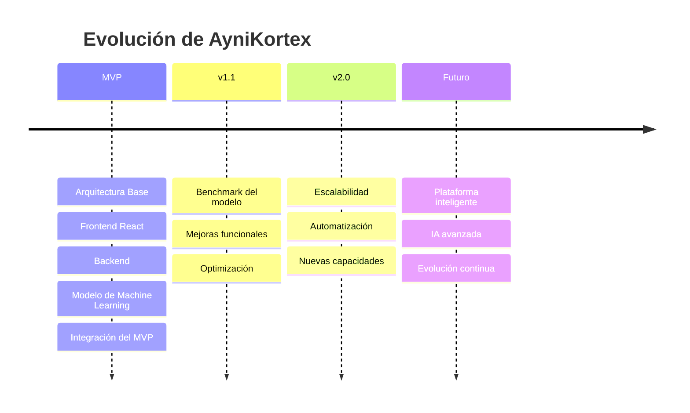

# 🗺️ Roadmap

> **Proyecto:** AyniKortex  
> **Estado:** En evolución

El Roadmap de AyniKortex describe la evolución prevista del proyecto desde la construcción del Producto Mínimo Viable (MVP) hasta futuras versiones de la plataforma.

Más que un listado de tareas, representa la visión de crecimiento del proyecto y la incorporación progresiva de nuevas capacidades, manteniendo siempre los principios de calidad, modularidad y escalabilidad que definen su arquitectura.

---

# 🎯 Objetivo

Este documento proporciona una visión estratégica sobre la evolución funcional y técnica de AyniKortex.

Su propósito es comunicar las metas del proyecto, los principales hitos alcanzados y las capacidades previstas para futuras versiones.

El Roadmap no constituye un cronograma de desarrollo ni un plan de gestión del proyecto. Es una guía que orienta el crecimiento de la plataforma y se actualizará conforme el proyecto evolucione.

---

# 🌟 Visión

AyniKortex busca convertirse en una plataforma capaz de organizar, clasificar y facilitar el acceso al conocimiento técnico mediante el uso de Inteligencia Artificial.

Nuestra evolución está orientada a construir una solución abierta, mantenible y escalable, donde cada nueva capacidad se incorpore de forma incremental y alineada con la arquitectura del sistema.

Cada fase del Roadmap representa un paso hacia una plataforma más completa, preparada para adaptarse a nuevos escenarios y necesidades.

---

# 📅 Evolución del Proyecto

---

# 🚀 Estado del MVP

El MVP de AyniKortex se construye de manera incremental mediante la colaboración entre los diferentes componentes del proyecto.

| Componente | Objetivo | Estado |
|------------|----------|:------:|
| 📚 Documentación | Documentación comunitaria y técnica | 🚧 |
| 🎨 Frontend | Desarrollo de la interfaz React | 🚧 |
| ⚙️ Backend | API REST y lógica de negocio | 🚧 |
| 🤖 Data Science | Modelo de clasificación | ✅ |
| 🔗 Integración | Comunicación entre componentes | ⏳ |
| 🚀 Despliegue | Publicación del MVP | ⏳ |

---

# 🤖 Hitos por Componente

## Data Science

El componente de Ciencia de Datos ha completado el alcance principal definido para el MVP, entregando un modelo entrenado, evaluado, persistido e integrado mediante la interfaz pública predict(title, text). En la etapa actual, el equipo participa en actividades de soporte a la integración con Backend y Frontend, así como en la validación experimental del modelo y las pruebas integrales del sistema.

| Sprint | Objetivo                                                    | Estado |
| ------ | ----------------------------------------------------------- | :----: |
| DS-01  | Arquitectura del componente                                 |    ✅   |
| DS-02  | Investigación y adquisición del dataset                     |    ✅   |
| DS-03  | Construcción del Dataset Maestro                            |    ✅   |
| DS-04  | Preprocesamiento del dataset                                |    ✅   |
| DS-05  | Análisis Exploratorio de Datos (EDA)                        |    ✅   |
| DS-06  | Entrenamiento y evaluación del modelo                       |    ✅   |
| DS-07  | Integración del modelo con Backend (`predict(title, text)`) |    ✅   |
| DS-08  | Persistencia y serialización del modelo                     |    ✅   |
| DS-09  | Benchmark experimental del modelo                           |   🚧   |
| DS-10  | Validación integral del MVP                                 |    ⏳   |

## Frontend

Los principales hitos previstos son:

- Diseño de la interfaz de usuario.
- Gestión de autenticación y sesiones.
- Carga y administración de documentos.
- Visualización de resultados de clasificación.
- Mejoras en experiencia de usuario.

## Backend

Los principales hitos previstos son:

- Desarrollo de APIs REST.
- Gestión de documentos.
- Integración con Data Science.
- Persistencia en MySQL.
- Validaciones y seguridad.

## Integración

Los hitos de integración contemplan:

- Comunicación Frontend ↔ Backend.
- Comunicación Backend ↔ Data Science.
- Persistencia de resultados.
- Validación extremo a extremo.
- Preparación para despliegue del MVP.

---

# 📈 Evolución del Producto

## 🌱 Fase 1 — MVP

Construcción de una plataforma funcional capaz de clasificar documentación técnica mediante Machine Learning.

## 🚀 Fase 2 — Integración y Estabilización

Fortalecer la integración entre componentes, mejorar la experiencia de usuario y estabilizar el sistema.
- Integración Backend ↔ Data Science
- Integración Frontend ↔ Backend
- Validación funcional del MVP
- Benchmark del modelo
- Optimización y Hardening
- Pruebas End-to-End

## 📊 Fase 3 — Escalabilidad

Optimizar el rendimiento, automatizar procesos e incorporar nuevas capacidades.

## 🌍 Fase 4 — Evolución Continua

Expandir la plataforma con nuevas funcionalidades, mejoras en Inteligencia Artificial e integraciones adicionales según las necesidades del proyecto.

---

# 🔮 Capacidades Futuras

Entre las funcionalidades que podrán incorporarse en versiones posteriores se encuentran:

| Área | Capacidades |
|------|-------------|
| 🤖 Inteligencia Artificial | Nuevos modelos de clasificación |
| 📊 Analítica | Dashboards y métricas |
| ⚙️ Backend | Nuevos servicios y APIs |
| 🎨 Frontend | Mejoras de experiencia de usuario |
| 🔐 Seguridad | Autenticación y control de acceso |
| ☁️ Infraestructura | Automatización de despliegues |
| 📚 Documentación | Publicación y gestión colaborativa |

---

# 🌟 Nuestra Visión

AyniKortex evoluciona de manera incremental, priorizando la calidad, la colaboración y la mejora continua.

Este Roadmap representa una guía para el crecimiento del proyecto y se actualizará conforme se alcancen nuevos hitos y se incorporen nuevas capacidades.

Nuestro objetivo es construir una plataforma sostenible, abierta a la colaboración y preparada para enfrentar los desafíos de la gestión inteligente del conocimiento técnico.

