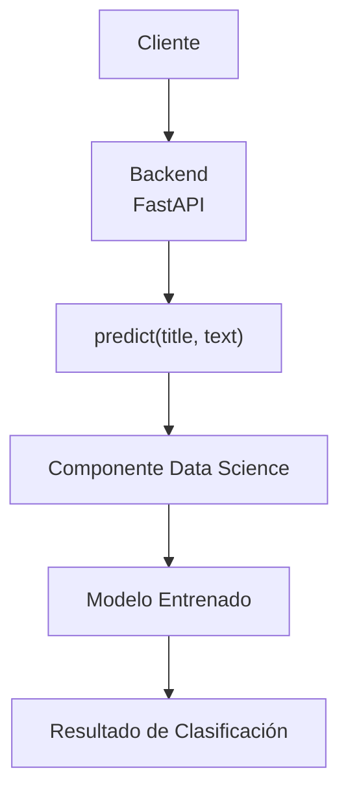
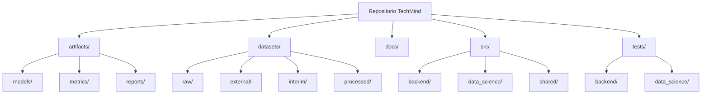
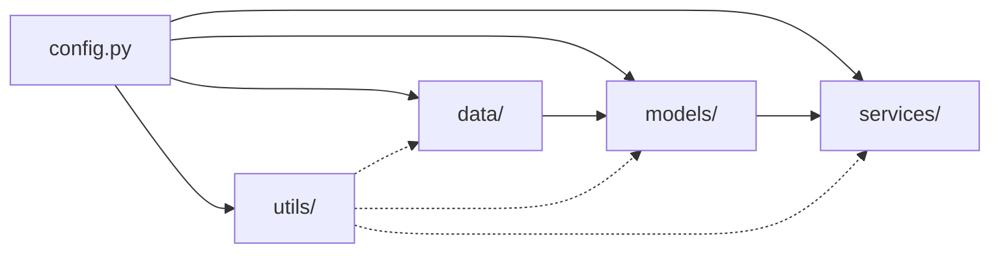
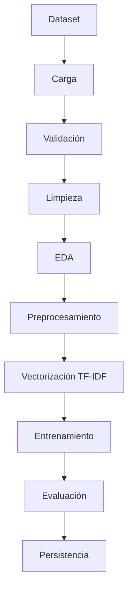
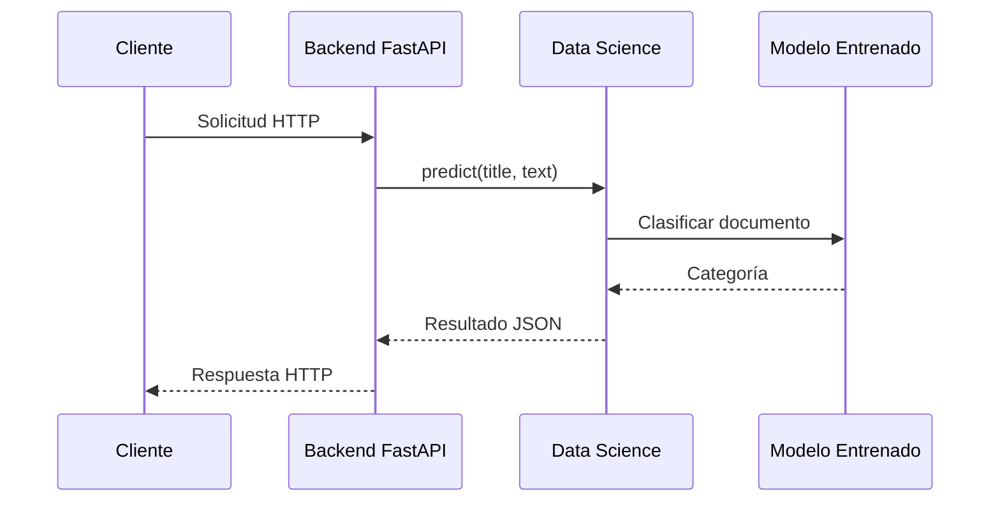

# Sprint DS-01
# Arquitectura del Componente de Ciencia de Datos

| Proyecto | TechMind – Organización Inteligente del Conocimiento Técnico |
|----------|--------------------------------------------------------------|
| Fase | Implementación |
| Sprint | DS-01 |
| Estado | En revisión |
| Responsable | Equipo Data Science |
| Versión | 1.0 |
| Fecha | Julio 2026 |

---

# 1. Objetivo

Diseñar la arquitectura interna del componente de Ciencia de Datos que será responsable del entrenamiento, evaluación e inferencia del modelo de Machine Learning utilizado por TechMind.

Este sprint establece la organización del código, la estructura de directorios, la separación de responsabilidades y el contrato de integración con el Backend.

No se desarrolla todavía ningún modelo de Machine Learning.

---

# 2. Alcance

Durante este sprint se define:

- Arquitectura del componente.
- Organización del código fuente.
- Flujo de entrenamiento.
- Flujo de inferencia.
- Organización de datasets.
- Organización de artefactos.
- Convenciones de desarrollo.
- Estructura de pruebas.
- Contrato de integración con Backend.

---

# 3. Arquitectura General

El componente de Ciencia de Datos forma parte del mismo repositorio del proyecto y no constituye un servicio independiente.

Su única responsabilidad es entrenar un modelo de clasificación y proporcionar una interfaz de inferencia que será utilizada por el Backend.



El componente no expone servicios HTTP, APIs REST ni procesos independientes.

Toda la comunicación se realiza mediante una única función pública.

```python
predict(title: str, text: str)
```

---

# 4. Principios de Diseño

La implementación seguirá los siguientes principios:

- KISS (Keep It Simple)
- Bajo acoplamiento
- Alta cohesión
- Separación de responsabilidades
- Reproducibilidad
- Desarrollo incremental
- Código limpio
- Evitar sobreingeniería

---

# 5. Organización del Proyecto

La estructura existente del proyecto se mantiene.

Únicamente se incorpora el módulo de Ciencia de Datos dentro del directorio `src`.



---

# 6. Arquitectura Interna del Componente Data Science



## Responsabilidades

### data/

Responsable de:

- Carga de datasets.
- Validación.
- Limpieza.
- Normalización.

---

### models/

Responsable de:

- Entrenamiento.
- Evaluación.
- Persistencia.
- Carga del modelo.

---

### services/

Responsable de:

- Motor de inferencia.
- Función pública `predict(title, text)`.

---

### utils/

Responsable de:

- Logging.
- Excepciones.
- Funciones auxiliares.

---

### config.py

Configuración centralizada:

- Rutas.
- Parámetros.
- Semillas.
- Constantes.

---

# 7. Organización de Datasets

Los datasets se almacenarán en:

```text
datasets/
│
├── raw/
├── external/
├── interim/
└── processed/
```

## raw

Datos originales.

Nunca se modifican.

---

## external

Información obtenida de fuentes externas.

---

## interim

Datos parcialmente procesados.

---

## processed

Dataset final listo para entrenamiento.

---

# 8. Organización de Artefactos

Los artefactos generados por el entrenamiento se almacenarán en:

```text
artifacts/
│
├── models/
├── metrics/
└── reports/
```

## models

- classifier.joblib
- vectorizer.joblib
- metadata.joblib

---

## metrics

Resultados de evaluación.

Ejemplos:

- Accuracy
- Precision
- Recall
- F1
- Classification Report

---

## reports

Documentación generada automáticamente.

---

# 9. Flujo de Entrenamiento



Este flujo únicamente se ejecuta durante el entrenamiento del modelo.

---

# 10. Flujo de Inferencia


Este flujo será utilizado en producción.

---

# 11. Convenciones de Desarrollo

- Python 3.12
- Scikit-Learn
- Pandas
- NumPy
- Joblib
- Tipado estático
- Docstrings
- Logging
- Black
- Ruff
- Pytest


## Documentación

- Diagramas en Mermaid.
- Markdown como formato oficial.
- Convención camelCase para nodos Mermaid.
- Identificadores semánticos.
---

# 12. Contrato con Backend

El Backend únicamente conocerá la siguiente función:



```python
predict(title: str, text: str)
```

Esta función constituye la única interfaz pública del componente de Ciencia de Datos. Cualquier cambio en su firma requerirá una revisión de la arquitectura y del contrato de integración con el Backend.

No podrá acceder directamente al modelo ni al vectorizador.

Toda la lógica interna permanecerá encapsulada.

---

# 13. Entregables

| Entregable | Estado |
|------------|--------|
| Arquitectura del componente | ✅ |
| Organización del proyecto | ✅ |
| Organización de datasets | ✅ |
| Organización de artefactos | ✅ |
| Flujo de entrenamiento | ✅ |
| Flujo de inferencia | ✅ |
| Contrato con Backend | ✅ |
| Convenciones | ✅ |

---

# 14. Criterios de Aceptación

Se considerará finalizado el Sprint DS-01 cuando:

- La arquitectura quede aprobada.
- La estructura del componente esté definida.
- Las responsabilidades de cada módulo estén documentadas.
- El contrato con Backend esté formalizado.
- El equipo pueda comenzar el Sprint DS-02 sin realizar cambios arquitectónicos.
- Todos los diagramas deberán utilizar Mermaid siguiendo el estándar documental del proyecto.

---

# 15. Próximo Sprint

DS-02 — Investigación y Adquisición del Dataset.

Durante el siguiente sprint se identificarán, evaluarán y seleccionarán las fuentes de datos que servirán como base para el entrenamiento del modelo de clasificación.