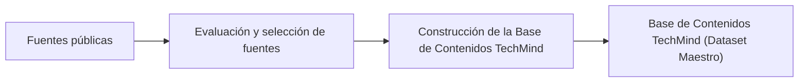

# Sprint DS-02
# Investigación y Adquisición del Dataset

# 1. Objetivo

Investigar, evaluar y seleccionar las fuentes de datos que servirán como base para el entrenamiento del modelo de clasificación de TechMind.

Durante este sprint se analizarán diferentes conjuntos de datos públicos relacionados con documentación técnica, desarrollo de software y tecnologías de la información, con el propósito de identificar aquellos que mejor representen el dominio del problema.

El resultado de este sprint será la selección de uno o más datasets que cumplan los criterios técnicos y funcionales definidos por el proyecto.

# 2. Alcance

Durante este sprint se realizará:

- Definición de los requisitos que debe cumplir el dataset.
- Investigación de fuentes de datos públicas.
- Evaluación de calidad, cobertura y licencias.
- Comparación entre diferentes alternativas.
- Selección del dataset o combinación de datasets que se utilizarán en el proyecto.
- Documentación de la decisión técnica.

No forma parte del alcance de este sprint:

- Descarga definitiva de los datasets.
- Limpieza o transformación de datos.
- Análisis exploratorio (EDA).
- Entrenamiento del modelo.
- Generación de métricas.

# 3. Definición del Problema

TechMind tiene como objetivo organizar automáticamente conocimiento técnico mediante técnicas de Ciencia de Datos.

El componente de Machine Learning será responsable de analizar el contenido textual de un documento y asignarle una categoría previamente definida, facilitando su organización, búsqueda y reutilización.

Cada registro del dataset representará un único contenido técnico, compuesto por información descriptiva y una categoría objetivo que será utilizada durante el entrenamiento del modelo.

El problema se aborda como una tarea de clasificación supervisada de texto (Text Classification), donde el modelo aprenderá a predecir la categoría más adecuada para un documento a partir de su contenido.

## 3.1 Problema de Negocio

En equipos de desarrollo es común acumular documentación técnica proveniente de diferentes fuentes, como manuales, tutoriales, artículos, guías, documentación oficial y notas internas.

A medida que esta información crece, resulta más difícil localizar contenido relevante, reutilizar conocimiento y mantener una organización consistente.

TechMind busca automatizar este proceso clasificando cada documento dentro de una categoría técnica, permitiendo posteriormente realizar búsquedas más eficientes y relacionar contenidos similares.

## 3.2 Problema de Ciencia de Datos

Desde la perspectiva de Ciencia de Datos, el problema consiste en desarrollar un modelo de clasificación supervisada capaz de asignar automáticamente una categoría a un documento técnico a partir de su contenido textual.

El modelo utilizará técnicas clásicas de Procesamiento de Lenguaje Natural (NLP), empleando una representación TF-IDF y un algoritmo de clasificación basado en Scikit-Learn.

## 3.3 Unidad de Análisis

La unidad mínima de información del dataset será un documento técnico.

Cada registro representará un único contenido independiente que podrá corresponder, por ejemplo, a:

- Artículos técnicos.
- Tutoriales.
- Documentación oficial.
- Manuales.
- Guías.
- Publicaciones técnicas.
- Preguntas y respuestas técnicas.

## 3.4 Variable Objetivo

La variable objetivo (Target) será la categoría técnica asignada a cada documento.

Esta categoría será la etiqueta que el modelo aprenderá a predecir durante el entrenamiento.

## 3.5 Variables Esperadas

Como mínimo, cada registro deberá contener la siguiente información:

| Variable | Tipo | Descripción |
|----------|------|-------------|
| source_id | Texto | Identificador original del registro, cuando exista. |
| title | Texto | Título del documento técnico. |
| text | Texto | Contenido textual del documento. |
| category | Texto | Categoría asignada al documento. |
| source | Texto | Fuente de origen del documento. |
| language | Texto | Idioma del documento. |

## 3.6 Categorías Iniciales

Para el MVP de TechMind se propone trabajar inicialmente con categorías generales del ecosistema de desarrollo de software.

Las categorías preliminares son:

- Backend
- Frontend
- Bases de Datos
- DevOps
- Cloud Computing
- Inteligencia Artificial
- Ciencia de Datos
- Ciberseguridad
- Desarrollo Móvil
- Arquitectura de Software

# 4. Requisitos del Dataset

Con el fin de garantizar que el modelo de Machine Learning pueda entrenarse con información representativa y de calidad, el dataset deberá cumplir una serie de requisitos funcionales y técnicos.

Estos requisitos servirán como criterio de evaluación durante la investigación de fuentes de datos.

## 4.1 Requisitos Funcionales

El dataset deberá:

- Contener contenido relacionado con desarrollo de software y tecnologías de la información.
- Incluir documentos o textos suficientemente descriptivos para permitir una clasificación automática.
- Contener categorías claramente definidas o permitir su construcción.
- Representar diferentes áreas del conocimiento técnico.
- Ser compatible con el alcance del MVP de TechMind.

## 4.2 Requisitos Técnicos

El dataset deberá cumplir, preferentemente, con las siguientes características:

| Requisito | Deseable |
|-----------|----------|
| Formato CSV, JSON o Parquet | Sí |
| Datos estructurados | Sí |
| Contenido textual | Sí |
| Registros únicos | Sí |
| Etiquetas consistentes | Sí |
| Licencia de uso público | Sí |
| Descarga gratuita | Sí |
| Fácil procesamiento con Python | Sí |

## 4.3 Requisitos de Calidad

Durante la evaluación se analizarán aspectos como:

- Cantidad de registros.
- Calidad del texto.
- Nivel de ruido.
- Registros duplicados.
- Valores faltantes.
- Balance entre categorías.
- Consistencia de las etiquetas.

## 4.4 Requisitos del Proyecto

Además de los criterios anteriores, el dataset deberá ser compatible con las decisiones arquitectónicas del proyecto TechMind:

- Integración con Scikit-Learn.
- Procesamiento mediante TF-IDF.
- Clasificación supervisada.
- Persistencia utilizando Joblib.
- Uso exclusivo de herramientas de software libre o gratuitas.

# 5. Estrategia de Investigación

La selección del dataset se realizará mediante una evaluación comparativa de diferentes fuentes públicas de información.

Cada alternativa será analizada utilizando criterios homogéneos de calidad, cobertura temática, disponibilidad, licencia y facilidad de integración.

La investigación se enfocará en conjuntos de datos relacionados con documentación técnica, desarrollo de software y tecnologías de la información.

## 5.1 Fuentes Prioritarias

Se priorizarán las siguientes plataformas:

- Kaggle
- Hugging Face Datasets
- GitHub
- UCI Machine Learning Repository
- Papers With Code
- Google Dataset Search

## 5.2 Estrategia de Evaluación

Cada dataset será evaluado considerando:

- Cobertura temática.
- Número de registros.
- Calidad del contenido.
- Disponibilidad de categorías.
- Licencia.
- Facilidad de descarga.
- Compatibilidad con el problema de clasificación.

# 6. Fuentes de Datos Evaluadas

Durante este sprint se evaluarán diferentes alternativas antes de seleccionar el dataset definitivo.

| Fuente | Tipo | Dominio | Resultado |
|---------|------|----------|-----------|
| Stack Exchange | Comunidad técnica | Desarrollo de software | Seleccionada |
| GitHub | Documentación técnica | Desarrollo de software | Seleccionada |
| Hugging Face Datasets | NLP / Machine Learning | Clasificación de texto | Seleccionada |
| Kaggle | Repositorio de datasets | Ciencia de Datos | Fuente complementaria |
| UCI Machine Learning Repository | Machine Learning | General | No seleccionada |
| Papers With Code | Investigación | IA / ML | Fuente complementaria |

# 7. Criterios de Selección

Para garantizar una selección objetiva, cada dataset será evaluado utilizando una matriz de criterios ponderados.

La evaluación permitirá comparar diferentes alternativas utilizando los mismos parámetros y justificar técnicamente la decisión final.

## 7.1 Criterios de Evaluación

| Criterio | Descripción | Prioridad |
|----------|-------------|-----------|
| Cobertura temática | Representa correctamente el dominio de TechMind. | Alta |
| Calidad del contenido | Textos completos, coherentes y útiles para entrenamiento. | Alta |
| Etiquetas disponibles | Dispone de categorías o facilita su construcción. | Alta |
| Cantidad de registros | Volumen suficiente para entrenar el modelo. | Alta |
| Balance entre categorías | Distribución equilibrada de clases. | Media |
| Licencia de uso | Compatible con proyectos académicos y demostrativos. | Alta |
| Idioma | Preferentemente inglés o español. | Media |
| Facilidad de procesamiento | Compatible con Python y Pandas. | Alta |
| Actualización | Dataset mantenido o recientemente publicado. | Baja |

## 7.2 Escala de Evaluación

Cada criterio será calificado utilizando la siguiente escala:

| Puntaje | Interpretación |
|----------|----------------|
| 5 | Excelente |
| 4 | Muy Bueno |
| 3 | Bueno |
| 2 | Regular |
| 1 | Deficiente |

El dataset con mejor evaluación global será seleccionado para las siguientes etapas del proyecto.

# 8. Estrategia de Construcción del Dataset Maestro

Ninguna fuente pública cubre completamente el dominio funcional de TechMind.

Por este motivo, se decidió construir una Base de Contenidos propia (Dataset Maestro) integrando información proveniente de múltiples fuentes públicas.

Esta estrategia permitirá obtener una mayor cobertura temática, mejorar la representatividad del dominio y facilitar futuras ampliaciones del conjunto de datos.

## 8.1 Evaluación de las Fuentes

Después de evaluar las diferentes alternativas, se concluye que ninguna fuente pública satisface por sí sola todos los requisitos definidos para TechMind.

La siguiente tabla resume la evaluación realizada.

| Fuente | Ventajas | Limitaciones | Decisión |
|---------|----------|--------------|----------|
| Stack Exchange | Excelente cobertura técnica, etiquetas de alta calidad, contenido real | Alto volumen y necesidad de limpieza | Seleccionada |
| GitHub README | Documentación oficial y actualizada | Ausencia de etiquetas homogéneas | Seleccionada |
| Hugging Face | Datasets preparados y documentados | Cobertura técnica parcial | Seleccionada |
| Kaggle | Amplia variedad de datasets | Calidad heterogénea | Fuente de apoyo |
| UCI Repository | Alta calidad académica | Escasa cobertura del dominio | No seleccionada |
| Papers With Code | Investigación de vanguardia | Enfoque principalmente académico | Fuente de apoyo |

## 8.2 Justificación de la Selección

Se decidió construir la Base de Contenidos TechMind (Dataset Maestro) mediante la integración controlada de múltiples fuentes públicas, ya que ninguna fuente individual representa completamente el dominio funcional del proyecto.

La integración de múltiples fuentes permitirá:

- Mejor cobertura tecnológica.
- Mayor diversidad de documentos.
- Categorías más representativas.
- Mayor capacidad de generalización del modelo.
- Posibilidad de ampliar el dataset en futuras versiones.

Esta estrategia mantiene el alcance del MVP y fortalece la calidad del entrenamiento del modelo.

## 8.3 Base de Contenidos TechMind (Dataset Maestro)

Como resultado del análisis realizado durante este sprint, se decidió que TechMind no utilizará un único dataset como fuente de entrenamiento.

En su lugar, el proyecto construirá una Base de Contenidos propia (Dataset Maestro), integrada a partir de múltiples fuentes públicas previamente evaluadas.

Esta decisión permitirá:

- Obtener una mayor cobertura temática del dominio técnico.
- Incrementar la diversidad de contenidos para el entrenamiento.
- Mantener una estructura de datos uniforme.
- Incorporar nuevas fuentes de información en futuras versiones sin modificar la arquitectura del proyecto.

La construcción de esta Base de Contenidos será desarrollada durante el Sprint DS-03 mediante un pipeline reproducible de integración de datos.

# 9. Riesgos Identificados

Durante la investigación y adquisición del dataset podrían presentarse los siguientes riesgos:

| Riesgo | Impacto | Mitigación |
|---------|----------|------------|
| Dataset insuficiente | Alto | Integrar múltiples fuentes de datos. |
| Etiquetas inconsistentes | Alto | Normalizar categorías durante el preprocesamiento. |
| Licencias incompatibles | Alto | Utilizar únicamente datasets de libre uso. |
| Datos desactualizados | Medio | Priorizar datasets mantenidos recientemente. |
| Desbalance de categorías | Medio | Aplicar técnicas de balanceo en etapas posteriores. |
| Idiomas mezclados | Bajo | Filtrar por idioma durante el preprocesamiento. |

# 10. Decisiones del Sprint

Durante la ejecución del Sprint DS-02 se tomaron las siguientes decisiones:

| Decisión | Justificación |
|----------|---------------|
| Se investigarán múltiples fuentes públicas. | Ninguna fuente individual cubre completamente el dominio de TechMind. |
| Se priorizarán datasets con etiquetas existentes. | Reduce el esfuerzo de preparación del dataset. |
| Se construirá un Dataset Maestro. | Permite integrar información complementaria de diferentes orígenes. |
| Kaggle y UCI serán fuentes secundarias. | No representan completamente el dominio técnico requerido. |
| La Base de Contenidos TechMind será construida mediante un pipeline reproducible de integración. | Garantiza trazabilidad, mantenibilidad y facilita incorporar nuevas fuentes de información. |

# 11. Lecciones Aprendidas

Durante el Sprint DS-02 se identificó que la calidad del dataset influirá directamente en el desempeño del modelo de clasificación.

Asimismo, se concluyó que la integración de múltiples fuentes proporciona una representación más completa del conocimiento técnico que la utilización de un único dataset.

Las decisiones adoptadas durante este sprint reducirán riesgos en las etapas de integración, limpieza y entrenamiento del modelo.

# 12. Entregables

| Entregable | Estado |
|-------------|--------|
| Definición del problema | ✅ |
| Requisitos del dataset | ✅ |
| Estrategia de investigación | ✅ |
| Fuentes evaluadas | ✅ |
| Evaluación comparativa | ✅ |
| Estrategia de construcción del Dataset Maestro | ✅ |
| Decisiones técnicas documentadas | ✅ |

# 13. Criterios de Aceptación

El Sprint DS-02 se considerará finalizado cuando:

- Se haya definido claramente el problema de clasificación.
- Existan criterios objetivos para evaluar datasets.
- Se hayan investigado múltiples fuentes de datos.
- Se haya construido una matriz comparativa de alternativas.
- Se haya seleccionado el dataset o conjunto de datasets que será utilizado en el proyecto.
- La decisión técnica quede completamente documentada y justificada.

# 14. Próximo Sprint

## DS-03 – Construcción e Integración del Dataset

Durante el siguiente sprint se realizará:

- Descarga de los datasets seleccionados.
- Organización de los archivos dentro del proyecto.
- Integración de múltiples fuentes, si aplica.
- Definición del esquema canónico.
- Construcción de la Base de Contenidos TechMind (Dataset Maestro).
- Validación inicial de la información.