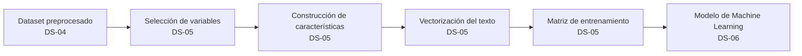
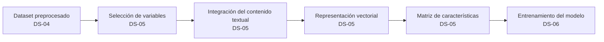
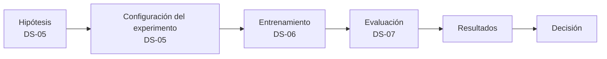
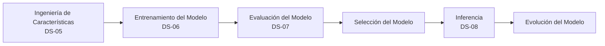

# DS-05 – Ingeniería de Características (Feature Engineering)

| Proyecto | AyniKortex – Organización Inteligente del Conocimiento Técnico |
|-----------|---------------------------------------------------------------|
| Componente | Data Science |
| Sprint | DS-05 |
| Documento | Ingeniería de Características (Feature Engineering) |
| Versión | 1.0 |
| Estado | Implementado y validado |
| Elaborado por | Equipo de Data Science |
| Fecha | Julio 2026 |

---

# 1. Información General

## 1.1 Objetivo

Diseñar la estrategia de Ingeniería de Características del componente de Data Science, definiendo las variables de entrada del modelo, la variable objetivo, el pipeline de transformación de datos, la estrategia de representación del texto y los criterios de evaluación que servirán como base para el entrenamiento, validación e inferencia del modelo de clasificación de documentos técnicos.

Este documento establece las decisiones de diseño necesarias para garantizar la trazabilidad, mantenibilidad y evolución del modelo de Machine Learning sin afectar el contrato de integración con el Backend.

---

## 1.2 Alcance

Este documento comprende el diseño de la estrategia de Ingeniería de Características del proyecto, incluyendo:

- Definición del problema de Machine Learning.
- Identificación de la variable objetivo (Target).
- Clasificación funcional de las variables del Dataset Maestro.
- Matriz de trazabilidad de variables.
- Diseño del Análisis Exploratorio de Datos (EDA).
- Estrategia de Ingeniería de Características.
- Diseño del Pipeline de Features.
- Estrategia de representación del texto.
- Estrategia de evaluación del modelo.
- Gestión de experimentos.
- Ciclo de vida del modelo.

Este sprint no contempla la implementación del entrenamiento, la evaluación experimental ni el despliegue del modelo, actividades que serán desarrolladas en los sprints posteriores.

---

## 1.3 Fuera del alcance

Las siguientes actividades no forman parte del presente sprint:

- Entrenamiento del modelo.
- Comparación de algoritmos.
- Optimización de hiperparámetros.
- Evaluación de métricas sobre modelos entrenados.
- Serialización del modelo.
- Implementación de la inferencia.
- Integración con Backend.

Estas actividades corresponden a los sprints DS-06, DS-07 y DS-08.

---

## 1.4 Dependencias

La estrategia definida en este documento depende de los entregables generados en los sprints anteriores.

| Sprint | Documento | Propósito |
|---------|-----------|-----------|
| DS-01 | Arquitectura del Componente de Data Science | Define la arquitectura y los principios de diseño del componente. |
| DS-02 | Investigación y Adquisición del Dataset | Justifica las fuentes de información utilizadas para construir el Dataset Maestro. |
| DS-03 | Construcción del Dataset Maestro | Define la estructura y el esquema de las variables del conjunto de datos. |
| DS-04 | Limpieza y Preprocesamiento del Dataset | Entrega los documentos técnicos normalizados que servirán como entrada para la Ingeniería de Características. |

---

## 1.5 Entregables

Al finalizar este sprint se espera contar con:

- Estrategia de Ingeniería de Características documentada.
- Variable objetivo definida y justificada.
- Clasificación funcional de las variables del Dataset Maestro.
- Matriz de trazabilidad de variables.
- Diseño del Análisis Exploratorio de Datos (EDA).
- Diseño del Pipeline de Features.
- Estrategia de representación del texto.
- Estrategia de evaluación del modelo.
- Estrategia de gestión de experimentos.
- Diseño del ciclo de vida del modelo.

---

## 1.6 Riesgos

Durante este sprint se identifican los siguientes riesgos principales:

| Riesgo | Impacto | Mitigación |
|--------|---------|------------|
| Selección inadecuada de variables | Alto | Clasificación funcional y matriz de trazabilidad. |
| Data Leakage | Alto | Validar disponibilidad de cada variable durante la inferencia. |
| Desalineación con el contrato del Backend | Alto | Mantener el contrato de integración como referencia durante todo el diseño. |
| Sobreingeniería del modelo | Medio | Priorizar una solución simple y alineada con el MVP. |
| Cambios futuros en el Dataset Maestro | Medio | Diseñar un pipeline modular y desacoplado. |

---

## 1.7 Criterios de aceptación

El sprint DS-05 será considerado completado cuando:

- Se encuentre documentada la estrategia de Ingeniería de Características.
- La variable objetivo haya sido definida y justificada.
- Las variables del Dataset Maestro hayan sido clasificadas según su función.
- Se complete la matriz de trazabilidad de variables.
- Se documente el diseño del EDA.
- Se defina el Pipeline de Features.
- Se establezca la estrategia de representación del texto.
- Se documente la estrategia de evaluación del modelo.
- Se defina la estrategia de gestión de experimentos.
- Se documente el ciclo de vida del modelo.

---

## 1.8 Estado

**Estado actual:** Implementado y validado..

Durante este sprint se implementó el pipeline de Ingeniería de Características del componente de Data Science, incluyendo la construcción de la matriz de características, la construcción de la variable objetivo, la vectorización mediante TF-IDF y la división del dataset para entrenamiento y prueba. La implementación fue validada mediante pruebas unitarias e integración.

---

# 2. Definición del Problema de Machine Learning

## 2.1 Contexto del negocio

El proyecto **AyniKortex – Organización Inteligente del Conocimiento Técnico** tiene como objetivo facilitar la organización y clasificación automática de documentación técnica mediante técnicas de Inteligencia Artificial y Machine Learning.

Dentro del alcance del MVP, el sistema deberá recibir el título y el contenido de un documento técnico y determinar automáticamente la categoría a la que pertenece, permitiendo mejorar la organización, búsqueda y reutilización del conocimiento dentro de una organización.

La solución de Data Science se integrará con el Backend mediante una interfaz de inferencia estable, desacoplando la implementación interna del modelo del resto del sistema.

---

## 2.2 Problema de negocio

Actualmente, la clasificación de documentación técnica suele realizarse de forma manual, lo que genera problemas como:

- Clasificaciones inconsistentes.
- Mayor tiempo de organización.
- Dificultad para localizar documentación.
- Baja reutilización del conocimiento técnico.
- Dependencia del criterio de cada usuario.

Como consecuencia, la información pierde valor al ser más difícil de encontrar y reutilizar.

El objetivo del negocio es automatizar este proceso de clasificación para mejorar la organización del conocimiento técnico.

---

## 2.3 Problema de Machine Learning

Desde la perspectiva de Machine Learning, el problema consiste en construir un modelo capaz de aprender la relación existente entre el contenido textual de un documento técnico y la categoría a la que pertenece.

A partir de ejemplos previamente etiquetados, el modelo deberá predecir la categoría más probable para nuevos documentos durante la fase de inferencia.

Formalmente, el problema puede expresarse como una tarea de clasificación supervisada donde la entrada corresponde al contenido textual del documento y la salida corresponde a una única categoría.

---

## 2.4 Tipo de aprendizaje

| Característica | Definición |
|----------------|-----------|
| Paradigma | Aprendizaje Supervisado |
| Tipo de problema | Clasificación |
| Número de clases | Multiclase |
| Tipo de salida | Una categoría por documento |
| Variable objetivo | category |

La selección de un enfoque supervisado se justifica porque el Dataset Maestro dispone de documentos previamente etiquetados, permitiendo entrenar un modelo a partir de ejemplos conocidos.

---

## 2.5 Variable objetivo

### Variable seleccionada

```text
category
```

La variable **category** representa la clasificación principal del documento técnico y constituye la salida esperada por el modelo de Machine Learning.

Esta variable será utilizada durante el entrenamiento como etiqueta (*label*) del modelo y durante la inferencia como resultado principal entregado al Backend.

---

## 2.6 Justificación de la variable objetivo

La selección de **category** como variable objetivo se fundamenta en los siguientes criterios:

- Se encuentra alineada con el objetivo funcional definido para el MVP.
- Representa la clasificación principal esperada por el usuario.
- Está disponible en el Dataset Maestro.
- Permite entrenar un modelo supervisado de clasificación multiclase.
- Mantiene un contrato de integración simple con el Backend.
- Facilita la evolución futura hacia clasificaciones jerárquicas sin modificar la interfaz pública.

Las variables como **subcategory**, **technology** o **keywords** podrán incorporarse posteriormente como salidas complementarias o tareas adicionales del modelo, sin afectar la arquitectura definida para el MVP.

---

## 2.7 Decisiones Arquitectónicas

### RDS-05-01 – Definición del problema de Machine Learning

**Decisión**

El componente de Data Science resolverá un problema de clasificación supervisada multiclase sobre documentos técnicos.

**Justificación**

Este enfoque responde directamente al objetivo del negocio y al alcance definido para el MVP, permitiendo construir un modelo interpretable, mantenible y alineado con el contrato de integración del Backend.

---

### RDS-05-02 – Selección de la variable objetivo

**Decisión**

La variable **category** será utilizada como variable objetivo del modelo.

**Justificación**

Corresponde a la clasificación principal requerida por el sistema, está disponible durante el entrenamiento y la inferencia, y constituye la salida principal del componente de Machine Learning.

Esta decisión favorece una arquitectura desacoplada y preparada para futuras ampliaciones sin modificar la interfaz pública del componente.

---

# 3. Inventario y Clasificación de Variables

## 3.1 Objetivo

Clasificar las variables del Dataset Maestro de acuerdo con su función dentro del componente de Data Science, identificando cuáles serán utilizadas como variables de entrada del modelo, cuál corresponde a la variable objetivo y cuáles deberán descartarse o reservarse para futuras etapas del proyecto.

Esta clasificación permitirá establecer una estrategia de Ingeniería de Características coherente con los objetivos del MVP y garantizará que únicamente se empleen variables disponibles durante la fase de inferencia.

---

## 3.2 Clasificación funcional de variables

Las variables del Dataset Maestro se agrupan según el papel que desempeñarán dentro del proceso de Machine Learning.

| Clasificación | Propósito |
|---------------|-----------|
| Variables de entrada (Features) | Información utilizada por el modelo para realizar la predicción. |
| Variable objetivo (Target) | Etiqueta que el modelo aprenderá a predecir. |
| Variables auxiliares | Información útil para análisis, validación o trazabilidad, pero no utilizada directamente durante el entrenamiento. |
| Variables descartadas | Variables que no aportan valor predictivo, presentan riesgo de Data Leakage o no estarán disponibles durante la inferencia. |

---

## 3.3 Variables de entrada

Para el MVP, el modelo utilizará como principales variables de entrada la información textual del documento.

| Variable | Tipo | Estado |
|----------|------|--------|
| title | Texto | Feature principal |
| description | Texto | Feature principal |
| content | Texto | Feature principal |

Estas variables contienen el contexto semántico necesario para que el modelo aprenda a identificar la categoría del documento.

---

## 3.4 Variable objetivo

La variable objetivo definida para el modelo es:

| Variable | Función |
|----------|---------|
| category | Etiqueta de clasificación del documento |

Esta variable representa la salida principal del modelo y constituye el valor que deberá ser predicho durante la fase de inferencia.

---

## 3.5 Variables auxiliares

Las siguientes variables no serán utilizadas como entrada del modelo durante el MVP, pero podrán emplearse para tareas de análisis, validación o evolución futura del sistema.

| Variable | Uso previsto |
|----------|--------------|
| programming_language | Análisis exploratorio |
| framework | Análisis exploratorio |
| technology | Análisis exploratorio |
| tags | Análisis exploratorio |
| keywords | Análisis exploratorio |
| language | Validación del corpus |
| file_type | Caracterización del dataset |
| word_count | Estadísticas descriptivas |

La incorporación de estas variables como características del modelo será evaluada en futuras iteraciones, una vez analizado su impacto mediante el EDA y los experimentos de entrenamiento.

---

## 3.6 Variables descartadas

Se excluyen del entrenamiento aquellas variables que:

- No aportan información predictiva.
- Funcionan únicamente como identificadores.
- Corresponden a metadatos administrativos.
- No estarán disponibles durante la inferencia.
- Pueden introducir sesgos o Data Leakage.

Entre ellas se encuentran:

- document_id
- author_name
- author_role
- department
- company
- repository
- project
- version
- status
- reviewed
- reviewer
- created_date
- updated_date
- popularity_score
- quality_score
- downloads
- likes
- comments
- views
- embedding_generated
- vector_model
- last_embedding_update

---

## 3.7 Riesgo de Data Leakage

Durante el análisis del Dataset Maestro se identificaron variables cuyo valor podría proporcionar información que no estaría disponible durante la inferencia o que podría inducir al modelo a aprender patrones artificiales.

Estas variables no serán utilizadas como características durante el entrenamiento del MVP.

La decisión busca garantizar que el comportamiento del modelo durante producción sea consistente con las condiciones reales de uso.

---

## 3.8 Decisiones Arquitectónicas

### RDS-05-FE-01 – Selección de Variables de Entrada

**Decisión**

El modelo utilizará únicamente variables textuales como características principales durante el MVP.

**Justificación**

Las variables textuales contienen la información semántica necesaria para resolver el problema de clasificación y estarán disponibles tanto en entrenamiento como en inferencia.

---

### RDS-05-FE-02 – Exclusión de Variables con Riesgo de Data Leakage

**Decisión**

Las variables que no estén disponibles durante la inferencia o que representen información derivada del propio proceso de entrenamiento serán excluidas del conjunto de características.

**Justificación**

Esta decisión evita sesgos en el modelo y garantiza la coherencia entre las fases de entrenamiento e inferencia.

---

# 4. Matriz de Trazabilidad de Variables

## 4.1 Objetivo

Establecer la justificación técnica para la selección, evaluación o descarte de cada variable del Dataset Maestro, garantizando la trazabilidad entre el conjunto de datos, la estrategia de Ingeniería de Características y el modelo de Machine Learning.

Esta matriz constituye el mecanismo de documentación que permite comprender el papel de cada variable dentro del componente de Data Science.

---

## 4.2 Criterios de evaluación

Cada variable fue analizada considerando los siguientes criterios:

| Criterio | Descripción |
|----------|-------------|
| Valor predictivo | Potencial para mejorar la capacidad de clasificación del modelo. |
| Disponibilidad en inferencia | La variable debe estar disponible cuando el Backend invoque el modelo. |
| Riesgo de Data Leakage | La variable no debe revelar información que el modelo no conocerá durante la inferencia. |
| Consistencia | La variable debe mantener un significado uniforme en todo el Dataset Maestro. |
| Alineación con el MVP | La variable debe aportar valor dentro del alcance definido para el proyecto. |

---

## 4.3 Matriz de trazabilidad

| Variable             | Clasificación      | Valor predictivo | Disponible en inferencia | Riesgo de Data Leakage | Decisión  | Justificación                                          |
| -------------------- | ------------------ | ---------------- | ------------------------ | ---------------------- | --------- | ------------------------------------------------------ |
| title                | Feature principal  | Alto             | Sí                       | No                     | Utilizar  | Resume el contenido del documento.                     |
| description          | Feature principal  | Alto             | Sí                       | No                     | Utilizar  | Complementa el contexto semántico.                     |
| content              | Feature principal  | Muy alto         | Sí                       | No                     | Utilizar  | Principal fuente de información para la clasificación. |
| category             | Target             | N/A              | Sí                       | No                     | Utilizar  | Variable objetivo del modelo.                          |
| programming_language | Variable candidata | Medio            | Parcial                  | Bajo                   | Evaluar   | Su impacto será validado mediante experimentación.     |
| framework            | Variable candidata | Medio            | Parcial                  | Bajo                   | Evaluar   | Puede aportar contexto técnico.                        |
| technology           | Variable candidata | Medio            | Parcial                  | Bajo                   | Evaluar   | Requiere validación experimental.                      |
| tags                 | Variable candidata | Medio            | Sí                       | Bajo                   | Evaluar   | Posible apoyo en la representación temática.           |
| keywords             | Variable candidata | Medio            | Sí                       | Bajo                   | Evaluar   | Su calidad dependerá de la consistencia del dataset.   |
| language             | Variable candidata | Bajo             | Sí                       | No                     | Evaluar   | Útil para validar el corpus.                           |
| file_type            | Variable candidata | Bajo             | Sí                       | No                     | Evaluar   | Puede aportar información contextual.                  |
| word_count           | Variable candidata | Bajo             | Sí                       | No                     | Evaluar   | Variable descriptiva con posible utilidad.             |
| document_id          | Identificador      | Nulo             | No                       | No                     | Descartar | No aporta información predictiva.                      |
| author_name          | Metadato           | Nulo             | No                       | Medio                  | Descartar | Puede introducir sesgos.                               |
| author_role          | Metadato           | Bajo             | No                       | Medio                  | Descartar | No representa el contenido del documento.              |
| repository           | Metadato           | Bajo             | No                       | Medio                  | Descartar | Información administrativa.                            |
| project              | Metadato           | Bajo             | Parcial                  | Medio                  | Descartar | No forma parte del contrato de inferencia del MVP.     |
| quality_score        | Métrica derivada   | Alto             | No                       | Alto                   | Descartar | Riesgo de Data Leakage.                                |
| popularity_score     | Métrica derivada   | Alto             | No                       | Alto                   | Descartar | Riesgo de Data Leakage.                                |
| downloads            | Métrica derivada   | Alto             | No                       | Alto                   | Descartar | No estará disponible durante la inferencia.            |
| likes                | Métrica derivada   | Alto             | No                       | Alto                   | Descartar | Información posterior al uso del documento.            |
| comments             | Métrica derivada   | Alto             | No                       | Alto                   | Descartar | Información posterior al uso del documento.            |
| views                | Métrica derivada   | Alto             | No                       | Alto                   | Descartar | Riesgo de sesgo temporal.                              |

Nota: La matriz completa deberá incluir las 41 variables definidas en el Dataset Maestro. La tabla anterior presenta la estructura y algunos ejemplos representativos.

---

## 4.4 Decisiones Arquitectónicas

### RDS-05-FE-03 – Matriz de Trazabilidad

**Decisión**

Toda variable del Dataset Maestro deberá clasificarse y documentarse antes de ser considerada para el entrenamiento del modelo.

**Justificación**

La trazabilidad permite fundamentar técnicamente las decisiones de Ingeniería de Características, reducir el riesgo de incorporar variables inadecuadas y facilitar la evolución futura del modelo.

### RDS-05-FE-04 – Validación de Variables Candidatas

**Decisión**

Las variables clasificadas como candidatas no serán incorporadas al modelo por defecto.

Su incorporación dependerá de la evidencia obtenida durante los experimentos definidos en los sprints DS-06 y DS-07.

**Justificación**

Se prioriza un MVP simple y controlado, evitando aumentar la complejidad del modelo sin evidencia de una mejora en su desempeño.

---

# 5. Estrategia de Ingeniería de Características

## 5.1 Objetivo

Definir la estrategia para transformar los documentos técnicos preprocesados en un conjunto de características que puedan ser utilizadas por el modelo de Machine Learning, garantizando consistencia, trazabilidad y compatibilidad con la arquitectura del componente de Data Science.

La estrategia propuesta prioriza la simplicidad, la interpretabilidad y la facilidad de evolución del modelo, manteniendo un bajo acoplamiento con el Backend.

---

## 5.2 Principios de diseño

La Ingeniería de Características se fundamenta en los siguientes principios:

- Utilizar únicamente información disponible durante la inferencia.
- Evitar el uso de variables con riesgo de Data Leakage.
- Priorizar información textual como fuente principal de conocimiento.
- Mantener un pipeline reproducible.
- Diseñar componentes desacoplados que permitan evolucionar la estrategia de representación del texto sin modificar el contrato del componente.

---

## 5.3 Variables seleccionadas

Para el MVP se utilizarán como variables principales:

| Variable | Tipo | Función |
|----------|------|---------|
| title | Texto | Contexto inicial del documento |
| description | Texto | Resumen funcional del documento |
| content | Texto | Fuente principal de información |

Estas variables serán concatenadas y tratadas como un único documento lógico durante la representación del texto.

---

## 5.4 Variables candidatas

Las siguientes variables permanecerán en evaluación:

- programming_language
- framework
- technology
- tags
- keywords
- language
- file_type
- word_count

Su incorporación dependerá de la evidencia obtenida durante los experimentos de entrenamiento.

---

## 5.5 Transformación de las variables

La Ingeniería de Características contempla las siguientes etapas:

1. Recepción del texto preprocesado.
2. Integración de las variables textuales.
3. Representación vectorial.
4. Construcción de la matriz de características.
5. Entrega al algoritmo de Machine Learning.

Cada etapa será implementada como un componente independiente para facilitar el mantenimiento y la evolución del sistema.

---

## 5.6 Estrategia de evolución

La arquitectura del componente permitirá sustituir la técnica de representación del texto sin modificar la interfaz pública del sistema.

De esta manera será posible evolucionar desde una representación basada en TF-IDF hacia técnicas más avanzadas, como embeddings o modelos Transformer, manteniendo el mismo contrato de integración con el Backend.

---

## 5.7 Beneficios

La estrategia propuesta ofrece las siguientes ventajas:

- Bajo acoplamiento.
- Fácil mantenimiento.
- Alta trazabilidad.
- Reproducibilidad.
- Escalabilidad.
- Compatibilidad con futuras mejoras del modelo.

---

## 5.8 Decisiones Arquitectónicas

### RDS-05-FE-05 – Estrategia de Ingeniería de Características

**Decisión**

La Ingeniería de Características utilizará como fuente principal la información textual del documento (`title`, `description` y `content`), priorizando variables disponibles durante la inferencia.

**Justificación**

Estas variables contienen la mayor cantidad de información semántica y permiten construir un modelo alineado con el alcance del MVP.

---

### RDS-05-FE-06 – Arquitectura Evolutiva

**Decisión**

La representación del texto será desacoplada del resto del pipeline mediante una arquitectura modular.

**Justificación**

Esta decisión permitirá reemplazar futuras técnicas de representación del texto sin modificar el contrato del componente ni afectar al Backend.



| Etapa                           | Sprint | Responsable                   |
| ------------------------------- | ------ | ----------------------------- |
| Dataset preprocesado            | DS-04  | Preprocesamiento              |
| Selección de variables          | DS-05  | Ingeniería de Características |
| Construcción de características | DS-05  | Ingeniería de Características |
| Vectorización                   | DS-05  | Ingeniería de Características |
| Matriz de entrenamiento         | DS-05  | Ingeniería de Características |
| Modelo de Machine Learning      | DS-06  | Entrenamiento                 |

---

# 6. Pipeline de Ingeniería de Características

## 6.1 Objetivo

Definir el flujo lógico mediante el cual un documento técnico preprocesado es transformado en un conjunto de características estructuradas que servirán como entrada para el entrenamiento del modelo de Machine Learning.

El diseño del pipeline busca garantizar reproducibilidad, modularidad y facilidad de evolución, manteniendo independencia entre las etapas del procesamiento.

---

## 6.2 Arquitectura del Pipeline

La Ingeniería de Características se organiza como una secuencia de transformaciones independientes.

Cada etapa recibe un resultado validado de la etapa anterior y genera una salida que será consumida por la siguiente, evitando dependencias innecesarias entre componentes.



---

## 6.3 Flujo de procesamiento

El pipeline sigue las siguientes etapas:

| Etapa | Descripción |
|--------|-------------|
| Selección de variables | Identifica las variables que serán utilizadas como entrada del modelo. |
| Integración del contenido textual | Consolida las variables textuales seleccionadas en una representación lógica del documento. |
| Representación vectorial | Convierte el texto en una representación numérica apta para algoritmos de Machine Learning. |
| Construcción de la matriz de características | Organiza las representaciones vectoriales en una estructura utilizada durante el entrenamiento del modelo. |

Cada transformación produce una salida claramente definida, reduciendo el acoplamiento entre etapas.

---

## 6.4 Entradas y salidas

| Entrada | Salida |
|----------|--------|
| Dataset preprocesado | Variables seleccionadas |
| Variables seleccionadas | Documento integrado |
| Documento integrado | Representación vectorial |
| Representación vectorial | Matriz de características |
| Matriz de características | Datos de entrenamiento |

---

## 6.5 Principios de diseño

El pipeline ha sido diseñado considerando los siguientes principios:

- Separación de responsabilidades.
- Bajo acoplamiento entre etapas.
- Reproducibilidad del procesamiento.
- Independencia respecto al algoritmo de Machine Learning.
- Evolución controlada de la representación del texto.
- Compatibilidad con el contrato de integración del Backend.

---

## 6.6 Decisiones Arquitectónicas

### RDS-05-FE-07 – Pipeline Modular

**Decisión**

La Ingeniería de Características se implementará como un pipeline compuesto por etapas independientes y secuenciales.

**Justificación**

La modularidad facilita el mantenimiento, la validación de cada etapa y la incorporación de futuras mejoras sin afectar el resto del proceso.

---

### RDS-05-FE-08 – Independencia de la Representación Vectorial

**Decisión**

La etapa de representación vectorial será independiente del algoritmo de Machine Learning utilizado durante el entrenamiento.

**Justificación**

Esta separación permite sustituir técnicas de representación del texto (TF-IDF, embeddings o Transformers) sin modificar las etapas anteriores ni posteriores del pipeline.

---

# 6.7 Implementación del pipeline

| Componente               | Responsabilidad                                   |
| ------------------------ | ------------------------------------------------- |
| `BaseVectorizer`         | Contrato para estrategias de vectorización.       |
| `TfidfVectorizerAdapter` | Implementación basada en TF-IDF de Scikit-Learn.  |
| `FeatureBuilder`         | Construcción de la matriz de características (X). |
| `TargetBuilder`          | Construcción de la variable objetivo (y).         |
| `DatasetSplitter`        | División en entrenamiento y prueba.               |
| `FeaturePipeline`        | Orquestación del flujo completo.                  |

---

# 7. Estrategia de Representación del Texto

## 7.1 Objetivo

Definir la estrategia mediante la cual la información textual será transformada en una representación numérica que permita a los algoritmos de Machine Learning identificar patrones y realizar la clasificación automática de documentos técnicos.

La estrategia seleccionada deberá ser compatible con el alcance del MVP y permitir una evolución gradual hacia técnicas de representación más avanzadas.

---

## 7.2 ¿Por qué representar el texto?

Los algoritmos de Machine Learning no operan directamente sobre texto libre. Por ello, es necesario transformar los documentos técnicos en estructuras numéricas que preserven la mayor cantidad posible de información relevante para la tarea de clasificación.

Esta representación constituye el puente entre el procesamiento del lenguaje natural y el modelo de aprendizaje supervisado.

---

## 7.3 Alternativas evaluadas

Durante el diseño de la solución se analizaron las siguientes estrategias de representación del texto:

| Alternativa | Descripción |
|--------------|-------------|
| Bag of Words (BoW) | Representación basada en frecuencia de palabras. |
| TF-IDF | Representación ponderada según la importancia de los términos en el corpus. |
| Embeddings | Representaciones vectoriales densas que capturan relaciones semánticas. |
| Modelos Transformer | Representaciones contextuales generadas mediante modelos de lenguaje profundo. |

---

## 7.4 Comparación de alternativas

| Criterio | BoW | TF-IDF | Embeddings | Transformers |
|----------|-----|--------|------------|--------------|
| Simplicidad | Alta | Alta | Media | Baja |
| Interpretabilidad | Alta | Alta | Media | Baja |
| Costo computacional | Bajo | Bajo | Medio | Alto |
| Tiempo de entrenamiento | Bajo | Bajo | Medio | Alto |
| Calidad semántica | Baja | Media | Alta | Muy alta |
| Adecuado para el MVP | Parcial | Sí | Parcial | No |

---

## 7.5 Estrategia seleccionada

Para el MVP se selecciona **TF-IDF** como técnica inicial de representación del texto.

### Justificación

La selección se fundamenta en los siguientes aspectos:

- Proporciona un equilibrio entre simplicidad y capacidad de representación.
- Reduce la influencia de términos excesivamente frecuentes.
- Es ampliamente utilizada en problemas de clasificación documental.
- Requiere un costo computacional bajo.
- Facilita la interpretación de los resultados.
- Se adapta al alcance y recursos del hackathon.

---

## 7.6 Estrategia de evolución

La arquitectura del componente permitirá reemplazar la técnica de representación del texto sin modificar el contrato de integración con el Backend.

La evolución prevista es la siguiente:

1. TF-IDF (MVP)
2. Embeddings
3. Modelos Transformer

Cada transición será evaluada mediante experimentación y métricas objetivas antes de ser adoptada.

---

## 7.7 Decisiones Arquitectónicas

### RDS-05-FE-09 – Representación Inicial del Texto

**Decisión**

Utilizar TF-IDF como técnica de representación del texto durante el desarrollo del MVP.

**Justificación**

TF-IDF proporciona una representación eficiente, interpretable y adecuada para problemas de clasificación documental, manteniendo un equilibrio entre desempeño y complejidad.

---

### ADR-04 – Evolución de la Representación del Texto

**Decisión**

La representación del texto deberá ser intercambiable sin afectar el resto del pipeline de Ingeniería de Características ni el contrato de integración con el Backend.

**Justificación**

Esta decisión garantiza la evolución controlada del componente, permitiendo incorporar nuevas técnicas de representación conforme madure el proyecto.

---

# 8. Diseño del Análisis Exploratorio de Datos (EDA)

## 8.1 Objetivo

Diseñar el Análisis Exploratorio de Datos (EDA) que permitirá evaluar la calidad, distribución y características del Dataset Maestro antes del entrenamiento del modelo de Machine Learning.

El EDA proporcionará evidencia objetiva para validar las decisiones de Ingeniería de Características y apoyar la selección de variables utilizadas durante el entrenamiento.

---

## 8.2 Propósito del EDA

El EDA tiene como finalidad comprender el comportamiento del conjunto de datos y detectar aspectos que puedan afectar el desempeño del modelo.

En particular, permitirá:

- Evaluar la calidad del Dataset Maestro.
- Analizar la distribución de las categorías.
- Identificar valores faltantes.
- Detectar posibles duplicados.
- Analizar la longitud de los documentos.
- Evaluar la consistencia de las variables candidatas.
- Identificar posibles fuentes de sesgo o Data Leakage.

Los resultados obtenidos servirán como insumo para los experimentos definidos en los siguientes sprints.

---

## 8.3 Preguntas de investigación

El EDA buscará responder, entre otras, las siguientes preguntas:

1. ¿Cómo se distribuyen las categorías del Dataset Maestro?
2. ¿Existe desbalance entre las clases?
3. ¿Cuál es la longitud promedio de los documentos?
4. ¿Existen documentos duplicados o muy similares?
5. ¿Qué porcentaje de valores faltantes presenta cada variable?
6. ¿Las variables candidatas contienen información consistente?
7. ¿Cuál es el idioma predominante del corpus?
8. ¿Existen categorías con pocos ejemplos?
9. ¿Hay evidencia de variables con riesgo de Data Leakage?
10. ¿El conjunto de datos requiere ajustes adicionales antes del entrenamiento?

---

## 8.4 Variables a analizar

El análisis exploratorio considerará tanto variables utilizadas por el modelo como variables auxiliares.

| Grupo | Variables |
|--------|-----------|
| Variables de entrada | title, description, content |
| Variable objetivo | category |
| Variables candidatas | programming_language, framework, technology, tags, keywords, language, file_type, word_count |
| Variables auxiliares | Metadatos relevantes para validación del dataset |

---

## 8.5 Indicadores

Durante el EDA se analizarán indicadores como:

- Distribución de categorías.
- Frecuencia de documentos por clase.
- Cantidad de valores faltantes.
- Longitud de documentos.
- Distribución de palabras por documento.
- Frecuencia de idiomas.
- Frecuencia de tecnologías.
- Cardinalidad de variables categóricas.
- Porcentaje de duplicados.
- Calidad del corpus.

---

## 8.6 Visualizaciones propuestas

Como parte del EDA se generarán visualizaciones que faciliten la interpretación del conjunto de datos.

Entre ellas:

- Gráfico de distribución de categorías.
- Histograma de longitud de documentos.
- Distribución de idiomas.
- Frecuencia de tecnologías.
- Distribución de tipos de archivo.
- Matriz de valores faltantes.
- Nube de palabras del corpus.
- Diagramas de barras para variables categóricas.

Las visualizaciones se utilizarán únicamente como apoyo para la toma de decisiones y no formarán parte del proceso de entrenamiento.

---

## 8.7 Impacto esperado

Los resultados del EDA permitirán:

- Validar la calidad del Dataset Maestro.
- Confirmar la selección de variables.
- Detectar problemas antes del entrenamiento.
- Reducir el riesgo de sesgos.
- Mejorar la calidad del modelo.
- Fundamentar las decisiones experimentales de DS-06 y DS-07.

---

## 8.8 Decisiones Arquitectónicas

### RDS-05-EDA-01 – Diseño del EDA

**Decisión**

El Análisis Exploratorio de Datos será diseñado antes del entrenamiento del modelo y ejecutado sobre el Dataset Maestro preprocesado.

**Justificación**

La exploración temprana del conjunto de datos reduce el riesgo de entrenar modelos sobre información inconsistente y permite validar las decisiones de Ingeniería de Características.

---

### RDS-05-EDA-02 – Uso del EDA como evidencia

**Decisión**

Las decisiones relacionadas con la incorporación o descarte de variables candidatas deberán sustentarse en los resultados del EDA y en los experimentos posteriores.

**Justificación**

La selección de variables estará basada en evidencia objetiva y no únicamente en criterios teóricos.

---

# 9. Estrategia de Evaluación

## 9.1 Objetivo

Definir los criterios, métricas y procedimientos que permitirán evaluar objetivamente el desempeño de los modelos de clasificación desarrollados para el componente de Data Science.

La estrategia de evaluación garantizará que los resultados obtenidos durante el entrenamiento sean comparables, reproducibles y alineados con los objetivos del proyecto.

---

## 9.2 Principios de evaluación

La evaluación del modelo se fundamenta en los siguientes principios:

- Objetividad en la comparación de modelos.
- Reproducibilidad de los resultados.
- Comparabilidad entre experimentos.
- Trazabilidad de las decisiones.
- Alineación con el problema de negocio.

---

## 9.3 Métricas seleccionadas

Las métricas propuestas para evaluar el desempeño del modelo son las siguientes:

| Métrica | Propósito |
|----------|-----------|
| Accuracy | Medir el porcentaje global de predicciones correctas. |
| Precision | Evaluar la exactitud de las predicciones realizadas por el modelo. |
| Recall | Medir la capacidad del modelo para identificar correctamente cada categoría. |
| F1-Score Macro | Métrica principal para comparar modelos considerando el equilibrio entre Precision y Recall. |
| Matriz de Confusión | Analizar el comportamiento del modelo y los errores de clasificación entre categorías. |

La selección de estas métricas permitirá obtener una evaluación integral del desempeño del modelo durante las etapas de entrenamiento y validación.

---

## 9.4 Validación del modelo

La validación del modelo deberá garantizar que los resultados obtenidos sean representativos y reproducibles.

Para ello se contempla:

- División del Dataset Maestro en conjuntos de entrenamiento y prueba.
- Validación cruzada (*Cross Validation*).
- Comparación consistente entre experimentos utilizando el mismo protocolo de evaluación.

El número de particiones de la validación cruzada será definido durante el Sprint DS-06, considerando el tamaño y distribución del Dataset Maestro.

---

## 9.5 Criterios para la selección del modelo

Un modelo candidato podrá ser promovido para las siguientes etapas cuando:

- Complete el entrenamiento sin errores.
- Sea reproducible.
- Cumpla los criterios definidos para el proyecto.
- Obtenga resultados consistentes durante la validación.
- Mantenga compatibilidad con el contrato de inferencia del Backend.

Los umbrales cuantitativos específicos serán establecidos una vez ejecutados los primeros experimentos de entrenamiento.

---

## 9.6 Riesgos durante la evaluación

| Riesgo | Mitigación |
|--------|------------|
| Sobreajuste (*Overfitting*) | Utilizar validación cruzada y comparar resultados entre entrenamiento y prueba. |
| Desbalance entre categorías | Priorizar F1-Score Macro y analizar la matriz de confusión. |
| Comparaciones inconsistentes | Mantener el mismo protocolo de evaluación en todos los experimentos. |
| Resultados no reproducibles | Registrar la configuración, parámetros y conjunto de datos utilizados en cada experimento. |

---

## 9.7 Decisiones Arquitectónicas

### ADR-05 – Estrategia de Evaluación

**Decisión**

Todos los modelos desarrollados dentro del proyecto deberán evaluarse utilizando un conjunto común de métricas y un procedimiento uniforme de validación.

**Justificación**

La estandarización del proceso de evaluación garantiza que los resultados obtenidos sean comparables, reproducibles y adecuados para seleccionar el modelo con mejor desempeño para el MVP.

---

### RDS-05-EVAL-01 – Métrica Principal

**Decisión**

El **F1-Score Macro** se establece como la métrica principal para comparar los modelos de clasificación.

**Justificación**

Esta métrica proporciona una evaluación equilibrada entre Precision y Recall para todas las categorías, siendo especialmente adecuada cuando existe la posibilidad de desbalance entre clases.

La confirmación del nivel de desbalance se realizará mediante el Análisis Exploratorio de Datos (EDA) y los experimentos de entrenamiento.

---

### RDS-05-EVAL-02 – Validación Experimental

**Decisión**

La selección del modelo final se realizará únicamente sobre la base de resultados obtenidos mediante experimentos reproducibles.

**Justificación**

Las decisiones relacionadas con el modelo deberán sustentarse en evidencia objetiva y no únicamente en supuestos teóricos, garantizando la trazabilidad y confiabilidad del proceso de evaluación.

---

# 10. Gestión de Experimentos

## 10.1 Objetivo

Definir la estrategia para planificar, ejecutar, documentar y comparar los experimentos de Machine Learning realizados durante el desarrollo del proyecto.

La gestión de experimentos permitirá garantizar la reproducibilidad de los resultados, facilitar la comparación entre diferentes configuraciones y respaldar las decisiones relacionadas con la selección del modelo.

---

## 10.2 Propósito

Cada modificación realizada sobre el modelo, las variables, la representación del texto o los hiperparámetros deberá ser considerada un experimento independiente.

Todos los experimentos deberán registrarse siguiendo una estructura común que permita identificar claramente:

- Qué se modificó.
- Por qué se modificó.
- Qué resultados produjo.
- Qué decisión se tomó.

Este enfoque garantiza la trazabilidad del proceso de entrenamiento y evita la pérdida de conocimiento durante la evolución del proyecto.

---

## 10.3 Información mínima de un experimento

Cada experimento deberá registrar, como mínimo, la siguiente información:

| Campo | Descripción |
|--------|-------------|
| Identificador | Código único del experimento. |
| Fecha | Fecha de ejecución. |
| Objetivo | Propósito del experimento. |
| Dataset | Versión del Dataset Maestro utilizada. |
| Variables | Variables empleadas durante el entrenamiento. |
| Representación del texto | Técnica utilizada (TF-IDF, Embeddings, etc.). |
| Algoritmo | Modelo de Machine Learning evaluado. |
| Configuración | Parámetros relevantes utilizados. |
| Métricas | Resultados obtenidos durante la evaluación. |
| Observaciones | Hallazgos relevantes del experimento. |
| Decisión | Continuar, descartar o promover el modelo. |

---

## 10.4 Flujo de experimentación

Los experimentos deberán ejecutarse siguiendo un proceso controlado que garantice la comparabilidad de los resultados.



---

## 10.5 Principios de experimentación

La experimentación deberá cumplir los siguientes principios:

- Reproducibilidad.
- Comparabilidad.
- Documentación obligatoria.
- Un cambio por experimento cuando sea posible.
- Registro permanente de resultados.
- Evidencia para todas las decisiones.

---

## 10.6 Catálogo inicial de experimentos

Como punto de partida se propone el siguiente conjunto inicial de experimentos:

| ID | Objetivo |
|----|----------|
| EXP-001 | Línea base utilizando TF-IDF y Regresión Logística. |
| EXP-002 | Evaluar el impacto de incorporar variables candidatas. |
| EXP-003 | Comparar distintos algoritmos de clasificación. |
| EXP-004 | Analizar diferentes configuraciones de vectorización. |
| EXP-005 | Evaluar técnicas avanzadas de representación del texto. |

Este catálogo podrá ampliarse conforme avance el proyecto.

---

## 10.7 Decisiones Arquitectónicas

### ADR-06 – Gestión de Experimentos

**Decisión**

Todos los experimentos realizados durante el proyecto deberán documentarse siguiendo una estructura homogénea.

**Justificación**

La documentación uniforme facilita la reproducibilidad, la comparación entre modelos y la transferencia de conocimiento dentro del equipo.

---

### RDS-05-EXP-01 – Identificación de Experimentos

**Decisión**

Cada experimento será identificado mediante un código único (EXP-XXX).

**Justificación**

La identificación única permite referenciar resultados, comparar configuraciones y mantener la trazabilidad durante el ciclo de vida del modelo.

---

### RDS-05-EXP-02 – Registro Obligatorio

**Decisión**

Todo experimento deberá registrar su configuración, métricas, observaciones y decisión final.

**Justificación**

El registro sistemático evita la pérdida de información y asegura que las decisiones técnicas estén respaldadas por evidencia objetiva.

---

# 11. Ciclo de Vida del Modelo

## 11.1 Objetivo

Definir el ciclo de vida del modelo de Machine Learning dentro del componente de Data Science, estableciendo las etapas por las que transitará desde su entrenamiento hasta su utilización durante la inferencia.

El propósito es garantizar un proceso controlado, reproducible y alineado con la arquitectura definida para el proyecto.

---

## 11.2 Alcance

El ciclo de vida comprende las actividades relacionadas con:

- Construcción de características.
- Entrenamiento del modelo.
- Evaluación del desempeño.
- Selección del modelo candidato.
- Publicación para inferencia.
- Evolución futura del modelo.

No contempla aspectos relacionados con el despliegue del Backend ni la infraestructura de ejecución.

---

## 11.3 Etapas del ciclo de vida

El modelo evolucionará siguiendo las siguientes etapas:

| Etapa | Sprint | Descripción |
|--------|---------|-------------|
| Ingeniería de Características | DS-05 | Definición y construcción de las variables de entrada. |
| Entrenamiento | DS-06 | Construcción de modelos candidatos. |
| Evaluación | DS-07 | Comparación y selección del mejor modelo. |
| Inferencia | DS-08 | Integración del modelo seleccionado con el componente de Data Science. |

---

## 11.4 Flujo del ciclo de vida



---

## 11.5 Promoción del modelo

Un modelo podrá avanzar a la siguiente etapa únicamente cuando:

- Haya sido entrenado correctamente.
- Sea reproducible.
- Cumpla los criterios de evaluación establecidos.
- Mantenga compatibilidad con el contrato de inferencia.
- Exista evidencia documentada que respalde su selección.

La promoción deberá estar sustentada en los resultados obtenidos durante los experimentos registrados.

---

## 11.6 Evolución del modelo

La arquitectura del componente permitirá evolucionar el modelo sin modificar la interfaz pública del componente de Data Science.

Las posibles líneas de evolución incluyen:

- Incorporación de nuevas variables de entrada.
- Sustitución de la técnica de representación del texto.
- Evaluación de nuevos algoritmos de clasificación.
- Ajuste de hiperparámetros.
- Reentrenamiento con nuevas versiones del Dataset Maestro.

Todas estas mejoras deberán conservar la compatibilidad con el contrato definido para el Backend.

---

## 11.7 Principios del ciclo de vida

El ciclo de vida del modelo se regirá por los siguientes principios:

- Evolución controlada.
- Compatibilidad hacia atrás.
- Reproducibilidad.
- Evidencia para la toma de decisiones.
- Separación entre entrenamiento e inferencia.
- Trazabilidad completa del proceso.

---

## 11.8 Decisiones Arquitectónicas

### ADR-07 – Ciclo de Vida del Modelo

**Decisión**

El modelo seguirá un ciclo de vida estructurado compuesto por las etapas de Ingeniería de Características, Entrenamiento, Evaluación e Inferencia.

**Justificación**

La separación de etapas facilita el mantenimiento, mejora la trazabilidad del proyecto y permite evolucionar cada fase de manera independiente.

---

### ADR-08 – Compatibilidad del Contrato de Inferencia

**Decisión**

La evolución del modelo no deberá modificar el contrato público de integración con el Backend.

**Justificación**

La estabilidad del contrato garantiza que las mejoras internas del componente de Data Science no generen impactos sobre los consumidores del servicio.

---

### RDS-05-LCM-01 – Promoción del Modelo

**Decisión**

La promoción de un modelo hacia la etapa de inferencia requerirá evidencia obtenida mediante experimentos y procesos de evaluación documentados.

**Justificación**

La selección basada en evidencia reduce el riesgo de incorporar modelos con desempeño insuficiente y fortalece la confiabilidad del componente.

---

# 12. Riesgos

## 12.1 Objetivo

Identificar los principales riesgos asociados al diseño de la Ingeniería de Características y establecer estrategias de mitigación que contribuyan a reducir su impacto durante las etapas de entrenamiento, evaluación e inferencia del modelo.

La gestión temprana de riesgos permitirá fortalecer la calidad del componente de Data Science y facilitar la evolución controlada del proyecto.

---

## 12.2 Riesgos identificados

| ID | Riesgo | Impacto | Probabilidad | Estrategia de mitigación |
|----|---------|---------|--------------|--------------------------|
| R-01 | Selección inadecuada de variables de entrada | Alto | Media | Validar la selección mediante EDA y experimentos controlados. |
| R-02 | Inclusión de variables con Data Leakage | Alto | Baja | Evaluar la disponibilidad de las variables durante la inferencia y excluir aquellas que comprometan la generalización del modelo. |
| R-03 | Representación del texto insuficiente para capturar información relevante | Medio | Media | Comparar diferentes estrategias de representación durante los experimentos. |
| R-04 | Desbalance entre categorías del Dataset Maestro | Alto | Media | Analizar la distribución de clases durante el EDA y utilizar métricas adecuadas para la evaluación. |
| R-05 | Baja reproducibilidad de los experimentos | Alto | Baja | Documentar la configuración completa de cada experimento y mantener un protocolo uniforme de evaluación. |
| R-06 | Incremento de la complejidad del pipeline | Medio | Baja | Mantener una arquitectura modular y aplicar el principio de separación de responsabilidades. |
| R-07 | Cambios futuros incompatibles con el contrato de inferencia | Alto | Baja | Preservar el contrato público del componente de Data Science y validar la compatibilidad antes de incorporar modificaciones. |

---

## 12.3 Estrategia de gestión de riesgos

La gestión de riesgos será un proceso continuo durante el desarrollo del componente de Data Science.

Cada riesgo identificado deberá:

- Ser documentado.
- Contar con una estrategia de mitigación.
- Revisarse conforme evolucionen los experimentos y el modelo.
- Actualizarse cuando existan cambios relevantes en el Dataset Maestro o en la arquitectura.

---

## 12.4 Riesgos residuales

Algunos riesgos podrán mantenerse incluso después de aplicar las estrategias de mitigación.

Entre ellos:

- Variaciones en la calidad de futuras versiones del Dataset Maestro.
- Cambios en la distribución de las categorías.
- Incorporación de nuevas tecnologías o dominios técnicos.
- Evolución de los requerimientos del proyecto.

Estos riesgos deberán ser considerados durante las fases de mantenimiento y mejora continua del componente.

---

## 12.5 Decisiones Arquitectónicas

### ADR-09 – Gestión Continua de Riesgos

**Decisión**

La identificación y seguimiento de riesgos formará parte del ciclo de vida del componente de Data Science.

**Justificación**

La gestión continua de riesgos permite anticipar problemas potenciales y adoptar medidas preventivas antes de que afecten la calidad del modelo.

---

### RDS-05-RSK-01 – Validación de Riesgos mediante Evidencia

**Decisión**

Los riesgos asociados a la selección de variables y a la representación del texto deberán evaluarse mediante resultados obtenidos durante el EDA y los experimentos de entrenamiento.

**Justificación**

Las decisiones relacionadas con la Ingeniería de Características deberán sustentarse en evidencia objetiva, reduciendo la dependencia de supuestos teóricos.

---

# 13. Criterios de Aceptación

## 13.1 Objetivo

Definir los criterios que deberán cumplirse para considerar completado el diseño de la Ingeniería de Características del componente de Data Science.

Estos criterios permitirán verificar que la documentación sea consistente, trazable y suficiente para iniciar las actividades de implementación de los siguientes sprints.

---

## 13.2 Criterios de aceptación funcionales

| ID | Criterio | Estado |
|----|----------|--------|
| CA-01 | El problema de Machine Learning se encuentra claramente definido. | ☐ |
| CA-02 | La variable objetivo ha sido identificada y justificada. | ☐ |
| CA-03 | Las variables del Dataset Maestro han sido clasificadas y documentadas. | ☐ |
| CA-04 | Existe una matriz de trazabilidad para todas las variables analizadas. | ☐ |
| CA-05 | La estrategia de Ingeniería de Características está documentada y justificada. | ☐ |
| CA-06 | El pipeline de Ingeniería de Características ha sido definido mediante diagramas y descripción funcional. | ☐ |
| CA-07 | La estrategia de representación del texto ha sido analizada, comparada y seleccionada. | ☐ |
| CA-08 | El diseño del Análisis Exploratorio de Datos (EDA) ha sido documentado. | ☐ |
| CA-09 | La estrategia de evaluación del modelo está definida. | ☐ |
| CA-10 | La estrategia de gestión de experimentos ha sido documentada. | ☐ |
| CA-11 | El ciclo de vida del modelo ha sido definido. | ☐ |
| CA-12 | Los riesgos asociados al proceso han sido identificados y documentados. | ☐ |

---

## 13.3 Criterios de aceptación arquitectónicos

Para considerar aprobado el diseño del Sprint DS-05 deberán cumplirse las siguientes condiciones:

- La arquitectura mantiene la separación de responsabilidades entre las diferentes etapas del pipeline.
- El diseño es compatible con la arquitectura definida en DS-01.
- El contrato de integración con el Backend permanece sin modificaciones.
- Las decisiones arquitectónicas se encuentran documentadas mediante ADR y RDS.
- El diseño permite la evolución futura del modelo sin afectar los componentes consumidores.

---

## 13.4 Criterios de calidad documental

La documentación deberá cumplir los siguientes criterios:

- Redacción técnica clara y consistente.
- Terminología uniforme en todo el documento.
- Diagramas elaborados mediante Mermaid.
- Trazabilidad entre las decisiones y su justificación.
- Coherencia con los documentos DS-01, DS-02, DS-03 y DS-04.
- Ausencia de contradicciones entre secciones.
- Preparación suficiente para iniciar la implementación del Sprint DS-06.

---

## 13.5 Criterios para la transición a DS-06

El Sprint DS-05 podrá darse por concluido cuando:

- Todos los criterios de aceptación se encuentren cumplidos.
- La documentación haya sido revisada por el equipo.
- Las decisiones arquitectónicas estén aprobadas.
- Exista consenso sobre la estrategia de Ingeniería de Características.
- El equipo cuente con la información necesaria para iniciar la implementación del entrenamiento del modelo.

---

## 13.6 Decisiones Arquitectónicas

### ADR-10 – Validación del Diseño

**Decisión**

La finalización del Sprint DS-05 requerirá la validación de los criterios funcionales, arquitectónicos y documentales definidos en esta sección.

**Justificación**

La validación formal garantiza que el diseño de la Ingeniería de Características proporcione una base sólida para las etapas posteriores del proyecto.

---

### RDS-05-ACC-01 – Aprobación del Sprint

**Decisión**

El Sprint DS-05 será considerado finalizado únicamente cuando todos los criterios de aceptación hayan sido verificados.

**Justificación**

La verificación sistemática de los criterios de aceptación reduce el riesgo de iniciar la implementación sobre un diseño incompleto o inconsistente.

---

# 14. Validación de la implementación

| Elemento               | Resultado        |
| ---------------------- | ---------------- |
| Pruebas unitarias      | ✅ Aprobadas      |
| Pruebas de integración | ✅ Aprobadas      |
| Total de pruebas       | **7**            |
| Resultado              | **7/7 exitosas** |

Pipeline fue validado exitosamente.

---

# 15. Estado

## Estado General

| Elemento | Estado |
|----------|--------|
| Documento | Aprobado |
| Sprint | DS-05 – Ingeniería de Características |
| Versión | 1.0 |
| Fecha | 2026-07-22 |
| Responsable | Equipo Data Science |
| Estado del Sprint | Finalizado |

---

## Avance del Sprint

| Actividad | Estado |
|-----------|--------|
| Definición del problema de Machine Learning | ✅ Completado |
| Clasificación de variables | ✅ Completado |
| Matriz de trazabilidad | ✅ Completado |
| Estrategia de Ingeniería de Características | ✅ Completado |
| Diseño del Pipeline | ✅ Completado |
| Estrategia de representación del texto | ✅ Completado |
| Diseño del EDA | ✅ Completado |
| Estrategia de evaluación | ✅ Completado |
| Gestión de experimentos | ✅ Completado |
| Ciclo de vida del modelo | ✅ Completado |
| Gestión de riesgos | ✅ Completado |
| Criterios de aceptación | ✅ Completado |

---

## Próximo Sprint

Una vez aprobado el presente documento, el equipo iniciará las actividades correspondientes al Sprint **DS-06 – Entrenamiento del Modelo**, en el cual se implementará la arquitectura definida durante este sprint y se ejecutarán los primeros experimentos de Machine Learning.

---

## Observaciones

Este documento constituye la base de diseño para las etapas de entrenamiento, evaluación e inferencia del componente de Data Science.

Cualquier modificación posterior deberá mantener la compatibilidad con la arquitectura aprobada y el contrato de integración definido para el Backend.

---

# 15. Referencias

## Documentación del Proyecto

- DS-01 – Arquitectura del Componente Data Science.
- DS-02 – Investigación y Adquisición del Dataset.
- DS-03 – Construcción e Integración del Dataset Maestro.
- DS-04 – Preprocesamiento del Dataset.
- Backend – Data Contract.
- Backend – Data Model.
- Arquitectura General del Proyecto.

---

## Bibliografía Técnica

- Bishop, C. M. *Pattern Recognition and Machine Learning*. Springer.
- Géron, A. *Hands-On Machine Learning with Scikit-Learn, Keras & TensorFlow*. O'Reilly.
- Jurafsky, D., & Martin, J. H. *Speech and Language Processing*.
- Manning, C. D., Raghavan, P., & Schütze, H. *Introduction to Information Retrieval*.

---

## Documentación de Referencia

- Documentación oficial de Scikit-learn.
- Documentación oficial de Pandas.
- Documentación oficial de NumPy.
- Documentación oficial de Matplotlib.
- Documentación oficial de Python.

---

## Convenciones del Documento

Durante la elaboración de este documento se siguieron los principios definidos para la documentación del componente de Data Science:

- Arquitectura antes de implementación.
- Decisiones respaldadas por evidencia.
- Separación entre diseño e implementación.
- Trazabilidad entre decisiones y componentes.
- Evolución controlada de la arquitectura.
- Compatibilidad con el contrato de integración del Backend.
- Aplicación de los principios SOLID, DRY y KISS.

---


