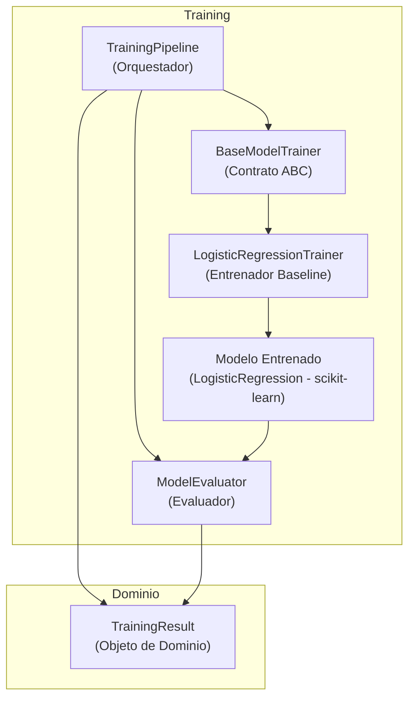
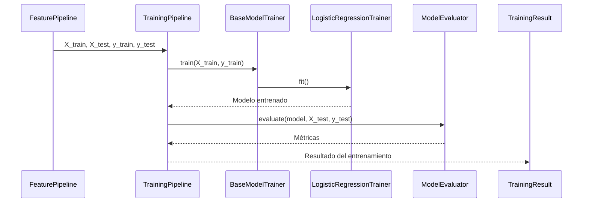

# Sprint DS-06 — Entrenamiento del Modelo

## Información General

| Campo | Valor |
|-------|-------|
| Proyecto | AyniKortex |
| Componente | Data Science |
| Sprint | DS-06 |
| Nombre | Arquitectura de Entrenamiento de Modelos |
| Estado | **Completado** |
| Responsable | Equipo Data Science |
| Arquitectura | Clean Architecture |
| Metodología | Scrum |

---

# 1. Introducción

Una vez finalizadas las etapas de construcción del dataset (DS-03), preprocesamiento (DS-04) e ingeniería de características (DS-05), el siguiente paso consiste en incorporar la capacidad de entrenar modelos de Machine Learning sobre las características generadas.

El objetivo de este sprint no es únicamente entrenar un modelo, sino diseñar una arquitectura desacoplada, extensible y mantenible que permita incorporar nuevos algoritmos de aprendizaje sin afectar el resto del sistema.

Para esta primera versión se utilizará Regresión Logística como modelo baseline debido a su simplicidad, interpretabilidad y buen desempeño en problemas de clasificación de texto.

---

# 2. Objetivo

Diseñar e implementar la arquitectura responsable del entrenamiento de modelos de Machine Learning utilizando una interfaz desacoplada que permita incorporar distintos algoritmos de clasificación manteniendo el principio Open/Closed (OCP).

---

# 3. Objetivos Específicos

- Diseñar el módulo de entrenamiento.
- Definir contratos abstractos para los entrenadores.
- Implementar un entrenador basado en Regresión Logística.
- Desacoplar completamente el algoritmo del pipeline.
- Centralizar el flujo mediante un Training Pipeline.
- Evaluar el desempeño del modelo utilizando métricas estándar.
- Preparar la arquitectura para futuros algoritmos.

---

# 4. Resultado del Sprint

Durante el Sprint DS-06 se diseñó e implementó la arquitectura completa del módulo de entrenamiento del componente de Data Science.

La solución desarrollada permite entrenar modelos de Machine Learning utilizando una arquitectura desacoplada basada en principios SOLID y Clean Architecture.

Como modelo baseline se implementó Regresión Logística mediante Scikit-Learn, manteniendo la posibilidad de incorporar nuevos algoritmos sin modificar el flujo principal del entrenamiento.

Al finalizar el sprint se implementaron exitosamente los siguientes componentes:

- TrainingException
- BaseModelTrainer
- LogisticRegressionTrainer
- ModelEvaluator
- TrainingResult
- TrainingPipeline

Toda la implementación fue validada mediante pruebas unitarias automatizadas, alcanzando un total de **138 pruebas exitosas**, sin introducir regresiones respecto a los sprints anteriores.

---

# 5. Alcance

## Incluye

- Arquitectura del entrenamiento.
- Contratos del entrenamiento.
- Pipeline de entrenamiento.
- Entrenador base.
- Entrenador de Regresión Logística.
- Evaluación del modelo.
- Objeto de resultado del entrenamiento.
- Pruebas unitarias.
- Documentación técnica.

## No incluye

- Persistencia del modelo.
- Carga del modelo.
- Predicción.
- Integración con Backend.
- Optimización de hiperparámetros.
- Validación cruzada.
- AutoML.

Estas funcionalidades serán abordadas en sprints posteriores.

---

# 6. Estado Actual del Proyecto

Actualmente el componente de Data Science cuenta con un pipeline completo compuesto por las siguientes etapas:

```text
Documento
    │
Readers
    │
Loaders
    │
Validación
    │
Preprocesamiento
    │
Ingeniería de Características
    │
Entrenamiento del Modelo

Los módulos anteriores se encuentran implementados, documentados y validados mediante pruebas automatizadas.

---

# 7. Arquitectura del Módulo de Entrenamiento

El entrenamiento será completamente independiente del algoritmo utilizado.

La comunicación entre componentes se realizará mediante contratos abstractos.

El Pipeline conocerá únicamente la interfaz del entrenador y nunca una implementación concreta.

## Diagrama de Dependencias


---

# Evolución de la Arquitectura

La arquitectura propuesta permite incorporar nuevos algoritmos de entrenamiento sin modificar el flujo principal del sistema.

La incorporación de un nuevo modelo consiste únicamente en implementar una nueva clase derivada de `BaseModelTrainer`.

Ejemplo:

BaseModelTrainer

├── LogisticRegressionTrainer

├── RandomForestTrainer

├── SVMTrainer

├── XGBoostTrainer

└── NaiveBayesTrainer

De esta forma el sistema permanece abierto para extensión y cerrado para modificación (Open/Closed Principle).

---

# Filosofía del Diseño

El módulo de entrenamiento fue diseñado priorizando la extensibilidad sobre la implementación de un algoritmo específico.

La arquitectura busca desacoplar completamente el flujo de entrenamiento del algoritmo utilizado, permitiendo incorporar nuevos modelos de Machine Learning sin modificar el resto del sistema.

El objetivo del Sprint DS-06 no consiste únicamente en entrenar un modelo de clasificación, sino en construir una infraestructura reutilizable para futuros algoritmos.

Actualmente el modelo baseline corresponde a Regresión Logística.

Sin embargo, la arquitectura fue diseñada para admitir futuras implementaciones como:

- Random Forest
- Support Vector Machine (SVM)
- XGBoost
- Naive Bayes
- Redes Neuronales

manteniendo el principio Open/Closed y la inversión de dependencias.

---

# 7. Componentes

| Componente                    | Rol                                                              |
| ----------------------------- | ---------------------------------------------------------------- |
| **TrainingPipeline**          | Orquestador del entrenamiento.                                   |
| **BaseModelTrainer**          | Contrato abstracto para todos los entrenadores.                  |
| **LogisticRegressionTrainer** | Implementación baseline basada en Regresión Logística.           |
| **Modelo Entrenado**          | Artefacto generado por el algoritmo y utilizado para predicción. |
| **ModelEvaluator**            | Calcula métricas del modelo entrenado.                           |
| **TrainingResult**            | Objeto de dominio que encapsula el resultado del entrenamiento.  |

---

## TrainingPipeline

Responsable de coordinar el flujo completo del entrenamiento.

No implementa algoritmos.

No calcula métricas.

No almacena modelos.

---

## BaseModelTrainer

Contrato abstracto que define el comportamiento esperado para cualquier algoritmo de entrenamiento.

Será el punto de extensión para futuros modelos.

---

## LogisticRegressionTrainer

Implementación concreta utilizando Regresión Logística como modelo baseline.

Su responsabilidad consiste únicamente en entrenar el modelo.

---

## ModelEvaluator

Calcula las métricas de desempeño del modelo entrenado.

Este componente es independiente del algoritmo utilizado.

---

## TrainingResult

Objeto del dominio encargado de encapsular el resultado del entrenamiento y las métricas obtenidas.

---

# Implementación Realizada

Durante este sprint fueron desarrollados e integrados los siguientes componentes:

| Componente | Estado |
|------------|--------|
| TrainingException | ✅ Implementado |
| BaseModelTrainer | ✅ Implementado |
| LogisticRegressionTrainer | ✅ Implementado |
| ModelEvaluator | ✅ Implementado |
| TrainingResult | ✅ Implementado |
| TrainingPipeline | ✅ Implementado |

Todos los componentes fueron sometidos a revisión de arquitectura y pruebas unitarias antes de su integración.

---

# 8. Flujo del Entrenamiento

```mermaid
flowchart LR

Dataset

FeaturePipeline

TrainingPipeline

ModelTrainer

Modelo

ModelEvaluator

TrainingResult

Dataset --> FeaturePipeline

FeaturePipeline --> TrainingPipeline

TrainingPipeline --> ModelTrainer

ModelTrainer --> Modelo

Modelo --> ModelEvaluator

ModelEvaluator --> TrainingResult
---

# 9. Estructura del Proyecto

```text
src/
└── data_science/
    └── ml/
        └── training/
            ├── training_pipeline.py
            ├── training_result.py
            ├── trainers/
            │   ├── base_model_trainer.py
            │   └── logistic_regression_trainer.py
            ├── evaluators/
            │   └── model_evaluator.py
            └── exceptions/
                └── training_exception.py
```

---


---

# 9. Estructura del Proyecto

```text
src/
└── data_science/
    └── ml/
        ├── evaluation/
        │   └── evaluators/
        │       └── model_evaluator.py
        │
        ├── features/
        │   ├── feature_builder.py
        │   ├── feature_pipeline.py
        │   ├── target_builder.py
        │   └── dataset_splitter.py
        │
        └── training/
            ├── training_pipeline.py
            ├── training_result.py
            ├── trainers/
            │   ├── base_model_trainer.py
            │   └── logistic_regression_trainer.py
            └── exceptions/
                └── training_exception.py
```

---

# 10. Principios de Diseño

Durante este sprint se aplicarán los siguientes principios:

- SOLID
- Clean Architecture
- Clean Code
- Separation of Concerns
- Single Responsibility Principle
- Dependency Inversion Principle
- Open/Closed Principle
- DRY
- KISS

---

# 11. Patrón Arquitectónico

El módulo de entrenamiento adopta el patrón de diseño **Strategy**, cuyo propósito es encapsular diferentes algoritmos de entrenamiento bajo una interfaz común.

Este enfoque permite cambiar el algoritmo utilizado sin modificar el flujo principal del entrenamiento.

En esta arquitectura:

- `TrainingPipeline` actúa como el **Context**.
- `BaseModelTrainer` define la **Strategy**.
- `LogisticRegressionTrainer` representa la primera **Concrete Strategy**.

En futuros sprints podrán incorporarse nuevas implementaciones como:

- RandomForestTrainer
- SVMTrainer
- XGBoostTrainer
- NaiveBayesTrainer

sin modificar el resto del sistema.

## Beneficios

- Cumple Open/Closed Principle (OCP).
- Reduce el acoplamiento.
- Facilita las pruebas unitarias.
- Simplifica la incorporación de nuevos modelos.
- Mantiene un único flujo de entrenamiento para cualquier algoritmo.

---

# 12. Secuencia del Entrenamiento


---

# 13. Decisiones Arquitectónicas (ADR)

## ADR-006-01

Se utilizará una clase abstracta para representar cualquier entrenador de modelos.

### Justificación

Permite incorporar nuevos algoritmos sin modificar el pipeline.

---

## ADR-006-02

TrainingPipeline será el único punto de entrada del entrenamiento.

### Justificación

Centraliza la coordinación y reduce el acoplamiento entre componentes.

---

## ADR-006-03

Las métricas serán calculadas por un componente independiente.

### Justificación

Evita mezclar responsabilidades de entrenamiento y evaluación.

---

## ADR-006-04

TrainingResult será un objeto del dominio.

### Justificación

Evita el uso de diccionarios y proporciona un contrato fuertemente tipado para los módulos posteriores.

---

# 14. Riesgos

- Acoplar el pipeline a un algoritmo específico.
- Mezclar entrenamiento y evaluación.
- Exponer directamente objetos internos de Scikit-Learn.
- Dificultar la incorporación de nuevos modelos.

---

# 15. Criterios de Aceptación

Se considerará finalizado el Sprint cuando:

- Exista una arquitectura completamente desacoplada.
- El Pipeline no dependa de un algoritmo específico.
- Regresión Logística funcione como modelo baseline.
- Las métricas se calculen correctamente.
- El código cumpla SOLID y Clean Architecture.
- Todas las pruebas automatizadas sean exitosas.
- La documentación técnica esté completamente actualizada.
- Arquitectura implementada.
- Código revisado.
- Pruebas unitarias implementadas.
- **138 pruebas exitosas.**
- Sprint aprobado.

---

# 16. Próximos Pasos

Con la arquitectura de entrenamiento finalizada, el siguiente sprint se enfocará en la persistencia del modelo entrenado y la construcción del flujo de inferencia para realizar predicciones sobre nuevos documentos.

La arquitectura desarrollada durante DS-06 constituye la base para la incorporación del componente de predicción dentro del ecosistema de Data Science de AyniKortex.

---

# Conclusiones

El Sprint DS-06 permitió construir una arquitectura desacoplada para el entrenamiento de modelos de Machine Learning, priorizando la mantenibilidad y extensibilidad del sistema sobre la implementación de un algoritmo específico.

El uso de un Pipeline de Entrenamiento, contratos abstractos para los entrenadores y un evaluador independiente facilita la incorporación de nuevos algoritmos sin modificar el flujo principal del sistema.

La arquitectura fue validada mediante una suite automatizada de **138 pruebas unitarias exitosas**, garantizando la estabilidad del componente y la ausencia de regresiones respecto a los sprints anteriores.

Con este sprint finaliza la fase de entrenamiento del modelo y el proyecto queda preparado para iniciar la construcción del módulo de inferencia y predicción en el siguiente sprint.
