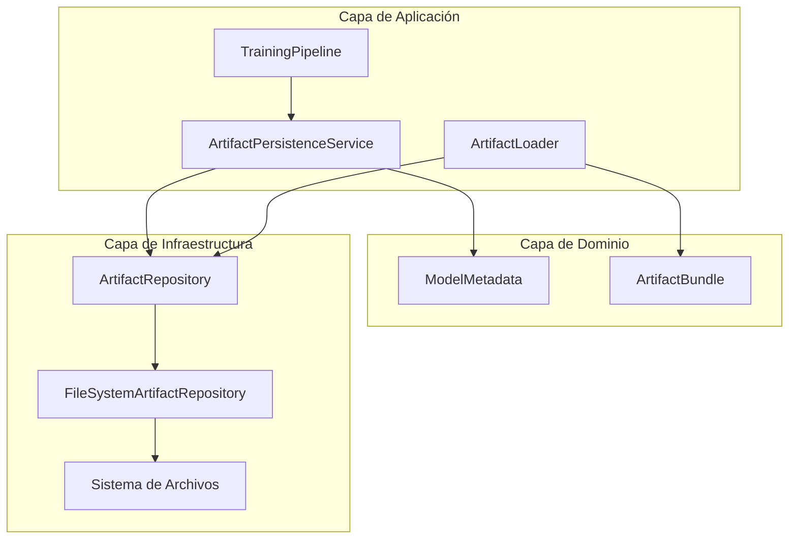
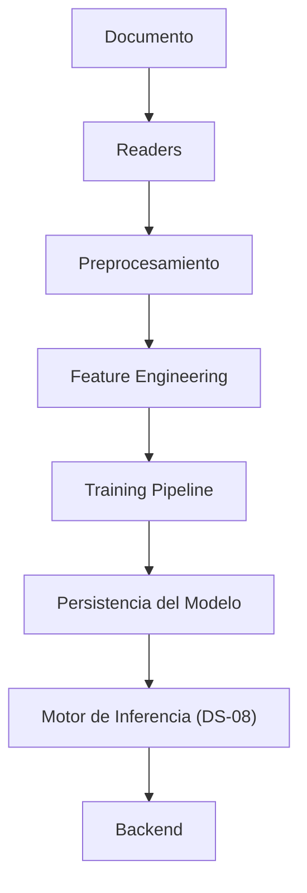
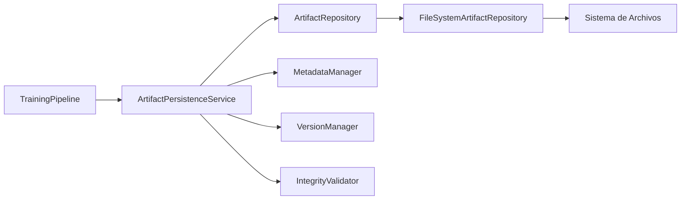
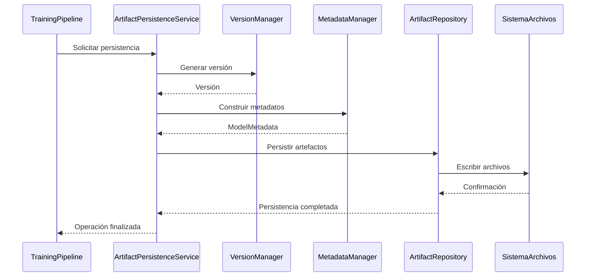
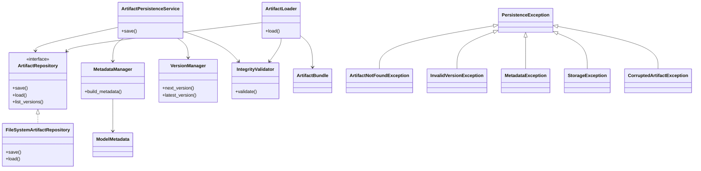
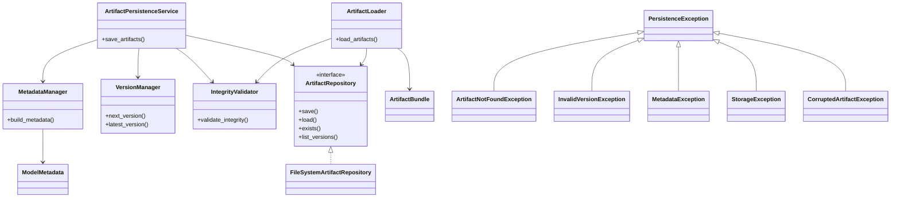
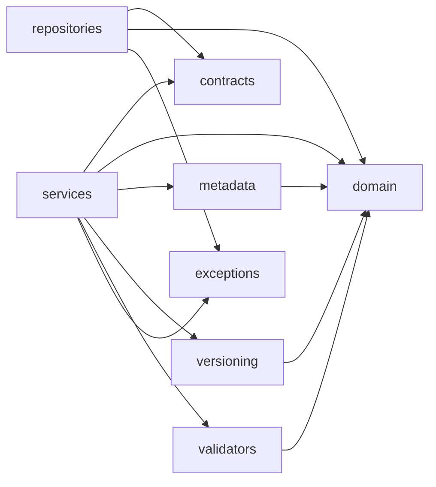
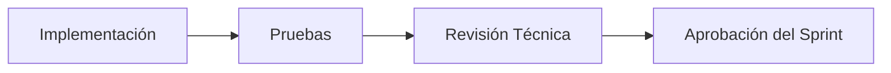
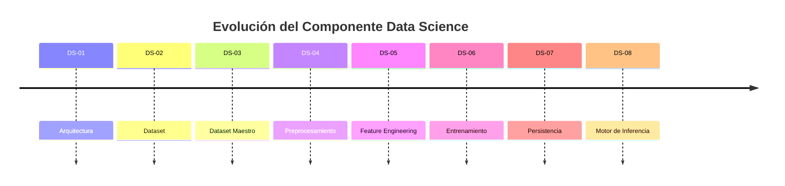

# DS-07 – Persistencia del Modelo

> **Documento:** DS-07-Persistencia-del-Modelo.md  
> **Proyecto:** AyniKortex  
> **Componente:** Data Science  
> **Autor:** Equipo Data Science – G9 LATAM Team 16  
> **Última actualización:** Julio 2026  
> **Estado:** En desarrollo


## Información General

| Campo | Información |
|---------|-------------|
| Proyecto | AyniKortex |
| Componente | Data Science |
| Sprint | DS-07 |
| Nombre | Persistencia del Modelo |
| Estado | 🟡 En desarrollo |
| Versión | 1.0 |
| Fecha | Julio 2026 |
| Equipo | Data Science |
| Dependencia | DS-06 – Entrenamiento del Modelo |
| Próximo Sprint | DS-08 – Motor de Inferencia |

---

# 1. Introducción

El Sprint DS-07 tiene como propósito incorporar el módulo de persistencia del componente de Machine Learning de AyniKortex.

Hasta el Sprint DS-06 el sistema es capaz de entrenar un modelo de clasificación utilizando el Dataset Maestro y el pipeline de ingeniería de características. Sin embargo, los artefactos generados durante el entrenamiento permanecen únicamente en memoria durante la ejecución del proceso.

Esta limitación impide reutilizar el modelo entrenado para realizar inferencias posteriores sin ejecutar nuevamente el entrenamiento.

Para resolver este problema se implementará un módulo especializado de persistencia responsable de almacenar, recuperar, validar y versionar todos los artefactos necesarios para la etapa de inferencia.

El diseño de este módulo mantiene la arquitectura aprobada desde DS-01 y respeta los principios de Clean Architecture, SOLID y separación de responsabilidades.

---

# 2. Objetivo

Diseñar e implementar un módulo independiente encargado de persistir y recuperar los artefactos generados durante el entrenamiento del modelo de Machine Learning.

El módulo deberá garantizar la integridad, trazabilidad y reutilización de los modelos entrenados, permitiendo que el Motor de Inferencia (DS-08) pueda realizar predicciones sin necesidad de ejecutar nuevamente el proceso de entrenamiento.

---

# 3. Objetivos Específicos

- Persistir el modelo entrenado.
- Persistir el vectorizador TF-IDF.
- Persistir el LabelEncoder.
- Persistir los metadatos del entrenamiento.
- Implementar una estrategia de versionado de artefactos.
- Validar la integridad de los artefactos almacenados.
- Recuperar los artefactos necesarios para la inferencia.
- Mantener una arquitectura desacoplada y extensible.
- Preparar la infraestructura para soportar futuros algoritmos de Machine Learning.

---

# 4. Alcance

El Sprint DS-07 comprende el diseño e implementación del módulo de persistencia del componente de Machine Learning.

Incluye:

- Persistencia del modelo entrenado.
- Persistencia del vectorizador TF-IDF.
- Persistencia del LabelEncoder.
- Persistencia de metadatos.
- Gestión de versiones.
- Validación de integridad.
- Recuperación de artefactos.
- Manejo de excepciones.
- Pruebas unitarias.
- Pruebas de integración.

No incluye:

- Motor de inferencia.
- Predicción.
- Reentrenamiento automático.
- Exposición mediante API REST.
- Integración con Backend.

Estas funcionalidades serán abordadas en los sprints posteriores.

---

# 5. Contexto Arquitectónico

El componente Data Science forma parte de la arquitectura principal de AyniKortex y se implementa como una biblioteca Python integrada directamente con el Backend.

La arquitectura aprobada establece que el componente **no funciona como un microservicio ni expone servicios HTTP**, sino que proporciona una única interfaz pública utilizada por Backend.

```python
predict(
    title: str,
    text: str,
)
```

El módulo desarrollado en este sprint no modifica dicha interfaz pública.

Su responsabilidad consiste únicamente en administrar el ciclo de vida de los artefactos generados durante el entrenamiento para que puedan ser reutilizados posteriormente por el Motor de Inferencia.

---

# 6. Relación con los Sprints Anteriores

El módulo de persistencia se incorpora sobre la arquitectura construida en los sprints anteriores.

| Sprint | Entregable | Estado |
|---------|------------|--------|
| DS-01 | Arquitectura del componente Data Science | ✅ |
| DS-02 | Investigación y adquisición del dataset | ✅ |
| DS-03 | Dataset Maestro | ✅ |
| DS-04 | Preprocesamiento | ✅ |
| DS-05 | Ingeniería de Características | ✅ |
| DS-06 | Entrenamiento del Modelo | ✅ |
| DS-07 | Persistencia del Modelo | 🟡 En desarrollo |

La incorporación del módulo de persistencia no modifica el comportamiento de los componentes existentes, preservando la compatibilidad con FeaturePipeline y TrainingPipeline.

---

# 7. Problema que Resuelve

Antes de este sprint, cada vez que la aplicación necesitaba realizar una predicción era necesario volver a ejecutar el proceso completo de entrenamiento del modelo.

Esta aproximación presenta varias desventajas:

- Incremento del tiempo de respuesta.
- Consumo innecesario de recursos computacionales.
- Imposibilidad de reutilizar modelos previamente entrenados.
- Ausencia de control de versiones.
- Falta de trazabilidad de los entrenamientos.
- Riesgo de inconsistencias entre ejecuciones.

El módulo de persistencia elimina estas limitaciones al proporcionar un mecanismo centralizado para almacenar, versionar y recuperar los artefactos del modelo de forma segura y consistente.

---

# 8. Arquitectura General

El módulo de Persistencia del Modelo constituye la capa intermedia entre el proceso de entrenamiento y el futuro Motor de Inferencia.

Su responsabilidad principal consiste en administrar el ciclo de vida de los artefactos generados durante el entrenamiento, garantizando su almacenamiento, recuperación, versionado e integridad.

La arquitectura mantiene el mismo enfoque utilizado en los módulos desarrollados durante los sprints anteriores:

- Responsabilidades claramente separadas.
- Bajo acoplamiento.
- Alta cohesión.
- Dependencia de abstracciones.
- Componentes reutilizables.
- Preparado para futuras extensiones.

La persistencia se implementa como un módulo independiente dentro del componente de Machine Learning, sin modificar los componentes de entrenamiento existentes.

---

# 9. Arquitectura por Capas

El módulo de persistencia mantiene la organización por capas definida desde el Sprint DS-01.

Cada capa posee responsabilidades claramente delimitadas, evitando dependencias innecesarias y favoreciendo la mantenibilidad del sistema.



La organización por capas permite que la lógica de negocio permanezca independiente de la infraestructura utilizada para almacenar los artefactos.

Gracias a esta separación será posible incorporar nuevos mecanismos de almacenamiento sin modificar los componentes responsables del entrenamiento o del futuro Motor de Inferencia.

---

# 10. Integración dentro del Pipeline de Machine Learning

La persistencia se incorpora inmediatamente después del entrenamiento del modelo y antes del Motor de Inferencia.



---

# 11. Arquitectura del Módulo de Persistencia

El módulo se organiza en componentes especializados, cada uno con una responsabilidad claramente definida.



---

# 12. Flujo Funcional

El almacenamiento de un entrenamiento sigue el siguiente flujo:

1. Finaliza el proceso de entrenamiento.
2. Se genera una nueva versión del modelo.
3. Se construyen los metadatos del entrenamiento.
4. Se almacenan los artefactos.
5. Se valida la integridad del conjunto persistido.
6. Se confirma la versión disponible para inferencia.



---

# 13. Componentes del Módulo

El módulo de persistencia estará compuesto por los siguientes componentes.

| Componente | Responsabilidad |
|------------|-----------------|
| ArtifactPersistenceService | Coordinar el proceso completo de persistencia |
| ArtifactRepository | Definir el contrato de almacenamiento |
| FileSystemArtifactRepository | Implementar el almacenamiento en sistema de archivos |
| VersionManager | Administrar las versiones del modelo |
| MetadataManager | Construir los metadatos del entrenamiento |
| IntegrityValidator | Verificar la consistencia de los artefactos |
| ArtifactLoader | Recuperar los artefactos para inferencia |
| ModelMetadata | Representar la información del entrenamiento |
| ArtifactBundle | Agrupar los artefactos recuperados |
| PersistenceException | Excepción base del módulo |

---

# 14. Responsabilidades

Cada componente tiene una única responsabilidad, respetando el principio de responsabilidad única (SRP).

## ArtifactPersistenceService

- Coordinar el almacenamiento.
- Orquestar el proceso de persistencia.
- Delegar responsabilidades a los componentes especializados.

No accede directamente al sistema de archivos.

---

## ArtifactRepository

Define el contrato que deberá cumplir cualquier mecanismo de almacenamiento.

No contiene implementación.

---

## FileSystemArtifactRepository

Implementa el almacenamiento utilizando el sistema de archivos local.

Es el único componente autorizado para interactuar con la infraestructura de almacenamiento.

---

## VersionManager

Centraliza la estrategia de versionado de modelos.

Entre sus responsabilidades se encuentran:

- generar versiones;
- validar formatos;
- obtener la última versión disponible.

---

## MetadataManager

Construye los metadatos asociados al entrenamiento.

No realiza operaciones de persistencia.

---

## IntegrityValidator

Verifica que todos los artefactos requeridos existan y sean consistentes antes de ser utilizados.

---

## ArtifactLoader

Reconstruye el conjunto completo de artefactos para el Motor de Inferencia.

---

## ModelMetadata

Representa la información del entrenamiento.

Es un objeto de dominio inmutable.

---

## ArtifactBundle

Agrupa todos los artefactos necesarios para ejecutar una predicción.

---

## PersistenceException

Define la jerarquía de excepciones del módulo de persistencia.

---

# 15. Principios de Diseño Aplicados

La arquitectura propuesta mantiene los principios definidos desde el inicio del proyecto.

| Principio | Aplicación |
|-----------|------------|
| Single Responsibility | Cada componente posee una única responsabilidad. |
| Open/Closed | La persistencia admite nuevas implementaciones sin modificar los consumidores. |
| Liskov Substitution | Cualquier implementación de `ArtifactRepository` puede sustituir a otra. |
| Interface Segregation | Los consumidores dependen únicamente de los contratos que utilizan. |
| Dependency Inversion | Los servicios dependen de abstracciones y no de implementaciones concretas. |
| Clean Architecture | Separación entre dominio, servicios e infraestructura. |
| Separation of Concerns | Cada capa resuelve un problema específico. |
| Bajo Acoplamiento | Los componentes interactúan mediante contratos. |
| Alta Cohesión | Cada módulo encapsula una responsabilidad bien definida. |

---

# 16. Matriz de Dependencias

La siguiente matriz resume las dependencias permitidas entre los componentes del módulo.

| Componente | Depende de | No depende de |
|------------|------------|---------------|
| ArtifactPersistenceService | ArtifactRepository, MetadataManager, VersionManager, IntegrityValidator | Sistema de archivos |
| ArtifactLoader | ArtifactRepository, IntegrityValidator | TrainingPipeline |
| MetadataManager | ModelMetadata | Sistema de archivos |
| VersionManager | Objetos del dominio | Sistema de archivos |
| IntegrityValidator | ArtifactRepository | TrainingPipeline |
| FileSystemArtifactRepository | Sistema de archivos | TrainingPipeline |
| ModelMetadata | Ninguno | Infraestructura |
| ArtifactBundle | Objetos del dominio | Infraestructura |

La dependencia hacia componentes de infraestructura queda encapsulada mediante contratos, cumpliendo el principio de Inversión de Dependencias (Dependency Inversion Principle).

---

# 17. Diseño de Clases

El módulo de persistencia se construye a partir de componentes especializados organizados según las responsabilidades definidas en la arquitectura.

Cada clase cumple una función específica y mantiene un bajo nivel de acoplamiento con el resto del sistema.

## Diagrama de Clases



---

# 18. Objetos del Dominio

Los objetos del dominio representan la información central del módulo y permanecen independientes de la infraestructura.

Todos los objetos de dominio se implementarán utilizando `@dataclass(frozen=True, slots=True)` para garantizar inmutabilidad, simplicidad y eficiencia.

## ModelMetadata

Representa la información asociada a un entrenamiento.

### Información de Identidad

- version
- model_name
- algorithm

### Información del Dataset

- dataset_name
- dataset_size
- feature_count
- class_count

### Información del Entrenamiento

- training_time_seconds
- random_state

### Métricas

- accuracy
- precision
- recall
- f1_score

### Información del Entorno

- created_at
- python_version
- scikit_learn_version

### Integridad

- model_hash
- vectorizer_hash
- encoder_hash

---

## ArtifactBundle

Agrupa todos los artefactos requeridos para ejecutar una inferencia.

Contiene:

- modelo entrenado
- vectorizador TF-IDF
- LabelEncoder
- ModelMetadata

Su única responsabilidad consiste en transportar los artefactos entre los distintos componentes del sistema.

No contiene lógica de negocio.

---

# 19. Contratos Públicos

El módulo expone contratos que permiten desacoplar la lógica de negocio de la infraestructura.

## ArtifactRepository

Responsable de definir las operaciones de persistencia.

Operaciones:

- save(...)
- load(...)
- list_versions(...)
- exists(...)

---

## ArtifactPersistenceService

Responsable de coordinar el proceso completo de persistencia.

Operaciones principales:

- save()
- persist()

---

## ArtifactLoader

Responsable de recuperar un conjunto completo de artefactos para inferencia.

Operaciones principales:

- load()
- load_latest()

---

## VersionManager

Administra la estrategia de versionado.

Operaciones principales:

- next_version()
- latest_version()
- validate()

---

## MetadataManager

Construye los metadatos del entrenamiento.

Operaciones principales:

- build_metadata()

---

## IntegrityValidator

Verifica la integridad del conjunto persistido.

Operaciones principales:

- validate()

---

# 20. Estructura de Paquetes

La organización física del módulo será la siguiente.

```text
ml/
└── persistence/
    ├── contracts/
    ├── domain/
    ├── exceptions/
    ├── metadata/
    ├── repositories/
    ├── services/
    ├── utils/
    ├── validators/
    └── versioning/
```

Cada paquete encapsula una responsabilidad específica, facilitando la mantenibilidad y la evolución del sistema.

---

# 21. Responsabilidades por paquete

| Paquete        | Responsabilidad                            |
| -------------- | ------------------------------------------ |
| `contracts`    | Interfaces y contratos públicos del módulo |
| `domain`       | Objetos de dominio inmutables              |
| `services`     | Coordinación de casos de uso               |
| `repositories` | Implementaciones de persistencia           |
| `metadata`     | Construcción de metadatos                  |
| `versioning`   | Gestión del versionado semántico           |
| `validators`   | Validación e integridad de artefactos      |
| `exceptions`   | Jerarquía de excepciones                   |
| `utils`        | Utilidades compartidas del módulo          |


---

# 22. Estructura de Directorios

```text
src/
└── data_science/
    └── ml/
        └── persistence/
            ├── contracts/
            ├── domain/
            │   ├── artifact_bundle.py
            │   └── model_metadata.py
            ├── exceptions/
            ├── metadata/
            ├── repositories/
            ├── services/
            ├── utils/
            ├── validators/
            └── versioning/

tests/
└── data_science/
    └── ml/
        └── persistence/
```

La estructura mantiene la misma organización utilizada en los módulos desarrollados durante los sprints anteriores, favoreciendo la consistencia del proyecto.

---

# 23. Diseño de Clases del Módulo

La arquitectura presentada en la sección anterior se materializa mediante un conjunto de clases organizadas según los principios de Clean Architecture y SOLID.

Cada clase posee una responsabilidad única y colabora con las demás a través de contratos bien definidos, reduciendo el acoplamiento entre la lógica de negocio y la infraestructura.

El siguiente diagrama representa las relaciones principales entre los componentes que conforman el módulo de persistencia.



| Clase                        | Tipo            | Responsabilidad                             |
| ---------------------------- | --------------- | ------------------------------------------- |
| ArtifactPersistenceService   | Servicio        | Coordinar el proceso de persistencia        |
| ArtifactLoader               | Servicio        | Recuperar artefactos para inferencia        |
| MetadataManager              | Servicio        | Construir metadatos                         |
| VersionManager               | Servicio        | Gestionar versiones                         |
| IntegrityValidator           | Servicio        | Validar integridad                          |
| ArtifactRepository           | Contrato        | Definir operaciones de persistencia         |
| FileSystemArtifactRepository | Infraestructura | Implementar almacenamiento local            |
| ModelMetadata                | Dominio         | Representar los metadatos del entrenamiento |
| ArtifactBundle               | Dominio         | Agrupar los artefactos persistidos          |


---

# 24. Modelo del Dominio

El dominio del módulo de persistencia está compuesto por objetos inmutables que representan la información necesaria para almacenar y recuperar los artefactos generados durante el entrenamiento.

Estos objetos encapsulan únicamente datos del dominio y permanecen completamente desacoplados de cualquier tecnología de almacenamiento.

Todos los objetos del dominio deberán implementarse utilizando `@dataclass(frozen=True, slots=True)` para garantizar:

- Inmutabilidad.
- Simplicidad.
- Mejor rendimiento en memoria.
- Facilidad de serialización.
- Ausencia de efectos secundarios.

---

## 24.1 ModelMetadata

`ModelMetadata` representa la información descriptiva asociada a un entrenamiento y constituye la principal fuente de trazabilidad del modelo persistido.

Su finalidad es documentar las características del entrenamiento, el entorno de ejecución y la información necesaria para validar la integridad de los artefactos almacenados.

### Atributos

| Categoría | Atributos |
|-----------|-----------|
| Identidad | version, model_name, algorithm |
| Dataset | dataset_name, dataset_size, feature_count, class_count |
| Entrenamiento | training_time_seconds, random_state |
| Métricas | accuracy, precision, recall, f1_score |
| Entorno | created_at, python_version, scikit_learn_version |
| Integridad | model_hash, vectorizer_hash, encoder_hash |

### Responsabilidades

- Representar los metadatos del entrenamiento.
- Facilitar la trazabilidad del modelo.
- Permitir la validación de versiones.
- Proporcionar información para auditoría.
- Mantener la integridad lógica del conjunto persistido.

`ModelMetadata` no contiene lógica de negocio ni operaciones relacionadas con persistencia.

---

## 24.2 ArtifactBundle

`ArtifactBundle` representa el conjunto completo de artefactos necesarios para ejecutar una inferencia.

Este objeto simplifica la comunicación entre los componentes del sistema al agrupar todos los elementos requeridos en una única estructura.

### Contenido

- Modelo entrenado.
- Vectorizador TF-IDF.
- LabelEncoder.
- ModelMetadata.

### Responsabilidades

- Agrupar los artefactos persistidos.
- Transportar los objetos entre componentes.
- Reducir el acoplamiento entre servicios.
- Facilitar la carga del Motor de Inferencia.

ArtifactBundle no implementa lógica de negocio ni realiza validaciones.

---

## 24.3 Principios del Modelo de Dominio

Los objetos del dominio cumplen las siguientes reglas de diseño:

- Son inmutables.
- No conocen la infraestructura.
- No realizan operaciones de lectura o escritura.
- No dependen de bibliotecas de persistencia.
- No contienen reglas de negocio relacionadas con almacenamiento.
- Pueden reutilizarse independientemente del mecanismo de persistencia.

Esta separación permite mantener un dominio limpio y alineado con los principios de Clean Architecture.

---

# 25. Contratos e Interfaces

El módulo define un conjunto de contratos que desacoplan la lógica de negocio de las implementaciones concretas.

Estos contratos permiten incorporar nuevos mecanismos de almacenamiento sin modificar los componentes consumidores.

---

## 25.1 ArtifactRepository

Define la interfaz que deberán implementar todos los mecanismos de persistencia soportados por el sistema.

### Responsabilidades

- Persistir artefactos.
- Recuperar artefactos.
- Consultar versiones disponibles.
- Verificar la existencia de una versión.

### Operaciones principales

| Operación | Descripción |
|-----------|-------------|
| save() | Almacena un conjunto de artefactos. |
| load() | Recupera un conjunto de artefactos. |
| exists() | Verifica la existencia de una versión. |
| list_versions() | Obtiene las versiones disponibles. |

---

## 25.2 ArtifactPersistenceService

Coordina el proceso completo de persistencia.

### Responsabilidades

- Orquestar el almacenamiento.
- Coordinar los servicios auxiliares.
- Delegar la persistencia al repositorio.

---

## 25.3 ArtifactLoader

Recupera un conjunto completo de artefactos listos para ser utilizados durante la inferencia.

### Responsabilidades

- Recuperar artefactos.
- Reconstruir el ArtifactBundle.
- Validar la integridad antes de la entrega.

---

## 25.4 MetadataManager

Construye la información descriptiva asociada al entrenamiento.

### Responsabilidades

- Generar ModelMetadata.
- Consolidar métricas.
- Registrar información del entorno.

---

## 25.5 VersionManager

Gestiona el ciclo de vida de las versiones del modelo.

### Responsabilidades

- Generar nuevas versiones.
- Validar el formato de versión.
- Obtener la versión más reciente.

---

## 25.6 IntegrityValidator

Verifica la consistencia del conjunto de artefactos almacenados.

### Responsabilidades

- Validar hashes.
- Comprobar la existencia de archivos.
- Detectar inconsistencias.

---

## 25.7 Colaboración entre Componentes

flowchart LR

TrainingPipeline --> ArtifactPersistenceService

ArtifactPersistenceService --> MetadataManager
ArtifactPersistenceService --> VersionManager
ArtifactPersistenceService --> IntegrityValidator
ArtifactPersistenceService --> ArtifactRepository

ArtifactRepository --> FileSystemArtifactRepository

---

# 26. Organización de Paquetes

La organización del módulo de persistencia sigue una estructura basada en responsabilidades, alineada con los principios de **Clean Architecture**, **SOLID** y **Separation of Concerns**.

Cada paquete agrupa componentes relacionados por su función dentro del sistema, evitando dependencias innecesarias y facilitando la evolución independiente de cada capa.

---

## 26.1 Principios de Organización

La estructura de paquetes cumple los siguientes principios:

- Separación clara entre dominio, servicios e infraestructura.
- Dependencias dirigidas hacia las abstracciones.
- Alta cohesión dentro de cada paquete.
- Bajo acoplamiento entre componentes.
- Facilidad para incorporar nuevas implementaciones de persistencia.
- Organización consistente con el resto del componente Data Science.

---

## 26.2 Organización de Paquetes

| Paquete | Responsabilidad |
|----------|-----------------|
| contracts | Define las interfaces públicas del módulo de persistencia. |
| domain | Contiene los objetos del dominio y estructuras inmutables. |
| services | Implementa la lógica de coordinación del proceso de persistencia y recuperación. |
| repositories | Contiene las implementaciones concretas de almacenamiento. |
| metadata | Gestiona la construcción y validación de metadatos del modelo. |
| versioning | Administra la generación y validación de versiones de los artefactos. |
| validators | Implementa las validaciones de integridad de los artefactos persistidos. |
| exceptions | Centraliza las excepciones específicas del módulo. |
| utils | Agrupa funciones auxiliares reutilizables por el módulo. |

---

## 26.3 Dependencias entre Paquetes

Las dependencias permitidas son las siguientes:



La dirección de las dependencias garantiza que los componentes de mayor nivel dependan únicamente de abstracciones y modelos del dominio, preservando la independencia de la infraestructura.

---

## 26.4 Beneficios de la Organización

La estructura propuesta ofrece las siguientes ventajas:

- Facilita la incorporación de nuevos mecanismos de persistencia.
- Reduce el impacto de cambios en la infraestructura.
- Favorece el desarrollo y las pruebas unitarias de forma aislada.
- Mejora la mantenibilidad del código.
- Mantiene una arquitectura consistente con los demás módulos del componente Data Science.

---

# 27. Estructura Física del Proyecto

La siguiente estructura representa la organización física del módulo de persistencia dentro del componente Data Science.

```text
src/
└── data_science/
    └── ml/
        └── persistence/
            ├── contracts/
            │   └── artifact_repository.py
            │
            ├── domain/
            │   ├── artifact_bundle.py
            │   └── model_metadata.py
            │
            ├── services/
            │   ├── artifact_loader.py
            │   └── artifact_persistence_service.py
            │
            ├── repositories/
            │   └── filesystem_artifact_repository.py
            │
            ├── metadata/
            │   └── metadata_manager.py
            │
            ├── versioning/
            │   └── version_manager.py
            │
            ├── validators/
            │   └── integrity_validator.py
            │
            ├── exceptions/
            │   └── persistence_exception.py
            │
            └── utils/
                └── hash_utils.py
```


flowchart LR

    Documento["DS-07<br/>Persistencia"]

    Paquetes["Organización de Paquetes"]

    Codigo["Implementación"]

    Pruebas["Tests"]

    Documento --> Paquetes
    Paquetes --> Codigo
    Codigo --> Pruebas


---

## 27.1 Estructura de Pruebas

Cada componente deberá contar con pruebas unitarias independientes.

```text
tests/
└── data_science/
    └── ml/
        └── persistence/
            ├── contracts/
            ├── domain/
            ├── services/
            ├── repositories/
            ├── metadata/
            ├── versioning/
            ├── validators/
            └── exceptions/
```

---

## 27.2 Convenciones de Organización

La estructura física del proyecto deberá respetar las siguientes convenciones:

- Un archivo por clase principal.
- Nombres de módulos en *snake_case*.
- Clases en *PascalCase*.
- Interfaces separadas de sus implementaciones.
- Objetos del dominio completamente independientes de la infraestructura.
- Las pruebas replicarán la misma estructura del código fuente para facilitar la trazabilidad.

---

## 27.3 Evolución del Módulo

La organización propuesta permite incorporar nuevas implementaciones sin modificar la estructura existente.

Algunos ejemplos de evolución futura son:

- Nuevos repositorios para almacenamiento en la nube.
- Persistencia sobre bases de datos especializadas.
- Validadores adicionales de integridad.
- Nuevos mecanismos de serialización.
- Estrategias avanzadas de versionado.

La incorporación de estas capacidades deberá realizarse respetando los contratos definidos en este documento y manteniendo la compatibilidad con los componentes existentes.

---

# 28. Estrategia de Pruebas

## 28.1 Objetivo

La estrategia de pruebas del módulo de persistencia tiene como propósito verificar que todos los componentes implementados funcionen de manera correcta, consistente y confiable antes de su integración con el resto del componente Data Science.

Las pruebas definidas en este capítulo permitirán validar tanto el comportamiento individual de cada componente como la interacción entre ellos, garantizando que los artefactos del modelo puedan persistirse y recuperarse de forma íntegra.

---

## 28.2 Alcance de las Pruebas

La estrategia contempla la validación de los siguientes componentes:

- Servicios de persistencia.
- Servicios de recuperación de artefactos.
- Gestión de metadatos.
- Gestión de versiones.
- Validación de integridad.
- Repositorios de almacenamiento.
- Objetos del dominio.
- Manejo de excepciones.

No forman parte del alcance de este sprint las pruebas relacionadas con:

- Inferencia del modelo.
- Clasificación documental.
- API REST.
- Integración con Backend.
- Rendimiento del modelo de Machine Learning.

Estas capacidades serán abordadas en los sprints posteriores.

---

## 28.3 Niveles de Prueba

La validación del módulo se realizará mediante diferentes niveles de prueba.

| Nivel | Objetivo |
|--------|----------|
| Pruebas Unitarias | Validar el comportamiento individual de cada clase. |
| Pruebas de Integración | Verificar la interacción entre los componentes del módulo. |
| Pruebas Funcionales | Confirmar el flujo completo de persistencia y recuperación de artefactos. |
| Pruebas de Validación | Detectar errores de integridad, versiones y metadatos. |

---

## 28.4 Estrategia de Pruebas Unitarias

Cada clase deberá contar con pruebas unitarias independientes que validen:

- Construcción correcta de objetos.
- Comportamiento esperado de los métodos públicos.
- Manejo adecuado de errores.
- Validación de entradas inválidas.
- Cumplimiento de las reglas del dominio.

Las pruebas deberán ejecutarse de manera aislada, sin depender de componentes externos.

---

## 28.5 Estrategia de Pruebas de Integración

Las pruebas de integración verificarán el correcto funcionamiento del flujo completo de persistencia.

Entre los escenarios principales se incluyen:

- Persistencia exitosa del conjunto de artefactos.
- Recuperación de artefactos previamente almacenados.
- Reconstrucción correcta del `ArtifactBundle`.
- Lectura consistente de metadatos.
- Recuperación de la versión más reciente.
- Validación de integridad posterior a la carga.

---

## 28.6 Casos de Prueba Principales

| Caso | Resultado Esperado |
|------|--------------------|
| Guardar un modelo entrenado | Artefactos persistidos correctamente. |
| Recuperar un modelo existente | Reconstrucción completa del `ArtifactBundle`. |
| Solicitar una versión inexistente | Generación de `ArtifactNotFoundException`. |
| Detectar corrupción de archivos | Rechazo de la carga y generación de excepción. |
| Validar metadatos | Información consistente con los artefactos almacenados. |
| Recuperar la última versión | Obtención de la versión vigente del modelo. |

---

## 28.7 Cobertura Esperada

Como objetivo de calidad del sprint se establece una cobertura mínima del **90 %** sobre el código del módulo de persistencia.

La cobertura deberá incluir:

- Servicios.
- Dominio.
- Repositorios.
- Validadores.
- Gestores de versiones.
- Excepciones.

---

## 28.8 Criterios de Éxito

La estrategia de pruebas se considerará satisfactoria cuando:

- Todas las pruebas unitarias finalicen correctamente.
- No existan errores críticos de persistencia.
- Los artefactos recuperados sean equivalentes a los almacenados.
- La validación de integridad sea satisfactoria.
- Se mantenga la compatibilidad con el diseño arquitectónico aprobado.

---

## 28.9 Resumen

La estrategia definida garantiza que el módulo de persistencia entregue un mecanismo confiable para almacenar y recuperar los artefactos del modelo, constituyendo la base sobre la cual se desarrollará el Motor de Inferencia en el siguiente sprint.

flowchart LR

    Unitarias["Pruebas Unitarias"]

    Integracion["Pruebas de Integración"]

    Validacion["Validación"]

    Resultado["Módulo Aprobado"]

    Unitarias --> Integracion
    Integracion --> Validacion
    Validacion --> Resultado

---

## 28.10 Matriz de Cobertura de Componentes

La siguiente matriz resume la cobertura esperada para cada uno de los componentes del módulo de persistencia.

| Componente | Unitarias | Integración | Validación |
|------------|-----------|-------------|------------|
| ArtifactPersistenceService | ✅ | ✅ | ✅ |
| ArtifactLoader | ✅ | ✅ | ✅ |
| MetadataManager | ✅ | ✅ | ✅ |
| VersionManager | ✅ | ✅ | ✅ |
| IntegrityValidator | ✅ | ✅ | ✅ |
| FileSystemArtifactRepository | ✅ | ✅ | ✅ |
| ModelMetadata | ✅ | — | ✅ |
| ArtifactBundle | ✅ | — | ✅ |
| Excepciones | ✅ | — | — |

Esta matriz facilita la planificación de las pruebas y permite verificar que todos los componentes críticos del módulo cuentan con una estrategia de validación adecuada.

---

# 29. Riesgos

## 29.1 Objetivo

El presente capítulo identifica los principales riesgos asociados al desarrollo, implementación e integración del módulo de persistencia del modelo, así como las estrategias definidas para reducir su probabilidad de ocurrencia y minimizar su impacto sobre el proyecto.

La gestión preventiva de riesgos contribuye a mantener la estabilidad del componente Data Science y facilita la integración con los módulos desarrollados por Backend durante los siguientes sprints.

---

## 29.2 Clasificación de Riesgos

Los riesgos identificados se agrupan en las siguientes categorías:

- Riesgos técnicos.
- Riesgos de integración.
- Riesgos operativos.
- Riesgos de mantenimiento.
- Riesgos de calidad.

Esta clasificación permite definir estrategias de mitigación específicas para cada tipo de amenaza.

---

## 29.3 Matriz de Riesgos

| ID | Riesgo | Probabilidad | Impacto | Nivel |
|----|---------|--------------|---------|--------|
| R-01 | Corrupción de artefactos persistidos | Media | Alto | Alto |
| R-02 | Incompatibilidad entre versiones del modelo | Media | Alto | Alto |
| R-03 | Pérdida de metadatos | Baja | Alto | Medio |
| R-04 | Fallos durante la recuperación del modelo | Baja | Alto | Medio |
| R-05 | Cambios futuros en el mecanismo de almacenamiento | Alta | Medio | Alto |
| R-06 | Errores de integración con el Motor de Inferencia | Media | Alto | Alto |
| R-07 | Implementaciones que incumplan los contratos definidos | Baja | Alto | Medio |
| R-08 | Degradación de la mantenibilidad por acoplamiento excesivo | Baja | Medio | Bajo |

---

## 29.4 Estrategias de Mitigación

Para cada riesgo identificado se establece una estrategia preventiva.

| Riesgo | Estrategia de Mitigación |
|---------|--------------------------|
| Corrupción de archivos | Validación de integridad antes de la carga. |
| Incompatibilidad de versiones | Gestión centralizada mediante VersionManager. |
| Pérdida de metadatos | Persistencia conjunta de artefactos y metadatos. |
| Recuperación incorrecta | Validación automática posterior a la carga. |
| Cambios tecnológicos | Uso de interfaces y repositorios desacoplados. |
| Integración con DS-08 | Contratos públicos estables y pruebas de integración. |
| Incumplimiento de contratos | Validación mediante pruebas unitarias e integración continua. |
| Acoplamiento elevado | Aplicación de principios SOLID y Clean Architecture. |

---

## 29.5 Riesgos Residuales

Aun aplicando las estrategias definidas, existen riesgos que no pueden eliminarse completamente.

Entre ellos se encuentran:

- Errores ocasionados por cambios futuros en librerías externas.
- Cambios en los formatos de serialización utilizados.
- Problemas derivados del sistema de archivos del entorno de ejecución.
- Incompatibilidades provocadas por futuras versiones del lenguaje o dependencias.

Estos riesgos deberán ser monitoreados durante la evolución del proyecto.

---

## 29.6 Monitoreo de Riesgos

Durante el desarrollo del componente se realizará un seguimiento continuo de los riesgos mediante:

- Ejecución periódica de pruebas automatizadas.
- Revisión de los artefactos persistidos.
- Validación de las versiones almacenadas.
- Auditoría de metadatos.
- Revisión de incidencias detectadas durante la integración.

---

## 29.7 Criterios de Aceptación del Riesgo

Se considerará que el módulo presenta un nivel aceptable de riesgo cuando:

- No existan riesgos críticos sin estrategia de mitigación.
- Todos los riesgos de nivel alto cuenten con mecanismos preventivos.
- Los riesgos residuales sean documentados.
- Existan procedimientos de recuperación ante fallos.

---

## 29.8 Resumen

La identificación temprana de riesgos fortalece la calidad del diseño arquitectónico y reduce la probabilidad de incidencias durante la implementación y evolución del módulo de persistencia.

Las estrategias definidas permiten mantener la confiabilidad del componente y constituyen la base para una integración segura con el Motor de Inferencia desarrollado en el siguiente sprint.

---

## 29.9 Flujo de gestión del riesgo


---

## 29.10 Matriz de Priorización

| Nivel | Acción Recomendada |
|--------|--------------------|
| Alto | Mitigación obligatoria antes de la implementación. |
| Medio | Monitoreo continuo y mitigación durante el desarrollo. |
| Bajo | Seguimiento periódico y revisión en futuras iteraciones. |

---

# 30. Criterios de Aceptación

## 30.1 Objetivo

Los criterios de aceptación establecen las condiciones funcionales, técnicas y de calidad que deberán cumplirse para considerar finalizado el Sprint DS-07 – Persistencia del Modelo.

Estos criterios servirán como referencia para validar que los entregables cumplen con los objetivos definidos al inicio del sprint y que el módulo está preparado para integrarse con el Motor de Inferencia en el siguiente ciclo de desarrollo.

---

## 30.2 Criterios Funcionales

El módulo deberá cumplir los siguientes requisitos funcionales:

- Persistir correctamente todos los artefactos generados durante el entrenamiento.
- Recuperar de forma íntegra los artefactos almacenados.
- Gestionar múltiples versiones del modelo.
- Mantener consistencia entre artefactos y metadatos.
- Detectar archivos inexistentes o corruptos.
- Garantizar la reconstrucción completa del `ArtifactBundle`.

---

## 30.3 Criterios Técnicos

El componente deberá cumplir con los siguientes criterios técnicos:

- Respetar la arquitectura definida para el componente Data Science.
- Implementar los contratos e interfaces documentados.
- Mantener bajo acoplamiento entre módulos.
- Aplicar los principios SOLID.
- Mantener separación entre dominio, servicios e infraestructura.
- Cumplir las convenciones de organización establecidas para el proyecto.

---

## 30.4 Criterios de Calidad

Para aprobar el sprint deberán cumplirse los siguientes indicadores de calidad:

- Cobertura mínima del 90 % en pruebas unitarias.
- Ejecución satisfactoria de las pruebas de integración.
- Ausencia de errores críticos durante la persistencia y recuperación.
- Código documentado y estructurado.
- Cumplimiento de las convenciones de nomenclatura del proyecto.
- Ausencia de dependencias circulares.

---

## 30.5 Checklist de Aceptación

| Criterio | Estado Esperado |
|----------|-----------------|
| Arquitectura implementada | ✅ |
| Contratos definidos | ✅ |
| Persistencia funcional | ✅ |
| Recuperación funcional | ✅ |
| Gestión de metadatos | ✅ |
| Versionado implementado | ✅ |
| Validación de integridad | ✅ |
| Pruebas ejecutadas | ✅ |
| Documentación actualizada | ✅ |
| Preparado para DS-08 | ✅ |

---

## 30.6 Evidencias Esperadas

Para considerar aprobado el sprint deberán existir las siguientes evidencias:

- Código fuente implementado.
- Pruebas unitarias exitosas.
- Resultados de pruebas de integración.
- Artefactos persistidos correctamente.
- Evidencias de recuperación del modelo.
- Documentación técnica actualizada.

---

## 30.7 Condiciones para el Cierre

El Sprint DS-07 será considerado finalizado cuando:

- Todos los criterios funcionales hayan sido satisfechos.
- Los criterios técnicos hayan sido validados.
- Los criterios de calidad hayan sido alcanzados.
- Los entregables hayan sido aprobados por el equipo.
- El módulo se encuentre preparado para iniciar el Sprint DS-08.

---

## 30.8 Resumen

El cumplimiento de los criterios de aceptación garantiza que el módulo de persistencia proporciona una base estable, mantenible y confiable para soportar el proceso de inferencia que será desarrollado en el siguiente sprint.

---

## Diagrama de aceptación



---

## 30.9 Matriz de Validación

| Objetivo | Evidencia |
|-----------|-----------|
| Persistir artefactos | Archivos generados correctamente |
| Recuperar artefactos | ArtifactBundle reconstruido |
| Gestionar versiones | VersionManager funcionando |
| Validar integridad | IntegrityValidator aprobado |
| Mantener arquitectura | Revisión de código satisfactoria |
| Preparar DS-08 | Interfaces y contratos disponibles |

---

# 31. Trazabilidad

## 31.1 Objetivo

El presente capítulo establece la relación entre los objetivos definidos para el Sprint DS-07, los componentes desarrollados, los entregables generados y las actividades planificadas para los siguientes sprints.

La trazabilidad garantiza que cada decisión arquitectónica tenga una justificación, que cada componente implementado responda a un objetivo específico y que la evolución del componente Data Science mantenga coherencia a lo largo del proyecto.

---

## 31.2 Trazabilidad de Objetivos

La siguiente tabla relaciona los objetivos específicos del sprint con los entregables generados.

| Objetivo | Entregable |
|----------|------------|
| Definir la arquitectura del módulo de persistencia | Diseño arquitectónico del módulo |
| Diseñar los contratos e interfaces | Interfaces públicas documentadas |
| Gestionar la persistencia de artefactos | ArtifactPersistenceService |
| Gestionar la recuperación de modelos | ArtifactLoader |
| Administrar versiones | VersionManager |
| Gestionar metadatos | MetadataManager |
| Validar la integridad | IntegrityValidator |
| Definir la estructura física | Organización de paquetes y directorios |
| Preparar la integración con DS-08 | Contratos compatibles con el Motor de Inferencia |

---

## 31.3 Trazabilidad de Componentes

Cada componente implementado responde a una responsabilidad claramente identificada.

| Componente | Responsabilidad | Sprint |
|------------|-----------------|--------|
| ArtifactPersistenceService | Persistencia de artefactos | DS-07 |
| ArtifactLoader | Recuperación de artefactos | DS-07 |
| MetadataManager | Gestión de metadatos | DS-07 |
| VersionManager | Gestión de versiones | DS-07 |
| IntegrityValidator | Validación de integridad | DS-07 |
| ArtifactRepository | Contrato de persistencia | DS-07 |
| FileSystemArtifactRepository | Implementación del repositorio | DS-07 |

---

## 31.4 Relación con Sprints Anteriores

El Sprint DS-07 consolida el trabajo realizado durante los sprints previos.

| Sprint | Aporte al DS-07 |
|--------|-----------------|
| DS-01 | Arquitectura base del componente Data Science |
| DS-02 | Definición y adquisición del dataset |
| DS-03 | Construcción del Dataset Maestro |
| DS-04 | Limpieza y preprocesamiento de datos |
| DS-05 | Ingeniería de características |
| DS-06 | Entrenamiento del modelo de Machine Learning |
| DS-07 | Persistencia de los artefactos del modelo |

---

## 31.5 Relación con Sprints Posteriores

El Sprint DS-07 constituye la base para las actividades de los siguientes sprints.

| Sprint | Dependencia con DS-07 |
|--------|-----------------------|
| DS-08 | Carga del modelo persistido para realizar inferencias |
| API REST | Exposición del servicio de inferencia |
| Backend | Consumo del servicio mediante los contratos definidos |

---

## 31.6 Dependencias Funcionales

La siguiente secuencia resume la dependencia entre los módulos del componente Data Science.


---

## 31.7 Matriz de Trazabilidad

La siguiente matriz resume la relación entre objetivos, componentes y validaciones.

| Objetivo | Componente | Validación |
|----------|------------|------------|
| Persistir modelos | ArtifactPersistenceService | Pruebas unitarias e integración |
| Recuperar modelos | ArtifactLoader | Pruebas funcionales |
| Gestionar versiones | VersionManager | Validación de versiones |
| Gestionar metadatos | MetadataManager | Validación de metadatos |
| Validar integridad | IntegrityValidator | Pruebas de integridad |
| Organizar almacenamiento | ArtifactRepository | Revisión arquitectónica |

---

## 31.8 Beneficios de la Trazabilidad

La estrategia de trazabilidad proporciona los siguientes beneficios:

- Relación clara entre objetivos y entregables.
- Facilita el seguimiento del avance del proyecto.
- Simplifica las revisiones técnicas.
- Reduce inconsistencias entre diseño e implementación.
- Mejora la mantenibilidad del componente.
- Facilita la incorporación de nuevos integrantes al equipo.

---

## 31.9 Resumen

La trazabilidad documentada demuestra que el Sprint DS-07 mantiene una continuidad lógica con los sprints anteriores y proporciona todos los elementos necesarios para iniciar el desarrollo del Motor de Inferencia en el Sprint DS-08.

---

## Diagrama de evolución del componente



---

# 32. Estado del Sprint

## 32.1 Resumen Ejecutivo

El Sprint DS-07 tuvo como propósito diseñar la arquitectura de persistencia del componente Data Science, estableciendo los mecanismos necesarios para almacenar, recuperar y versionar los artefactos generados durante el entrenamiento del modelo de Machine Learning.

Como resultado del sprint, se definió una arquitectura desacoplada, extensible y alineada con los principios de Clean Architecture y SOLID, permitiendo que los modelos entrenados puedan reutilizarse posteriormente durante el proceso de inferencia.

---

## 32.2 Objetivos Alcanzados

Durante el desarrollo del sprint se alcanzaron los siguientes objetivos:

- Definición de la arquitectura del módulo de persistencia.
- Diseño del modelo del dominio.
- Definición de contratos e interfaces.
- Diseño de la estructura de servicios.
- Definición de la estrategia de almacenamiento.
- Diseño del mecanismo de versionado.
- Definición del sistema de metadatos.
- Diseño de la validación de integridad.
- Organización física del módulo.
- Definición de la estrategia de pruebas.
- Identificación de riesgos y estrategias de mitigación.
- Establecimiento de criterios de aceptación.

---

## 32.3 Entregables Generados

Como resultado del Sprint DS-07 se generan los siguientes entregables:

| Entregable | Estado |
|------------|--------|
| Arquitectura del módulo | ✅ Completado |
| Diagramas arquitectónicos | ✅ Completado |
| Diseño de clases | ✅ Completado |
| Modelo del dominio | ✅ Completado |
| Contratos e interfaces | ✅ Completado |
| Organización de paquetes | ✅ Completado |
| Estructura física | ✅ Completado |
| Estrategia de pruebas | ✅ Completado |
| Gestión de riesgos | ✅ Completado |
| Criterios de aceptación | ✅ Completado |
| Documento técnico DS-07 | ✅ Completado |

---

## 32.4 Estado de Implementación

Al finalizar el sprint, el diseño del módulo se encuentra completamente definido y preparado para iniciar su implementación.

Las responsabilidades de cada componente han sido documentadas, así como las relaciones entre ellos, los contratos públicos y la estructura del proyecto.

La implementación del código fuente se desarrollará posteriormente siguiendo la arquitectura aprobada en este documento.

---

## 32.5 Impacto sobre el Proyecto

La finalización del Sprint DS-07 aporta los siguientes beneficios al proyecto AyniKortex:

- Garantiza la reutilización de modelos entrenados.
- Reduce el tiempo requerido para futuras inferencias.
- Facilita el mantenimiento del componente Data Science.
- Permite incorporar nuevas estrategias de almacenamiento sin afectar la arquitectura.
- Proporciona una base estable para la integración con el Motor de Inferencia.

---

## 32.6 Preparación para el Siguiente Sprint

Con la finalización de este sprint, el proyecto dispone de todos los elementos necesarios para iniciar el desarrollo del Sprint DS-08.

El siguiente sprint reutilizará directamente los contratos, servicios y artefactos definidos durante DS-07 para construir el Motor de Inferencia.

---

## 32.7 Resumen

El Sprint DS-07 cumple satisfactoriamente los objetivos establecidos, proporcionando una arquitectura robusta para la persistencia de modelos y dejando preparado el componente Data Science para la siguiente fase del proyecto.

---

## Diagrama de cierre


---

# 33. Próximo Sprint

## 33.1 Introducción

Con la finalización del Sprint DS-07 se concluye el diseño de la arquitectura de persistencia del componente Data Science. Los mecanismos necesarios para almacenar, recuperar y gestionar los artefactos del modelo han sido definidos y documentados, proporcionando una base sólida para la siguiente etapa del proyecto.

El Sprint DS-08 estará orientado al desarrollo del **Motor de Inferencia**, responsable de cargar los modelos persistidos y ejecutar el proceso de clasificación de documentación técnica.

---

## 33.2 Objetivo del Sprint DS-08

El objetivo principal del Sprint DS-08 es implementar el Motor de Inferencia que utilizará los artefactos generados durante el entrenamiento para realizar predicciones sobre nuevos documentos.

El motor deberá ser capaz de:

- Cargar automáticamente el modelo persistido.
- Recuperar el vectorizador utilizado durante el entrenamiento.
- Cargar los codificadores de etiquetas.
- Preparar los datos de entrada para el proceso de inferencia.
- Ejecutar predicciones de clasificación.
- Construir la respuesta que será consumida posteriormente por la API REST.

---

## 33.3 Dependencias Heredadas

El Sprint DS-08 reutilizará directamente los siguientes componentes desarrollados durante DS-07:

| Componente | Uso en DS-08 |
|------------|--------------|
| ArtifactPersistenceService | Recuperación de artefactos del modelo. |
| ArtifactLoader | Carga de modelos persistidos. |
| MetadataManager | Lectura de metadatos del modelo. |
| VersionManager | Selección de la versión adecuada. |
| IntegrityValidator | Validación de artefactos antes de la carga. |
| ArtifactBundle | Reconstrucción del conjunto de artefactos. |

---

## 33.4 Arquitectura Prevista

El Motor de Inferencia se integrará con los componentes existentes mediante la siguiente arquitectura.


---

## 33.5 Entregables Esperados

Durante el Sprint DS-08 se espera desarrollar los siguientes componentes:

- InferenceService.
- PredictionPipeline.
- PredictionResult.
- InputValidator.
- PredictionException.
- ModelLoaderAdapter.
- Pruebas unitarias del Motor de Inferencia.
- Pruebas de integración con los artefactos persistidos.

---

## 33.6 Integración con la API REST

Una vez implementado el Motor de Inferencia, este será consumido por la API REST del componente Data Science.

La API será responsable de:

- Recibir las solicitudes del Backend.
- Validar los datos de entrada.
- Invocar el Motor de Inferencia.
- Construir la respuesta en formato JSON.
- Gestionar errores y excepciones.

Esta separación mantiene la independencia entre la lógica de inferencia y la capa de exposición del servicio.

---

## 33.7 Preparación para Backend

La finalización del Sprint DS-08 permitirá que el Backend consuma el servicio de clasificación mediante los contratos previamente definidos.

La integración se apoyará en los documentos:

- Backend-Data-Contract.
- Backend-Data-Model.

Con ello se garantizará la compatibilidad entre ambos componentes y se facilitará la integración dentro de la arquitectura general del proyecto.

---

## 33.8 Continuidad del Proyecto

La secuencia planificada para los siguientes componentes será la siguiente:


Esta hoja de ruta asegura una evolución progresiva del componente Data Science, permitiendo validar cada etapa antes de avanzar hacia la siguiente.

---

## 33.9 Resumen Ejecutivo

El Sprint DS-07 establece las bases necesarias para la reutilización de modelos entrenados, mientras que el Sprint DS-08 incorporará las capacidades de inferencia que permitirán transformar dichos modelos en un servicio funcional.

La combinación de ambos sprints constituye el núcleo del componente Data Science y representa un paso fundamental para la integración con la API REST y el Backend del proyecto AyniKortex.

---

