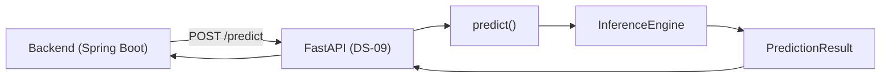
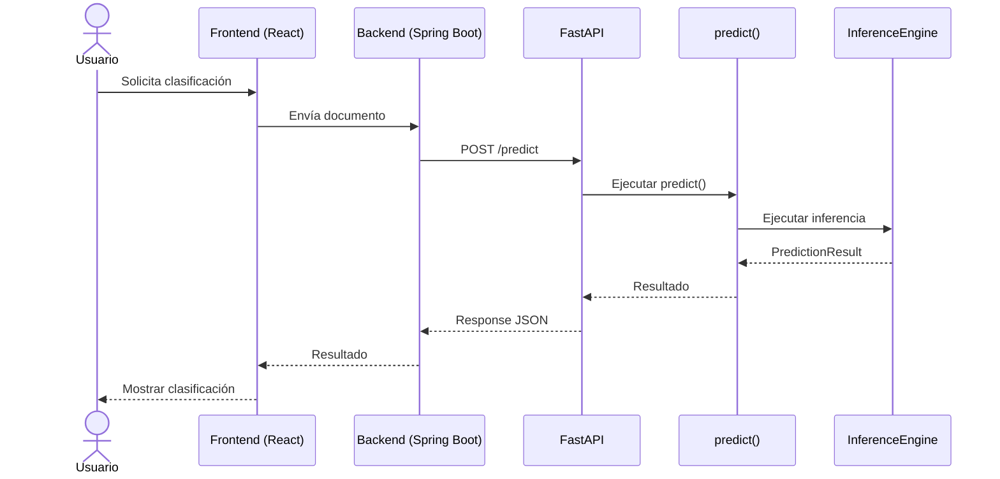

# DS-08 – Motor de Inferencia y Contrato de Integración

## Información General

| Campo | Valor |
|-------|-------|
| Sprint | DS-08 |
| Nombre | Motor de Inferencia y Contrato de Integración |
| Fase | Fase 4 – Producción |
| Componente | Data Science |
| Estado | ✅ Completado |
| Responsable | Equipo Data Science |
| Dependencias | DS-07 – Persistencia del Modelo |
| Documento relacionado | ARCHITECTURE.md |

---

# 1. Introducción

## 1.1 Objetivo

Implementar el **Motor de Inferencia** del componente de Data Science, responsable de cargar los artefactos persistidos, ejecutar el pipeline de inferencia y generar predicciones utilizando el modelo previamente entrenado.

Este motor constituye la base funcional para el proceso de clasificación automática de documentos técnicos y será expuesto mediante una API REST durante el Sprint **DS-09**, permitiendo su integración con el Backend desarrollado en Spring Boot.

---

## 1.2 Contexto

Durante los sprints anteriores se desarrolló el ciclo completo de construcción del modelo de Machine Learning:

- Arquitectura del componente de Data Science.
- Investigación y construcción del Dataset Maestro.
- Pipeline de preprocesamiento.
- Ingeniería de características.
- Entrenamiento del modelo.
- Evaluación y selección del mejor modelo.
- Persistencia de los artefactos del modelo.

Como resultado del Sprint **DS-07**, el proyecto dispone de un modelo entrenado, validado y persistido junto con todos los artefactos necesarios para su utilización en producción.

En este sprint el enfoque cambia del entrenamiento hacia la inferencia. Se implementa el conjunto de componentes responsables de cargar los artefactos persistidos, reutilizar el pipeline de procesamiento y ejecutar predicciones consistentes utilizando el modelo entrenado.

La exposición del motor mediante una API REST será desarrollada durante el Sprint **DS-09**.

---

## 1.3 Justificación

Separar el proceso de entrenamiento del proceso de inferencia constituye una práctica ampliamente adoptada en arquitecturas modernas de Machine Learning.

Esta separación permite:

- Desacoplar el entrenamiento del consumo del modelo.
- Reutilizar el mismo modelo entrenado sin necesidad de reentrenarlo.
- Garantizar consistencia entre entrenamiento e inferencia.
- Facilitar el mantenimiento y evolución del sistema.
- Preparar el componente para su futura integración mediante servicios REST.

Además, el diseño implementado sigue principios de arquitectura limpia, manteniendo responsabilidades claramente definidas entre los distintos componentes del motor de inferencia.

---

## 1.4 Alcance

Durante este sprint se desarrollaron las siguientes actividades:

- Implementación del Motor de Inferencia.
- Implementación de `PredictionResult`.
- Implementación de `ArtifactLoader`.
- Implementación de `PredictPipeline`.
- Implementación de `InferenceEngine`.
- Implementación de la función pública `predict()`.
- Integración con el Pipeline de Preprocesamiento desarrollado en DS-04.
- Integración con los artefactos persistidos generados en DS-07.
- Desarrollo de pruebas unitarias para todos los componentes del motor.

No forman parte del alcance de este sprint:

- Implementación de FastAPI.
- Exposición de endpoints REST.
- Documentación OpenAPI / Swagger.
- Despliegue del servicio.
- Reentrenamiento del modelo.
- Automatización MLOps.
- Monitoreo del servicio.

Estas actividades serán desarrolladas durante el Sprint **DS-09**.

---

## 1.5 Estado del Componente Data Science

| Sprint | Estado | Resultado |
|---------|---------|-----------|
| DS-01 | ✅ Completado | Arquitectura del componente |
| DS-02 | ✅ Completado | Investigación y selección del dataset |
| DS-03 | ✅ Completado | Construcción del Dataset Maestro |
| DS-04 | ✅ Completado | Pipeline de preprocesamiento |
| DS-05 | ✅ Completado | Ingeniería de características |
| DS-06 | ✅ Completado | Entrenamiento del modelo |
| DS-07 | ✅ Completado | Persistencia del modelo |
| DS-08 | ✅ Completado | Motor de Inferencia |
| **DS-09** | ⏳ Pendiente | API REST e Integración con Backend |
| **DS-10** | ⏳ Pendiente | Optimización y Despliegue |

---

# 2. Arquitectura del Motor de Inferencia

## 2.1 Visión General

El Motor de Inferencia constituye el componente responsable de ejecutar el proceso de clasificación automática de documentos técnicos utilizando el modelo entrenado durante los sprints anteriores.

Su principal responsabilidad consiste en cargar los artefactos persistidos, reutilizar el pipeline de preprocesamiento y generar una predicción consistente a partir de la información recibida.

A diferencia de las etapas de entrenamiento, este componente no modifica el modelo ni genera nuevos artefactos. Su única función es realizar inferencias de forma eficiente, reproducible y desacoplada del proceso de entrenamiento.

La exposición del Motor de Inferencia mediante una API REST será implementada durante el Sprint **DS-09**, manteniendo completamente separada la lógica de Machine Learning de la capa de integración.

---

## 2.2 Rol dentro de la Arquitectura

Dentro de la arquitectura general de TechMind, el Motor de Inferencia actúa como la capa encargada de transformar la información enviada por el sistema en una predicción generada por el modelo de Machine Learning.

Para ello reutiliza todos los artefactos construidos durante los sprints anteriores:

- Pipeline de preprocesamiento.
- Vectorizador persistido.
- Modelo entrenado.
- Configuración del modelo.

El motor encapsula toda la lógica de inferencia, evitando que otros componentes del sistema conozcan detalles relacionados con algoritmos, procesamiento de texto o clasificación automática.

Esta separación facilita la mantenibilidad, la reutilización y la evolución independiente de cada componente.

---

## 2.3 Arquitectura General


---

## 2.4 Componentes del Motor de Inferencia

El Motor de Inferencia está compuesto por los siguientes elementos:

| Componente | Responsabilidad |
|------------|-----------------|
| **predict()** | Punto de entrada público utilizado para ejecutar una predicción. |
| **InferenceEngine** | Coordina el proceso completo de inferencia y orquesta la interacción entre los componentes internos. |
| **ArtifactLoader** | Recupera el modelo entrenado y los artefactos persistidos desde el repositorio. |
| **ArtifactBundle** | Contiene el modelo, el vectorizador y la información necesaria para realizar la inferencia. |
| **PredictPipeline** | Ejecuta el pipeline de procesamiento y genera la predicción utilizando los artefactos cargados. |
| **PredictionResult** | Representa el resultado final de la inferencia, incluyendo la categoría predicha y el nivel de confianza. |

---

## 2.5 Responsabilidades del Motor

El Motor de Inferencia es responsable de:

- Recuperar los artefactos persistidos del modelo.
- Construir el contexto necesario para la inferencia.
- Reutilizar el Pipeline de Preprocesamiento.
- Transformar el texto mediante el vectorizador entrenado.
- Ejecutar el modelo de Machine Learning.
- Obtener la categoría predicha.
- Calcular el nivel de confianza.
- Construir el objeto de respuesta.

---

## 2.6 Responsabilidades Excluidas

Para mantener una arquitectura modular y desacoplada, el Motor de Inferencia no realiza las siguientes actividades:

- Entrenamiento del modelo.
- Reentrenamiento automático.
- Ingeniería de características.
- Construcción del Dataset Maestro.
- Persistencia de artefactos.
- Exposición mediante API REST.
- Gestión de usuarios.
- Persistencia de información en bases de datos.
- Reglas de negocio del sistema.

Estas responsabilidades corresponden a otros componentes del proyecto o serán implementadas en sprints posteriores.

---

## 2.7 Principios Arquitectónicos Aplicados

La implementación del Motor de Inferencia sigue los siguientes principios arquitectónicos:

### Desacoplamiento

La lógica de inferencia permanece completamente independiente del proceso de entrenamiento y de la futura capa de integración REST.

### Modularidad

Cada componente posee una única responsabilidad claramente definida, favoreciendo la reutilización y el mantenimiento del código.

### Reutilización

El mismo Pipeline de Preprocesamiento desarrollado durante el entrenamiento es reutilizado durante la inferencia para garantizar resultados consistentes.

### Escalabilidad

La arquitectura permite incorporar nuevos modelos o estrategias de inferencia sin modificar el flujo principal del sistema.

### Mantenibilidad

Los componentes internos pueden evolucionar de manera independiente mientras mantengan su contrato de interacción.

---

## 2.8 Beneficios de la Arquitectura

La arquitectura implementada proporciona los siguientes beneficios:

| Beneficio | Descripción |
|-----------|-------------|
| Desacoplamiento | El entrenamiento y la inferencia evolucionan de forma independiente. |
| Reutilización | Se reutilizan los artefactos persistidos y el pipeline de procesamiento. |
| Consistencia | El procesamiento aplicado durante la inferencia es equivalente al utilizado durante el entrenamiento. |
| Mantenibilidad | Cada componente posee responsabilidades claramente definidas. |
| Escalabilidad | La incorporación de nuevas estrategias de inferencia requiere cambios mínimos en la arquitectura. |
| Integración | El Motor de Inferencia se encuentra preparado para ser expuesto mediante una API REST durante el Sprint DS-09. |

---

# 3. Diseño Técnico

## 3.1 Estructura del Motor de Inferencia

Con el objetivo de mantener una arquitectura modular, desacoplada y fácilmente mantenible, el Motor de Inferencia fue implementado como un conjunto de componentes especializados dentro del paquete `ml/inference`.

La siguiente estructura representa la implementación desarrollada durante el Sprint DS-08:

```text
src/
└── data_science/
    └── ml/
        └── inference/
            ├── __init__.py
            ├── prediction_result.py
            ├── artifact_loader.py
            ├── predict_pipeline.py
            ├── inference_engine.py
            └── predict.py
```

Cada módulo cumple una responsabilidad específica dentro del proceso de inferencia, favoreciendo la reutilización y el cumplimiento del principio de responsabilidad única (Single Responsibility Principle - SRP).

---

## 3.2 Descripción de los Componentes

| Componente | Responsabilidad |
|------------|-----------------|
| **prediction_result.py** | Define el objeto `PredictionResult`, encargado de representar el resultado de una predicción. |
| **artifact_loader.py** | Recupera los artefactos persistidos desde el repositorio utilizando la capa de persistencia implementada en DS-07. |
| **predict_pipeline.py** | Ejecuta el flujo de inferencia reutilizando el pipeline de preprocesamiento, el vectorizador y el modelo entrenado. |
| **inference_engine.py** | Coordina el proceso completo de inferencia y orquesta la interacción entre los distintos componentes. |
| **predict.py** | Expone la función pública `predict()`, utilizada como punto de entrada del Motor de Inferencia. |

---

## 3.3 Relación entre los Componentes

Los componentes del Motor de Inferencia colaboran entre sí siguiendo una secuencia claramente definida.

La función `predict()` constituye el punto de entrada del proceso y delega la coordinación al `InferenceEngine`.

Posteriormente, el motor solicita los artefactos persistidos mediante `ArtifactLoader`, construye el contexto necesario para la inferencia y delega la ejecución al `PredictPipeline`, el cual reutiliza el Pipeline de Preprocesamiento, el vectorizador y el modelo entrenado para generar la predicción.

Finalmente, el resultado es encapsulado en un objeto `PredictionResult`.


---

## 3.4 Flujo Interno del Motor

El flujo de ejecución implementado durante el Sprint DS-08 puede resumirse en los siguientes pasos:

1. La función `predict()` recibe la solicitud de clasificación.
2. Se crea una instancia de `InferenceEngine`.
3. El motor solicita los artefactos persistidos mediante `ArtifactLoader`.
4. Se recupera un `ArtifactBundle` que contiene el modelo, el vectorizador y la información asociada.
5. `PredictPipeline` ejecuta el pipeline de preprocesamiento.
6. El texto procesado es transformado mediante el vectorizador.
7. El modelo entrenado genera la predicción.
8. Se calcula el nivel de confianza.
9. Se construye un objeto `PredictionResult`.
10. El resultado es devuelto al componente consumidor.

---

## 3.5 Principios de Diseño Aplicados

La implementación del Motor de Inferencia sigue los siguientes principios de diseño:

### Responsabilidad Única (SRP)

Cada componente realiza una única función claramente definida, evitando dependencias innecesarias.

### Bajo Acoplamiento

Los módulos interactúan mediante interfaces bien definidas, facilitando su mantenimiento y evolución.

### Reutilización

El Pipeline de Preprocesamiento desarrollado durante DS-04 es reutilizado sin modificaciones durante la inferencia, garantizando consistencia entre entrenamiento e inferencia.

### Extensibilidad

La arquitectura permite incorporar nuevos modelos, estrategias de inferencia o mecanismos de carga de artefactos sin alterar el flujo principal del sistema.

### Testabilidad

La separación entre componentes permitió desarrollar pruebas unitarias independientes para cada módulo implementado durante el Sprint DS-08.

---

# 4. Pipeline de Inferencia

## 4.1 Descripción General

El Pipeline de Inferencia representa la secuencia de procesos ejecutados por el Motor de Inferencia para transformar un documento técnico en una predicción utilizando el modelo entrenado.

Durante este proceso se reutilizan los artefactos generados en los sprints anteriores, garantizando que el tratamiento de los datos sea consistente con el utilizado durante el entrenamiento del modelo.

El pipeline implementado no modifica el modelo ni genera nuevos artefactos. Su única responsabilidad consiste en ejecutar inferencias de forma rápida, reproducible y consistente.

---

## 4.2 Flujo General del Pipeline


---

## 4.3 Etapas del Pipeline

| Etapa | Descripción |
|--------|-------------|
| Solicitud | Recepción del título y contenido del documento. |
| Inicialización | La función `predict()` crea el Motor de Inferencia. |
| Carga de artefactos | `ArtifactLoader` recupera el modelo, vectorizador y metadatos persistidos. |
| Preprocesamiento | Se reutiliza el Pipeline de Preprocesamiento desarrollado en DS-04. |
| Vectorización | El texto procesado es transformado mediante el vectorizador entrenado. |
| Inferencia | El modelo entrenado genera la categoría predicha. |
| Cálculo de confianza | Se obtiene la probabilidad asociada a la predicción. |
| Resultado | Se construye un objeto `PredictionResult`. |

---

## 4.4 Flujo de Procesamiento

El proceso implementado durante el Sprint DS-08 sigue la siguiente secuencia:

1. La función `predict()` recibe el título y contenido del documento.

2. Se crea una instancia de `InferenceEngine`.

3. `ArtifactLoader` recupera el `ArtifactBundle` desde el repositorio de persistencia.

4. El `PredictPipeline` construye un `DocumentRecord` utilizando la información recibida.

5. El Pipeline de Preprocesamiento normaliza y limpia el contenido del documento.

6. El vectorizador transforma el texto procesado en un conjunto de características numéricas.

7. El modelo entrenado genera la categoría más probable.

8. Se calcula el nivel de confianza asociado a la predicción.

9. El resultado es encapsulado en un objeto `PredictionResult`.

10. El Motor de Inferencia devuelve la respuesta al componente consumidor.

---

## 4.5 Garantía de Consistencia

Para garantizar resultados reproducibles y consistentes, el Motor de Inferencia reutiliza exactamente los mismos artefactos generados durante los sprints anteriores.

Estos artefactos incluyen:

- Pipeline de Preprocesamiento.
- Vectorizador persistido.
- Modelo entrenado.
- Configuración del modelo.
- Codificador de etiquetas (cuando aplica).

La reutilización de estos componentes garantiza que el procesamiento realizado durante la inferencia sea equivalente al utilizado durante el entrenamiento del modelo.

---

## 4.6 Consideraciones Técnicas

El Pipeline de Inferencia fue diseñado considerando los siguientes principios:

### Consistencia

El mismo Pipeline de Preprocesamiento utilizado durante el entrenamiento es reutilizado durante la inferencia.

### Reproducibilidad

Todos los artefactos utilizados pertenecen a la misma versión del modelo persistido.

### Modularidad

Cada etapa del pipeline posee una responsabilidad claramente definida.

### Reutilización

Los componentes implementados durante DS-04, DS-05, DS-06 y DS-07 son reutilizados sin duplicar lógica.

### Extensibilidad

La arquitectura permite incorporar nuevos modelos o estrategias de inferencia sin modificar el flujo principal.

### Testabilidad

Cada componente puede validarse mediante pruebas unitarias independientes.

---

## 4.7 Artefactos Utilizados durante la Inferencia

| Artefacto | Sprint de origen | Función |
|-----------|------------------|---------|
| Pipeline de Preprocesamiento | DS-04 | Limpieza y normalización del documento. |
| Vectorizador | DS-05 | Transformación del texto en características numéricas. |
| Modelo Entrenado | DS-06 | Generación de la clasificación. |
| Artefactos Persistidos | DS-07 | Recuperación del modelo y recursos asociados. |

---

## 4.8 Interacción entre Componentes

El siguiente diagrama resume la interacción entre los principales componentes implementados durante el Sprint DS-08.


---

## 4.9 Beneficios del Pipeline Implementado

La implementación del Pipeline de Inferencia proporciona las siguientes ventajas:

| Beneficio | Descripción |
|-----------|-------------|
| Consistencia | Utiliza el mismo procesamiento aplicado durante el entrenamiento. |
| Reutilización | Aprovecha los artefactos desarrollados en sprints anteriores. |
| Bajo acoplamiento | Cada componente posee responsabilidades claramente definidas. |
| Escalabilidad | Facilita la incorporación de nuevos modelos o versiones. |
| Mantenibilidad | Reduce la duplicación de código y simplifica la evolución del sistema. |
| Testabilidad | Cada módulo puede validarse mediante pruebas unitarias independientes. |


---


Durante el Sprint DS-08 se implementó el Motor de Inferencia del componente de Data Science.

## Componentes desarrollados

- PredictionResult
- ArtifactLoader
- PredictPipeline
- InferenceEngine
- Función pública `predict()`

## Flujo implementado

Solicitud

↓

predict()

↓

InferenceEngine

↓

ArtifactLoader

↓

ArtifactBundle

↓

PredictPipeline

↓

PreprocessingPipeline

↓

Vectorizer

↓

Modelo entrenado

↓

PredictionResult

## Pruebas unitarias

Se desarrollaron pruebas unitarias para todos los componentes del Motor de Inferencia:

- test_prediction_result.py
- test_artifact_loader.py
- test_predict_pipeline.py
- test_inference_engine.py
- test_predict.py

## Resultados de validación

- Pruebas del módulo de inferencia: **4/4 exitosas**
- Pruebas del módulo Machine Learning: **103/103 exitosas**
- Pruebas del proyecto: **212/212 exitosas**

## Estado

**Sprint DS-08 finalizado.**

---

# 5. API REST (Contrato de Integración)

> **Nota**
>
> El presente capítulo describe el **Contrato de Integración** acordado entre el componente de Data Science y el Backend (Spring Boot).
>
> La implementación del servicio REST mediante FastAPI forma parte del **Sprint DS-09**. La especificación presentada en este documento constituye la interfaz oficial que permitirá la comunicación entre ambos componentes.

---

## 5.1 Objetivo

Definir el contrato de comunicación entre el componente de Data Science y el Backend (Spring Boot), estableciendo la estructura de las solicitudes, respuestas y códigos HTTP que serán utilizados durante la integración del Motor de Inferencia.

Este contrato garantiza que ambos equipos puedan desarrollar sus componentes de manera independiente, respetando una interfaz común y estable.

---

## 5.2 Especificación General

| Propiedad | Valor |
|------------|-------|
| Servicio | Motor de Inferencia |
| Implementación | FastAPI (DS-09) |
| Arquitectura | REST |
| Protocolo | HTTP / HTTPS |
| Formato | JSON |
| Método | POST |
| Endpoint | `/predict` |
| Consumidor | Backend (Spring Boot) |
| Productor | Componente Data Science |

---

## 5.3 Flujo de Comunicación

El Backend (Spring Boot) enviará la información del documento al servicio de inferencia mediante una solicitud HTTP.

Una vez recibida la información, el Motor de Inferencia ejecutará el pipeline de clasificación y devolverá la categoría predicha junto con el nivel de confianza.



---

## 5.4 Endpoint de Clasificación

### POST /predict

Permite clasificar automáticamente un documento técnico utilizando el modelo entrenado durante los sprints anteriores.

---

### Headers

| Header | Valor |
|----------|------|
| Content-Type | application/json |
| Accept | application/json |

---

## 5.5 Modelo de Solicitud (Request)

El servicio recibirá un documento técnico mediante una estructura JSON.

### Campos

| Campo | Tipo | Obligatorio | Descripción |
|--------|------|-------------|-------------|
| title | string | Sí | Título del documento. |
| content | string | Sí | Contenido textual del documento. |

---

### Ejemplo

```json
{
  "title": "Introducción a FastAPI",
  "content": "FastAPI es un framework moderno para construir APIs utilizando Python."
}
```

---

### Validaciones

Antes de ejecutar la inferencia se verificarán las siguientes condiciones:

| Validación | Descripción |
|------------|-------------|
| title requerido | No puede estar vacío. |
| content requerido | No puede estar vacío. |
| JSON válido | La solicitud debe contener un JSON válido. |
| application/json | El encabezado Content-Type debe ser correcto. |

---

## 5.6 Modelo de Respuesta (Response)

El Motor de Inferencia devolverá la categoría predicha junto con el nivel de confianza.

### Campos

| Campo | Tipo | Descripción |
|--------|------|-------------|
| category | string | Categoría predicha. |
| confidence | float | Nivel de confianza entre 0 y 1. |

---

### Ejemplo

```json
{
  "category": "Backend",
  "confidence": 0.96
}
```

---

## 5.7 Códigos HTTP

| Código | Estado | Descripción |
|---------|--------|-------------|
| 200 | OK | Predicción realizada correctamente. |
| 400 | Bad Request | Solicitud inválida. |
| 422 | Unprocessable Entity | Error de validación del Request. |
| 500 | Internal Server Error | Error durante la inferencia. |

---

## 5.8 Manejo de Errores

Las respuestas de error seguirán una estructura uniforme.

### Ejemplo

```json
{
  "error": "ValidationError",
  "message": "El campo 'content' es obligatorio."
}
```

---

### Tipos de Error

| Error | Descripción |
|--------|-------------|
| ValidationError | Error en los datos enviados. |
| InvalidJSON | JSON inválido. |
| ModelNotLoaded | No fue posible cargar el modelo. |
| PredictionError | Error durante la inferencia. |
| InternalServerError | Error inesperado del servicio. |

---

## 5.9 Ejemplos de Consumo

### Solicitud

```http
POST /predict HTTP/1.1

Content-Type: application/json
Accept: application/json
```

```json
{
  "title": "Introducción a FastAPI",
  "content": "FastAPI es un framework moderno para construir APIs utilizando Python."
}
```

---

### Respuesta Exitosa

```http
HTTP/1.1 200 OK
```

```json
{
  "category": "Backend",
  "confidence": 0.96
}
```

---

### Respuesta con Error

```http
HTTP/1.1 400 Bad Request
```

```json
{
  "error": "ValidationError",
  "message": "El campo 'content' es obligatorio."
}
```

---

## 5.10 Resumen del Contrato

El presente contrato define la interfaz oficial entre el componente de Data Science y el Backend (Spring Boot).

Su objetivo es garantizar una integración consistente y desacoplada, permitiendo que el Motor de Inferencia sea consumido mediante un servicio REST sin exponer los detalles internos del modelo de Machine Learning.

La implementación técnica de este contrato será desarrollada durante el Sprint **DS-09**, manteniendo la compatibilidad con las estructuras de Request y Response definidas en este documento.

---

# 6. Integración con Backend (Spring Boot)

## 6.1 Objetivo

El Motor de Inferencia forma parte de la arquitectura de TechMind como el componente responsable de ejecutar la clasificación automática de documentos técnicos.

Su integración con el Backend (Spring Boot) permite desacoplar completamente la lógica de Machine Learning de la lógica de negocio de la aplicación, estableciendo una comunicación basada en un contrato REST previamente definido.

Durante el Sprint DS-08 se implementó el Motor de Inferencia, mientras que la exposición mediante FastAPI y la integración física con Backend serán desarrolladas durante el Sprint DS-09.

---

## 6.2 Arquitectura de Integración

La integración entre Backend y Data Science seguirá una arquitectura desacoplada, donde el Backend actuará como consumidor del servicio de inferencia.


---

## 6.3 Flujo de Integración

El proceso de integración seguirá la siguiente secuencia:

1. El usuario solicita la clasificación de un documento desde la interfaz.

2. El Frontend envía la información al Backend (Spring Boot).

3. El Backend construye el Request definido en el contrato de integración.

4. FastAPI recibe la solicitud y la valida.

5. El endpoint invoca la función `predict()`.

6. El Motor de Inferencia ejecuta el proceso de clasificación.

7. Se obtiene un objeto `PredictionResult`.

8. FastAPI construye el Response JSON.

9. El Backend recibe el resultado.

10. El Frontend presenta la clasificación al usuario.

---

## 6.4 Diagrama de Secuencia



---

## 6.5 Responsabilidades de los Componentes

| Componente | Responsabilidad |
|------------|-----------------|
| Usuario | Solicita la clasificación del documento. |
| Frontend (React) | Captura la información y la envía al Backend. |
| Backend (Spring Boot) | Gestiona la lógica de negocio y consume el servicio de inferencia. |
| FastAPI (DS-09) | Expone el endpoint REST y valida las solicitudes. |
| Motor de Inferencia | Ejecuta el proceso completo de clasificación. |
| PredictionResult | Devuelve la categoría predicha y el nivel de confianza. |

---

## 6.6 Consideraciones de Integración

Para garantizar una integración estable entre ambos componentes se establecen las siguientes consideraciones:

- El Backend será el único consumidor del servicio de inferencia.

- Toda la comunicación utilizará HTTP/HTTPS con intercambio de información en formato JSON.

- El contrato definido en el Capítulo 5 deberá mantenerse estable para garantizar la compatibilidad entre versiones.

- El Motor de Inferencia permanecerá desacoplado de la lógica de negocio del Backend.

- FastAPI actuará únicamente como una capa de integración entre Backend y Data Science.

- Los artefactos del modelo serán cargados una única vez al iniciar el servicio para minimizar la latencia.

- Cualquier modificación del Request o Response deberá ser coordinada entre ambos equipos.

---

## 6.7 Beneficios de la Integración

La arquitectura propuesta proporciona los siguientes beneficios:

| Beneficio | Descripción |
|-----------|-------------|
| Bajo acoplamiento | Backend y Data Science evolucionan de manera independiente. |
| Escalabilidad | El servicio de inferencia puede desplegarse de forma independiente. |
| Reutilización | El Motor de Inferencia puede ser consumido por otros sistemas. |
| Mantenibilidad | La lógica de Machine Learning permanece aislada de la lógica de negocio. |
| Interoperabilidad | La comunicación mediante REST facilita la integración con diferentes clientes. |
| Evolución | Nuevas versiones del modelo podrán desplegarse sin modificar el Backend. |

---

## 6.8 Resumen

La arquitectura definida establece una separación clara entre la lógica de negocio y la lógica de Machine Learning.

Durante el Sprint DS-08 se implementó el Motor de Inferencia como núcleo funcional del componente de Data Science. En el Sprint DS-09 este motor será expuesto mediante FastAPI, permitiendo que el Backend (Spring Boot) consuma el servicio utilizando el contrato de integración definido en este documento.

Esta estrategia garantiza una arquitectura modular, desacoplada y preparada para la evolución independiente de cada componente del sistema.

---

# 7. Resultados del Sprint

## 7.1 Objetivo Alcanzado

Durante el Sprint **DS-08** se implementó satisfactoriamente el **Motor de Inferencia** del componente de Data Science.

La solución desarrollada permite reutilizar el modelo entrenado y los artefactos persistidos para generar predicciones de forma consistente, desacoplada y preparada para su futura exposición mediante una API REST.

La implementación mantiene la separación entre entrenamiento e inferencia, siguiendo los principios arquitectónicos definidos desde los primeros sprints del proyecto.

---

## 7.2 Componentes Implementados

Como resultado del Sprint DS-08 se desarrollaron los siguientes componentes:

| Componente | Descripción | Estado |
|------------|-------------|--------|
| `PredictionResult` | Representa el resultado de una predicción. | ✅ Implementado |
| `ArtifactLoader` | Recupera los artefactos persistidos desde el repositorio. | ✅ Implementado |
| `PredictPipeline` | Ejecuta el pipeline de inferencia reutilizando los componentes desarrollados en sprints anteriores. | ✅ Implementado |
| `InferenceEngine` | Coordina todo el proceso de inferencia. | ✅ Implementado |
| `predict()` | Punto de entrada público del Motor de Inferencia. | ✅ Implementado |

---

## 7.3 Flujo Implementado

El Motor de Inferencia ejecuta la siguiente secuencia de procesamiento:

```text
Solicitud

↓

predict()

↓

InferenceEngine

↓

ArtifactLoader

↓

ArtifactBundle

↓

PredictPipeline

↓

PreprocessingPipeline

↓

Vectorizador

↓

Modelo Entrenado

↓

PredictionResult
```

Este flujo reutiliza los artefactos generados durante los sprints anteriores, garantizando consistencia entre el proceso de entrenamiento y el proceso de inferencia.

---

## 7.4 Integración con Componentes Existentes

El Motor de Inferencia reutiliza componentes desarrollados previamente en el proyecto.

| Sprint | Componente reutilizado |
|---------|------------------------|
| DS-04 | Pipeline de Preprocesamiento |
| DS-05 | Vectorizador |
| DS-06 | Modelo entrenado |
| DS-07 | Persistencia de artefactos |

Esta reutilización evita la duplicación de lógica y garantiza que la inferencia utilice exactamente el mismo procesamiento aplicado durante el entrenamiento.

---

## 7.5 Pruebas Unitarias

Se desarrollaron pruebas unitarias para todos los componentes implementados durante este sprint.

| Archivo de prueba | Estado |
|-------------------|--------|
| `test_prediction_result.py` | ✅ |
| `test_artifact_loader.py` | ✅ |
| `test_predict_pipeline.py` | ✅ |
| `test_inference_engine.py` | ✅ |
| `test_predict.py` | ✅ |

Las pruebas fueron diseñadas para validar el comportamiento individual de cada componente, utilizando objetos simulados (*Mock*) cuando fue necesario para aislar las dependencias.

---

## 7.6 Resultados de Validación

La ejecución de la suite de pruebas confirmó el correcto funcionamiento del Motor de Inferencia y su integración con el resto del componente de Machine Learning.

| Alcance | Resultado |
|----------|-----------|
| Pruebas del módulo de Inferencia | **4 / 4 exitosas** |
| Pruebas del módulo Machine Learning | **103 / 103 exitosas** |
| Pruebas del proyecto | **212 / 212 exitosas** |

Estos resultados evidencian la estabilidad del componente y la correcta integración con la arquitectura existente.

---

## 7.7 Entregables del Sprint

Como resultado del Sprint DS-08 se entregan los siguientes artefactos:

- Motor de Inferencia completamente funcional.
- Pipeline de Inferencia integrado con el Pipeline de Preprocesamiento.
- Recuperación de artefactos persistidos mediante `ArtifactLoader`.
- Punto de entrada público `predict()`.
- Pruebas unitarias del Motor de Inferencia.
- Documentación técnica del Sprint DS-08.
- Contrato de Integración con Backend (Spring Boot).

---

## 7.8 Estado del Sprint

| Actividad | Estado |
|-----------|--------|
| Implementación del Motor de Inferencia | ✅ |
| Integración con Persistencia | ✅ |
| Integración con Preprocesamiento | ✅ |
| Pipeline de Inferencia | ✅ |
| Pruebas Unitarias | ✅ |
| Documentación Técnica | ✅ |

**Estado General:** ✅ **Sprint DS-08 Completado**

---

## 7.9 Próximos Pasos

El siguiente sprint corresponde a **DS-09 – API REST e Integración con Backend**, en el cual se desarrollarán las actividades necesarias para exponer el Motor de Inferencia mediante FastAPI y permitir su consumo por el Backend (Spring Boot).

Las principales actividades previstas son:

- Implementación del servicio REST con FastAPI.
- Desarrollo del endpoint `POST /predict`.
- Validación de solicitudes mediante Pydantic.
- Integración del Motor de Inferencia con FastAPI.
- Documentación automática mediante OpenAPI.
- Pruebas de integración con Backend.
- Validación del contrato de integración.

Con este sprint finaliza la implementación del **Motor de Inferencia**, dejando preparada la base tecnológica para la integración completa del componente de Data Science con el resto de la plataforma TechMind.